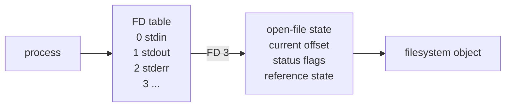

# P1-M02 — Files, Permissions, Descriptors, and Error Boundaries

> Phase 1 / M02  
> Target: **L3**  
> Prerequisite: P1-M01  
> AI mode: first implementation, initial fault diagnosis, D+7 reconstruction, and Gate are **AI-Free**; official docs/man pages are allowed.  
> Planned learner time: **5.5 h MUST**.

## Why

Linux file I/O 不是“记住 `open/read/write/close` 四个函数”。真正需要建立的是资源边界：

```text
pathname
   ↓
open()
   ↓
file descriptor (FD)
   ↓
kernel open-file state
   ↓
read/write
   ↓
close
```

pathname 是用来**寻找/打开**对象的名字；FD 是某个 process 内的一个整数 handle；open-file state 还包含 offset 等状态；`close()` 则改变 resource ownership/reference。把这些层混成“3 就是那个文件”，后续 leak、error path、pipe、process inheritance 都会变得难以推理。

M02 只学足够支持可靠 userspace I/O 与 Debug 的模型，不进入 VFS internals、`fork`、`dup2`、pipe 或 sockets。

## Mental Model — FD 不是 file 本身



这是**教学简化图**。Linux man-pages 对中间这层使用 canonical term **open file description**；图中写 `open-file state` 是为了强调我们此时只关心它保存的 offset/status 等可观察状态。现在只需掌握：process 用 FD table 中的整数引用 open file description，再关联 filesystem object。后续 `dup/fork` 会让多个 FD/reference 的关系更复杂；本章不提前展开。

同样，`/proc/<pid>/fd` 能让你看到 process 当前 FD entries 的一个用户可观察视图，但它**不是整个 kernel file model 或 open file description graph 的完整 dump**。

## Minimal Theory

### 1. pathname 与 FD 是两个阶段

```c
int fd = open("data.bin", O_RDONLY);
```

`"data.bin"` 是 pathname。成功后 `fd` 是 nonnegative integer；失败返回 `-1` 并设置 error state。后续：

```c
read(fd, buf, sizeof buf);
```

不再重新解析原 pathname。即使 pathname 后来发生变化，已经打开的 FD 仍代表一次 open 建立的引用关系；本章不扩展 rename/unlink 的高级语义。

### 2. 0 / 1 / 2

通常 process 启动时：

- `0` — standard input (`STDIN_FILENO`)
- `1` — standard output (`STDOUT_FILENO`)
- `2` — standard error (`STDERR_FILENO`)

它们只是约定良好的 FD numbers，不是另一套 I/O 世界。Lab/Challenge 用 `-` 表示 borrow stdin/stdout，这会直接测试 ownership：**borrowed standard FD 不应被 helper 擅自 close。**

### 3. file offset

对普通 seekable file，`read()` / `write()` 通常从当前 open-file offset 工作并推进 offset。offset 属于 open-file state，而不是 pathname 字符串，也不是 buffer。

本章只观察 sequential I/O；不正式教授 `lseek`、shared offsets 或 duplicated descriptors。

### 4. EOF 不是特殊 byte

对 `read()`：

- `> 0`：本次得到这么多 bytes；可能小于 requested count；
- `== 0`：当前已到 EOF；
- `< 0`：failure，随后才检查 `errno`。

因此 EOF 是**一次 read 的返回状态**，不是文件里藏着一个“EOF byte”。

### 5. short read / short write

`read(fd, buf, 4096)` 成功返回 137 并不自动是 error；consumer 应处理实际返回的 byte count。

更重要：successful `write(fd, buf, n)` **可以返回 `0 < r < n`**。可靠 copy loop 需要对剩余 bytes 重试：

```c
static int write_all(int fd, const uint8_t *buf, size_t len)
{
    size_t off = 0;
    while (off < len) {
        ssize_t n = write(fd, buf + off, len - off);
        if (n > 0) {
            off += (size_t)n;
            continue;
        }
        if (n < 0 && errno == EINTR)
            continue;
        if (n == 0)
            errno = EIO;
        return -1;
    }
    return 0;
}
```

本章不展开 nonblocking/socket 语义。现在只建立 contract：**requested count 不是 guaranteed completion count。**

### 6. `EINTR` 到什么深度

系统调用可能因 signal interruption 返回 `-1` / `EINTR`。M02 只要求：在一个明确可重试的 `read/write` loop 中识别这种情况并重试；不要在这里学习 signal handlers、restart policy 或 async-signal-safety——那些是后续内容。

### 7. `errno` 的正确 mental model

不要背“errno 是全局错误码”。对当前层次，更准确地记：

1. **先看 API return value 是否表示 failure**；
2. 只有 contract 说 failure 后 `errno` 有意义时才解释它；
3. successful call 后 `errno` 可能仍保留旧值，也可能被库调用改变，不能据此凭空判错；
4. `perror()` 适合把当前 `errno` 与上下文字符串一起输出；`strerror(saved_errno)` 可把保存的 error number 转成文字；
5. error cleanup 本身可能调用会影响 `errno` 的函数，所以如果原始 error 要跨 cleanup 使用，先 `int saved = errno;`，cleanup 后恢复/显式报告 saved value。

在常见 threaded libc 中 `errno` 实现为 thread-local state；本章不需要实现细节，只需要彻底放弃“每次调用后都检查一个共享全局整数”的模型。

### 8. FD ownership

本课程沿用三词 contract：

- **owned FD**：当前代码负责最终 `close`；
- **borrowed FD**：可使用，但不能擅自 `close`；
- **transferred FD**：ownership 明确交给另一方。

一个 helper 的 happy path 与 error path 必须遵守同一 contract。resource leak 与 double-close 往往就藏在“失败时谁收尾”不清楚的分支里。

### 9. permissions：只学够定位 `Permission denied`

传统 mode bits 先理解三组：user / group / other，每组 r/w/x。

- 对 regular file：`r`/`w` 直接关联读取/修改；`x` 与执行相关；
- 对 directory：`x` 更接近 **search/traverse** permission，不能简单解释成“执行文件夹”；`r` 与读取目录 entries 相关。

不背 chmod 数字大全。Lab 04 的目标是制造 `EACCES`，用 `ls -l`、optional `namei -l`、return value/errno 和可用时的 strace 解释到底哪一层拒绝。

## Experiment Map

| Lab | 问题 | Evidence |
|---|---|---|
| [01 `fdcopy`](labs/01-fdcopy/) | 怎样正确实现 open/read/write/close 与 partial write | copied bytes + failures + ownership audit |
| [02 `/proc/<pid>/fd`](labs/02-proc-fd/) | FD table 在 process 存活时如何变化 | predict → open → inspect → close → inspect |
| [03 `strace`](labs/03-strace/) | source 里的 `open()` 为什么可能观察到 `openat()` | failing command + syscall trace |
| [04 permissions](labs/04-permissions/) | `Permission denied` 如何变成 evidence-driven diagnosis | mode bits + errno + optional trace |

实验统一遵循：**Predict → Run → Observe → Explain**。

## Observation — 把“程序输出”翻译成 model

完成 labs 后应能解释：

- pathname 被 `open()` 消费后，程序拿到 FD；后续 `read/write/close` 的主要 handle 是 FD；
- `/proc/<pid>/fd/3` 看到的是 process FD entry 的可观察表示，不是“kernel 内所有 file structures”；
- copy 成功的条件不只是 `read()` 没失败，还包括每一段 returned bytes 都被完整写出；
- error path 与 happy path 一样需要 ownership design；
- source-level libc `open()` 与 strace 里 observed syscall name 可能不是一一对应。

## Source Walkthrough — BusyBox `cat`

**Pinned reading baseline:** BusyBox **1.38.0 release (2026-05-13)**。当次发布时 upstream Git tag `1_38_0` 尚未建立；为避免虚构 tag，本章同时 pin release tarball 与 maintainer mirror commit `fc71374dfccd46448c62947269a35f1420d7ee28`。License/provenance: BusyBox project distribution license plus the **file-level notices** recorded in [SOURCE_LEDGER.md](SOURCE_LEDGER.md); notably, the selected files do not all use identical “only/or-later” wording.

只跟 normal `cat` path：

```text
coreutils/cat.c : cat_main()
        ↓
libbb/bb_cat.c : bb_cat()
        ↓
open_or_warn_stdin()
        ↓
libbb/copyfd.c : bb_copyfd_eof()
        ↓
read/copy/write + error/exit behavior
```

Pin 下实际文件：

- `coreutils/cat.c` — 217 physical lines；normal path 最后进入 `bb_cat(argv)`；
- `libbb/bb_cat.c` — 33 physical lines；真正的 `bb_cat()` 在这里；
- `libbb/copyfd.c` — 162 physical lines；copy helper 含 production robustness/optimization 分支。

阅读问题：

1. CLI arguments 怎样进入 FD/data path？
2. 为什么 production `cat` 不像我们的 `fdcopy` 那么短？
3. 哪些复杂性是 robust engineering（feature handling、error handling、copy strategy），而不是 FD mental model 本身？
4. 此阶段哪些代码应该忽略？

**现在忽略：** Kconfig/applet generation、所有 feature macro 展开、`sendfile` strategy、build internals。你只需读出 open → copy → close / exit boundary。

## Common Misconceptions

| 错误 mental model | 修正 |
|---|---|
| pathname == FD | pathname 用于解析/open；FD 是 process-local handle |
| FD == actual file | FD entry 还要关联 kernel open-file state / filesystem object |
| `write(n)` always writes n bytes | success 也可能 short write；必须处理 returned count |
| EOF is a special byte | EOF 由 `read()==0` 表达 |
| errno should be checked after every successful call | 先看 return contract；success 后旧 errno 无判错意义 |
| close ownership doesn't matter | leak/double-close/error masking 都来自 ownership 失配 |
| `/proc/<pid>/fd` shows entire kernel file model | 它只暴露该 process 的 FD entries 视图 |

## GDB — 仍然只学“为 hypothesis 服务”的动作

在 `write_all` 或 fault helper 上练：

```text
break write_all
run ...
bt
frame 0
info locals
print off
print len
x/16bx buf+off
watch off
info registers   # SHOULD
```

目标不是背命令，而是回答：“short write 之后 remaining region 是哪一段？” 当前 authoring environment 未安装 GDB，因此这些交互步骤标为 **UNVERIFIED**，不提供伪造 transcript。

## Challenge — `fdcopy --limit N INPUT OUTPUT`

进入 [challenge/](challenge/)：在可靠 `fdcopy` 基础上加入 byte limit，并保证：

- parse `N` 不 overflow；
- EOF before N 是正常 completion，不读伪造 bytes；
- 每次 write 处理 partial completion；
- stdin/stdout 是 borrowed；自己 `open` 的 FD 是 owned；
- errors 保存正确 `errno`，cleanup 不覆盖 root cause。

第一次实现 AI-Free；reviewer solution 隔离在 `reviewer/`。

## Fault Injection

[faults/](faults/) 包含：

- F1 FD leak；
- F2 incorrect close ownership；
- F3 deterministic short-write bug；
- F4 permissions/error propagation bug。

每个 root cause 必须至少有一种 evidence：`/proc`、strace、return value/errno。不能只说“看代码觉得像”。

## Gate — `log_copy`

[gate/](gate/) 是新的 transfer context，含：

- resource leak；
- error-path ownership bug；
- short-write handling bug。

Gate **AI-Free**。修复后必须给 `/proc` evidence、strace evidence（若本机可用；若工具缺失则 reviewer/Leader 决定替代证据，不得伪造）以及 regression。只“输出文件看起来对”不通过。

## Spaced Review

### D+1 — 5–8 min recall

闭卷画出 `process → FD table → open-file state → filesystem object`。然后解释 pathname 与 FD 的区别、EOF 的返回值语义、为什么 `errno` 不能成功调用后乱看。

### D+3 — changed context

一个 logging helper 接收 `int fd`，文档写 “borrowed”。它遇到 `write` error 后执行 `close(fd)`。调用者之后尝试 fallback write。判断这是 data error、ownership error，还是两者都可能，并列出你要收集的 evidence。

### D+7 — blank-file reconstruction

**AI-Free**：从空文件重新写 `copy_fd(int in_fd, int out_fd)` 与 `write_all()`；只用 `read/write`，正确处理 EOF、EINTR-at-this-depth 与 short write。再写 4 个 tests。

## Career Relevance

- **FD ownership → userspace daemon**：长期运行 service 的 leak/error-path resource bug 不会像短程序一样被 process exit 自动掩盖。
- **error path → driver/tool/service quality**：可靠工程往往由 failure handling 区分，而不是 happy path API 数量。
- **strace → Embedded Linux debug**：当 source-level symptom 与 kernel boundary 不一致时，syscall evidence 能快速缩小范围。
- **open-file mental model → later VFS/driver boundary**：以后会看到更深 kernel structures；M02 先保证 userspace handle/state 边界是对的。

## Required Reading Budget

目标 **~55–65 min**，与 M01 REQUIRED 合计约 **1 h 40 min–2 h**，低于 2.5–3 h 上限：

- `open(2)`, `read(2)`, `write(2)`, `close(2)`, `errno(3)` 的 RETURN VALUE / ERRORS / key NOTES：~30 min；
- `proc_pid_fd(5)` + `path_resolution(7)` permissions selected parts：~10–15 min；
- BusyBox guided normal path：~15–20 min。

TLPI Ch. 4 / Ch. 5 selected sections 是 selective reference，不要求课前整章背诵。

## Further Reading

- TLPI Ch. 4；Ch. 5 §5.4（FD/open-file relationship）作为 stable mental-model reference；
- `strace(1)` filtering 仅在 Lab 03 按问题使用；
- `namei(1)` 可用于多级 directory permission diagnosis，但不是 Gate 必背工具。

完整版本、路径、license 与 checked date 见 [SOURCE_LEDGER.md](SOURCE_LEDGER.md)。
