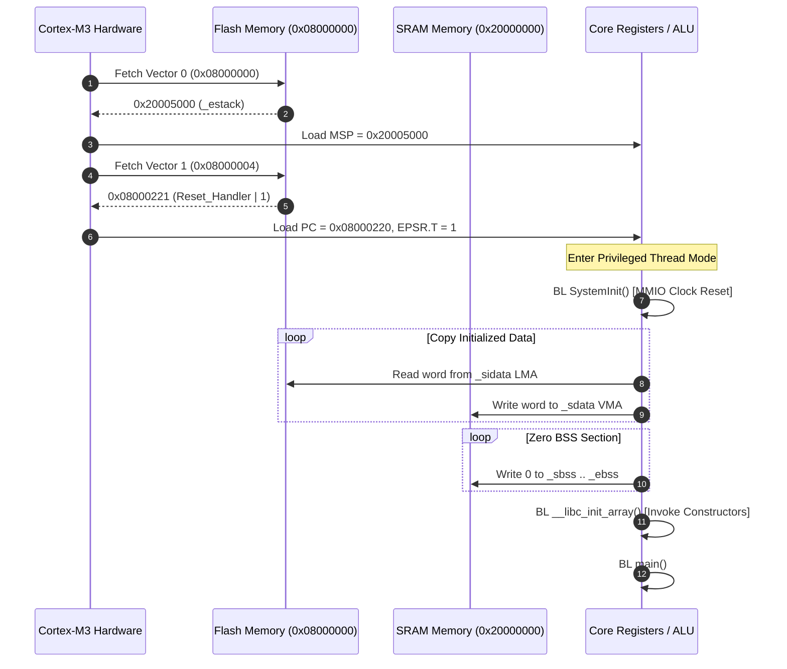

# P2-M01 Diagrams

```mermaid
sequenceDiagram
    autonumber
    participant HW as Cortex-M3 Hardware
    participant FLASH as Flash Memory (0x08000000)
    participant SRAM as SRAM Memory (0x20000000)
    participant CPU as Core Registers / ALU

    HW->>FLASH: Fetch Vector 0 (0x08000000)
    FLASH-->>HW: 0x20005000 (_estack)
    HW->>CPU: Load MSP = 0x20005000

    HW->>FLASH: Fetch Vector 1 (0x08000004)
    FLASH-->>HW: 0x08000221 (Reset_Handler | 1)
    HW->>CPU: Load PC = 0x08000220, EPSR.T = 1

    Note over CPU: Enter Privileged Thread Mode
    CPU->>CPU: BL SystemInit() [MMIO Clock Reset]

    loop Copy Initialized Data
        CPU->>FLASH: Read word from _sidata LMA
        CPU->>SRAM: Write word to _sdata VMA
    end

    loop Zero BSS Section
        CPU->>SRAM: Write 0 to _sbss .. _ebss
    end

    CPU->>CPU: BL __libc_init_array() [Invoke Constructors]
    CPU->>CPU: BL main()
```
