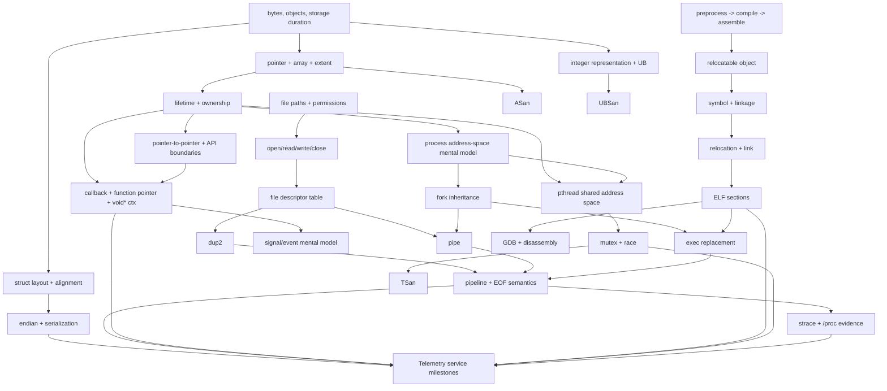

# Phase 1 — System C + Linux Foundations Curriculum Design

> Status: **Research Package — Leader review required**  
> Role: Phase Curriculum Designer + Technical Researcher  
> Checked date: **2026-08-31**  
> Scope: 6–8 weeks, **55–70 h mandatory planned work**, with unscheduled buffer preserved  
> Verification: curriculum/lab/project design is **UNVERIFIED** until learner/Leader execution; no fabricated runtime evidence is claimed.  
> Canonical authority: none. This document proposes a production blueprint; the Leader decides what becomes canonical.

## Inputs and constraints

This design is constrained by the repository governance, source/resource/lab/review/AI/version/maintenance policies, the canonical resource registry, Phase 0 curriculum research v1.2, and the approved-but-not-yet-merged Phase 0 Baseline branch `assessment/phase-0-baseline` (PR #2, Leader disposition: APPROVED WITH MINOR FIXES APPLIED). It intentionally does **not** modify Phase 0 Baseline.

Phase 0 already diagnoses pointer/lifetime defects, callback + `void *ctx`, compile/link/ELF failures, `fork/pipe/dup2/exec/waitpid`, FD/zombie investigation, memory corruption, pthread race, linking faults, ABI reasoning, and STM32 reasoning. Therefore Phase 1 must not repeat the diagnostic as a larger quiz. It must convert those same foundations into durable, independently executable engineering capability.

---

# Part 1 — Phase 1 Executive Design

## Design verdict

Phase 1 should be an **interleaved systems-foundation course**, not a C course followed by a Linux course. The teaching spine is:

`object/lifetime -> address-space/process -> bytes/layout -> files/FDs -> translation/link/ELF -> process creation/exec -> ownership/API/callback -> pipe/signal -> debugging evidence -> pthread/mutex/race -> integration service`.

Every module uses the repository chapter arc: Why -> Mental Model -> Minimal Theory -> official/book/upstream source -> small experiment -> observation -> challenge -> fault injection -> debug -> Gate.

## Planned scope

- **Core modules + distributed integration project:** about **62 h MUST**.
- **Phase 1 Final Gate:** an additional **5–6 h MUST**, for about **67–68 h total mandatory planned work**.
- **SHOULD:** selective reading/reconstruction only when the rolling buffer remains healthy; these hours are not pre-committed.
- **STRETCH:** optional source archaeology, static analysis, and deeper socket/process variants.
- **Calendar:** 7 weeks recommended; 6 weeks is possible only for a strong Phase 0 result, 8 weeks for remediation/gate retry.
- **Weekly planned load:** roughly **9–10 h average including the Final Gate**, never filling the nominal 14 h/week gross capacity.
- **Unscheduled buffer:** roughly 4 h/week on average remains for school workload, debugging, failed labs, Gate retry, reading spillover, and project rework.

## Phase exit capability

At Phase end, the learner should be able to independently build and debug a small multi-file Linux C program, explain the memory/object/FD/process/linker model behind it, inspect ELF/symbol/relocation evidence, use GDB/sanitizers/strace deliberately, and reason about one basic concurrency path. Target is **L3 on the selected foundation scope**, with **L4-local only for explicitly rehearsed fault families**.

## Deliberate exclusions

No deep page-table implementation, kernel internals, RTOS tutorial, driver tutorial, Yocto, CMake/autotools, recursive Make, advanced sockets, complex IPC catalog, advanced lock-free algorithms, advanced data structures, or large kernel source reading.

---

# Part 2 — Learning Dependency Graph



Sequence implication: files/FDs appear before process pipelines; linking appears before `exec` so an executable is not a black box; ownership precedes callback context and threads; concurrency comes only after process-vs-thread resource boundaries are concrete.

---

# Part 3 — Module Sequence

## P1-M01 — Objects, Storage, Extent, and Linux Process Memory

**Why:** the most damaging early systems bugs come from confusing pointer value, object extent, storage duration, and lifetime. Pairing these with the process memory view prevents C from becoming syntax memorization.  
**Career relevance:** Firmware 5/5; Linux/Kernel/Driver/BSP/SoC 5/5 because all low-level APIs cross memory/lifetime boundaries.  
**Prerequisites:** Phase 0 attempt; basic C expressions/functions.  
**Target depth:** L3, L4-local for dangling/OOB diagnosis.  
**Concepts:** object, byte, array extent, pointer arithmetic, `sizeof`, automatic/static/allocated storage duration, lifetime, stack/heap/static segments as mental model, `const`, initial `volatile` boundary, integer width/signedness/UB.  
**Canonical sources:** Official: WG14 N1570 selected §§6.2.4, 6.2.5, 6.5.6, 6.7.3; GCC warning/instrumentation docs. Book: CS:APP 3e §3.7 and selected Ch. 9 process-memory figures only; Effective C selected object/pointer/UB items if available. Course: CS61C selected C memory material. Open source: musl `src/string/memmove.c`.  
**Required reading:** N1570 §6.2.4 storage durations/lifetime; §6.5.6 additive operators; GCC `-Wall/-Wextra` and sanitizer overview; musl `src/string/memmove.c` only.  
**Lab:** write byte-buffer experiments that compare array vs pointer `sizeof`, stack vs heap lifetime, overlapping move, signed overflow, and inspect `/proc/self/maps`. Compile with normal flags, ASan, UBSan.  
**Observation:** pointer size does not encode extent; lifetime failures can survive normal execution; process mappings are regions, not “the C stack/heap diagram” itself; sanitizer coverage differs by bug.  
**Challenge:** design `span_u8 { uint8_t *ptr; size_t len; }` APIs that reject invalid extents without hidden global state.  
**Fault injection:** dangling pointer, OOB, signed overflow.  
**Debug skills:** warnings -> hypothesis; ASan/UBSan report reading; GDB `bt`, `frame`, `locals`.  
**Gate:** AI-Free: repair three seeded memory faults and explain object, extent, storage duration, lifetime, and which evidence proves each root cause.  
**Estimated hours:** 6.5 h MUST + 1 h SHOULD.  
**AI Mode:** first lab/gate AI-Free; documentation navigation AI-Hint after hypothesis; post-lab code review AI-Assisted.

## P1-M02 — Files, Permissions, Descriptors, and Error Boundaries

**Why:** Linux system programming becomes coherent once “file path” and “open file descriptor” are separated. This also creates the error-handling/API-boundary discipline required for later drivers.  
**Career relevance:** Linux/BSP/Kernel/Driver 5/5; Firmware 3/5; SoC 4/5.  
**Prerequisites:** M01.  
**Target depth:** L3.  
**Concepts:** filesystem navigation only as needed; permissions; `open/read/write/close`; short I/O; `errno`; FD table; file offset; `/proc/<pid>/fd`; stdout/stderr; ownership of FDs.  
**Canonical sources:** Official: Linux man-pages `open(2)`, `read(2)`, `write(2)`, `close(2)`, `proc_pid_fd(5)`; TLPI Ch. 3 §§3.1–3.4, Ch. 4, Ch. 5 §§5.4–5.5. Open source: BusyBox `coreutils/cat.c` selected normal path and its call into `bb_cat`; no need to understand BusyBox build macros.  
**Required reading:** TLPI Ch. 4 complete; Ch. 5 §5.4 relationship between FDs/open files and §5.5 FD duplication; man pages above.  
**Lab:** implement `fdcopy` using `open/read/write`, handle partial writes, inspect live descriptors through `/proc`, change permissions and explain failures.  
**Observation:** descriptors are per-process integers referring to kernel open-file state; EOF is `read()==0`, not a special byte; error handling is part of API design.  
**Challenge:** copy stdin/stdout when `-` is supplied without double-closing inherited descriptors.  
**Fault injection:** FD leak, ignored short write, wrong permissions.  
**Debug skills:** `/proc/<pid>/fd`, `strace -e trace=%file,%desc`, errno interpretation.  
**Gate:** AI-Free: implement and audit an FD-owning helper with explicit close responsibility and evidence of zero leaked nonstandard FDs.  
**Estimated hours:** 5.5 h.  
**AI Mode:** AI-Free implementation/gate; AI-Hint for man-page navigation; AI-Assisted test ideas.

## P1-M03 — Translation Pipeline, Linkage, Symbols, Relocations, ELF, and Make

**Why:** later kernel/BSP work requires treating build artifacts as evidence. `undefined reference` must map to translation/linkage/symbol facts, not trial-and-error flags.  
**Career relevance:** all target roles 5/5.  
**Prerequisites:** M01; basic shell.  
**Target depth:** L3; L4-local for common link failures.  
**Concepts:** preprocessing, compilation, assembly, relocatable object, symbol tables, static/external linkage, tentative/actual definitions, relocation, linker, ELF `.text/.rodata/.data/.bss`, Make target/prerequisite/recipe/variables/pattern rule/dependency basics.  
**Canonical sources:** Official: GCC overall options/preprocessor options; GNU `nm`, `readelf`, `objdump`; GNU make §§2.1, 3.1, 4.2, 4.6, 10.5.1–10.5.3; System V ABI ELF selected object-file/section/symbol/relocation sections. Book: CS:APP 3e Ch. 7, especially §§7.1–7.7; skip deep PIC/GOT/PLT on first pass. Course: CS61C compiler/assembler/linker/loader selected lecture.  
**Required reading:** CS:APP Ch. 7 §§7.1–7.7; GNU make “What a Rule Looks Like”, variables, phony target, pattern-rule intro; `nm/readelf/objdump` command docs for symbols/sections/relocations/disassembly.  
**Lab:** one 4-file program; emit `.i`, `.s`, `.o`, final ELF; use `readelf -S/-s/-r`, `nm`, `objdump -d`; build via Make; touch header and verify dependency behavior.  
**Observation:** `.bss` does not occupy initialized bytes in the file like `.data`; unresolved references exist in relocatable objects before final link; C linkage choices change symbols.  
**Challenge:** explain why a `static` helper fixes one multiple-definition problem but is wrong for another API boundary.  
**Fault injection:** undefined reference, multiple definition, accidental external symbol.  
**Debug skills:** compiler-vs-linker error classification; symbol/relocation evidence; GDB disassembly bridge.  
**Gate:** AI-Free from a broken multi-file tree: restore build, show one relevant symbol and relocation before linking, then explain resulting section placement.  
**Estimated hours:** 7 h.  
**AI Mode:** AI-Free core; AI-Hint docs; AI-Assisted Makefile cleanup only after working baseline.

## P1-M04 — Process, `fork`, `exec`, `waitpid`, Environment

**Why:** the executable/process distinction completes the build-to-runtime model and prepares pipes, signals, `/proc`, and later kernel process concepts.  
**Career relevance:** Linux/Kernel/BSP 5/5; Driver/SoC 4/5; Firmware 2/5.  
**Prerequisites:** M02, M03.  
**Target depth:** L3.  
**Concepts:** process vs program; PID/PPID; address space; `fork` copy semantics at user-visible level; inherited FDs; `execve` replacement; argv/env; child status; zombie; `waitpid`.  
**Canonical sources:** Official: `fork(2)`, `execve(2)`, `waitpid(2)`, `environ(7)`, `/proc`; TLPI Ch. 6 §§6.1–6.7, Ch. 24, Ch. 26, Ch. 27; OSTEP Ch. 4 “Processes”, Ch. 5 “Process API”. Book alternative: APUE Ch. 8 selected sections.  
**Required reading:** TLPI Ch. 24 sample/selected sections, Ch. 26 wait status, Ch. 27 exec family overview; OSTEP Ch. 5.  
**Lab:** parent forks two children with distinct env/argv, one successful exec and one failed exec, collect status and inspect `/proc/<pid>/status` while blocked.  
**Observation:** `exec` does not create a new PID; a child can become zombie until reaped; inherited descriptors survive unless closed/CLOEXEC rules intervene.  
**Challenge:** implement `run_command(argv)` returning a normalized exit description without `system()`.  
**Fault injection:** zombie, exec failure, unexpected inherited FD.  
**Debug skills:** `ps`, `/proc`, `strace -f`, wait-status decoding.  
**Gate:** diagnose a child that “finished but remains visible” and prove root cause/fix with process evidence.  
**Estimated hours:** 5.5 h.  
**AI Mode:** AI-Free challenge/gate; AI-Hint docs; AI-Assisted tests.

## P1-M05 — Ownership, Pointer-to-Pointer, Callbacks, `void *ctx`, API Design

**Why:** embedded and kernel code frequently expresses polymorphism and context with function pointers and opaque pointers. Correct ownership/lifetime boundaries matter more than callback syntax.  
**Career relevance:** Firmware/RTOS/Driver/Kernel 5/5; Linux/BSP/SoC 4/5.  
**Prerequisites:** M01, M02.  
**Target depth:** L3, L4-local for ownership failures.  
**Concepts:** pointer-to-pointer output parameters; caller/callee ownership; borrowed vs owned lifetime; cleanup-on-error; callback registration; function-pointer signatures; `void *ctx`; `const` API promises; limited `volatile`: observable access, not synchronization/atomicity.  
**Canonical sources:** Official: C standard selected declarator/qualifier sections; POSIX/C API examples; GCC warnings. Book: Effective C selected pointers/dynamic allocation/API guidance (SHOULD, not canonical truth). Open source: musl small string/memory implementation as compact pointer discipline example.  
**Required reading:** short project-provided ownership notation + official function-pointer/qualifier references; no whole book chapter required.  
**Lab:** implement a callback-based byte parser where state is passed only via `void *ctx`; add `parser_create/parser_destroy`; write failure-safe initialization.  
**Observation:** `void *ctx` solves context transport, not lifetime; `const` restricts mutation through an access path, not object lifetime; `volatile` does not make thread sharing safe.  
**Challenge:** add a registration API that remains safe if construction fails midway.  
**Fault injection:** dangling callback context; double-free/ownership confusion.  
**Debug skills:** watchpoint; ownership table; destructor-path tracing.  
**Gate:** AI-Free API review + implementation: draw ownership/lifetime table and demonstrate one seeded failure repaired with regression test.  
**Estimated hours:** 5.5 h.  
**AI Mode:** AI-Free first implementation/gate; AI-Hint after written hypotheses; AI-Assisted style review.

## P1-M06 — Pipes, `dup2`, Signals, and Small IPC

**Why:** this is where C ownership, FD lifecycle, process inheritance, and event interruption meet in one observable mechanism.  
**Career relevance:** Linux/Kernel/BSP 5/5; Driver 4/5; Firmware/SoC 3/5.  
**Prerequisites:** M02, M04, M05.  
**Target depth:** L3.  
**Concepts:** `pipe`, read/write ends, EOF conditions, `dup2`, descriptor closure across fork/exec, signal disposition/mask at introductory level, async-signal-safety concept, self-pipe/event notification as SHOULD, IPC taxonomy only enough to position pipes/Unix sockets.  
**Canonical sources:** Official: `pipe(2)`, `pipe(7)`, `dup2(2)`, `signal(7)`, `sigaction(2)`, `signal-safety(7)`; TLPI Ch. 20 §§20.1–20.4, Ch. 21 selected safe-handler concepts, Ch. 44 pipes/FIFOs selected sections.  
**Required reading:** man pages above; TLPI pipe chapter sections on pipe creation/EOF; signal fundamentals only.  
**Lab:** build `producer | filter` with own `fork/exec/pipe/dup2`; add SIGINT/SIGTERM shutdown reporting in parent.  
**Observation:** pipe EOF depends on **all** write-end references being closed; `dup2` changes descriptor bindings; signal handlers are severely constrained.  
**Challenge:** redirect child stderr to a log FD while stdout remains in pipeline.  
**Fault injection:** pipe EOF hang, wrong `dup2` target, unsafe handler doing too much.  
**Debug skills:** `strace -f`, `/proc/<pid>/fd`, GDB attach concept.  
**Gate:** AI-Free diagnose a hanging pipeline from descriptor evidence and produce the complete Symptom -> Hypotheses -> Evidence -> Experiment -> Root Cause -> Fix -> Regression record.  
**Estimated hours:** 6 h.  
**AI Mode:** AI-Free gate; AI-Hint only after hypothesis list; AI-Assisted regression-test ideas.

## P1-M07 — Binary Data: Struct Layout, Alignment, Endian, Serialization

**Why:** driver/BSP/SoC work is full of byte streams, registers, descriptors, protocol fields, and ABI boundaries. Direct struct-casting habits must be corrected before hardware-facing work.  
**Career relevance:** Firmware/Driver/BSP/SoC 5/5; Kernel 5/5; Linux 4/5.  
**Prerequisites:** M01, M03.  
**Target depth:** L3.  
**Concepts:** padding/alignment, `offsetof`, object representation, fixed-width integers, endian, explicit encode/decode, overflow/range validation, why packed structs are not a universal serialization solution.  
**Canonical sources:** C standard object representation/alignment sections; System V ABI data representation where relevant; `stdint.h`, `endian(3)`/byteorder references. Book: CS:APP Ch. 2 selected data representation only.  
**Required reading:** selected CS:APP §§2.1–2.3; official ABI layout notes; man byte-order helpers.  
**Lab:** serialize telemetry frames to a fixed byte format; compare `sizeof(struct)` and explicit wire size; inspect hex dump on host.  
**Observation:** C object layout can include padding; host representation is not a portable wire format; integer conversion and validation are boundary concerns.  
**Challenge:** add versioned record decode with truncated/oversized input rejection.  
**Fault injection:** wrong endian, trusting `sizeof(struct)` as wire size, signed-length conversion.  
**Debug skills:** GDB `x` memory; `objdump/readelf` data inspection; hex evidence.  
**Gate:** reconstruct a record from raw bytes and explain every byte/offset/alignment assumption.  
**Estimated hours:** 4.5 h.  
**AI Mode:** AI-Free implementation/gate; AI-Hint docs; AI-Assisted test vectors after own cases.

## P1-M08 — GDB, Sanitizers, `strace`: Evidence Selection

**Why:** tools are introduced earlier, but this module forces deliberate choice: which evidence source can answer which hypothesis, and what it cannot prove.  
**Career relevance:** all target roles 5/5.  
**Prerequisites:** M01–M07 fault exposure.  
**Target depth:** L3; L4-local on practiced bug families.  
**Concepts:** GDB breakpoint/backtrace/frame/locals/registers/memory/disassembly/watchpoint; core-dump concept; ASan vs UBSan vs TSan; `strace` syscall boundary; static analyzer optional.  
**Canonical sources:** official GDB manual sections “Breakpoints”, “Stack”, “Registers”, “Memory”, “Machine Code”, “Watchpoints”, “Core Files”; GCC Instrumentation Options; strace upstream manual/man page.  
**Required reading:** only sections needed for seeded bugs; no debugger command encyclopedia.  
**Lab:** four short unknown faults where learner must first write hypotheses, then choose one evidence tool before running it.  
**Observation:** ASan catches many OOB/use-after-free cases but not every logical corruption; UBSan targets instrumented undefined behavior; TSan is race-focused and cannot be combined with ASan in the same GCC run; `strace` sees syscall activity, not arbitrary user-space memory corruption.  
**Challenge:** diagnose one fault with GDB only, then compare with sanitizer evidence.  
**Fault injection:** recurrence of dangling/OOB/UB/link/FD/exec bugs.  
**Debug skills:** full required set; core dump is SHOULD if environment supports it.  
**Gate:** AI-Free unknown-bug station: no fix accepted without hypothesis/evidence/root-cause chain and regression.  
**Estimated hours:** 5 h.  
**AI Mode:** AI-Free gate; AI-Hint only documentation navigation after hypotheses; AI-Assisted postmortem review.

## P1-M09 — pthread, Shared State, Mutex, Race and Lock Misuse

**Why:** Phase 1 needs one bounded concurrency model before RTOS mechanisms and kernel synchronization. The objective is not “learn pthread API”; it is shared-state reasoning.  
**Career relevance:** RTOS/Kernel/Driver/Linux 5/5; Firmware/BSP/SoC 4/5.  
**Prerequisites:** M01, M04, M05, M08.  
**Target depth:** L3.  
**Concepts:** process vs thread resource sharing; `pthread_create/join`; mutex ownership; critical section; race/data race; deadlock/lock misuse; minimal condition-variable wait/signal semantics. Because the integration project uses a blocking producer/consumer queue, the **minimal condition-variable pattern is MUST for that bounded scope**; broader condition-variable API coverage remains SHOULD.  
**Canonical sources:** Official: `pthread_create(3)`, `pthread_join(3)`, `pthread_mutex_lock(3p)`/POSIX equivalent, and condition-variable wait/signal documentation for the project predicate loop; TLPI Ch. 29 and Ch. 30 selected synchronization sections; OSTEP Ch. 26 and Ch. 28 selected.  
**Required reading:** TLPI Ch. 29 §§thread model/create/join; Ch. 30 mutex fundamentals plus only the condition-variable material needed to understand a mutex-protected predicate/wait loop; OSTEP concurrency intro and locks.  
**Lab:** parallel counters and queue access; reproduce lost updates; repair with mutex; run TSan; implement one predicate + mutex + condition-variable wait loop for the bounded queue; deliberately create lock-order misuse or self-deadlock in a tiny fixture.  
**Observation:** shared address space changes ownership assumptions; “works repeatedly” is not evidence of race freedom; synchronization establishes constraints `volatile` does not.  
**Challenge:** define and document lock ownership for two shared fields without coarse global locking everywhere.  
**Fault injection:** race + one deadlock/lock misuse.  
**Debug skills:** TSan, GDB thread/backtrace basics, structured lock-state reasoning.  
**Gate:** AI-Free race diagnosis plus mutex fix and explanation of invariant protected by the lock.  
**Estimated hours:** 6 h.  
**AI Mode:** AI-Free core/gate; AI-Hint docs; AI-Assisted test stress ideas after fix.

## P1-M10 — Integration: Linux Systems Telemetry Service

**Why:** foundations become useful only when memory, bytes, FDs, build artifacts, process/thread lifecycle, signals, tests, and debugging coexist in one bounded system.  
**Career relevance:** direct portfolio bridge to Embedded Linux/BSP/Driver: long-running service, data path, lifecycle, observability, defensive boundaries.  
**Prerequisites:** M01–M09; milestones start earlier, final integration here.  
**Target depth:** L3 integrated; L4-local for seeded project fault chain.  
**Concepts:** multiple files, Make, parser, bounded queue/ring buffer, worker, stats, logging, config/CLI, Unix-domain socket optional/SHOULD, signal shutdown, tests, sanitizer builds, tracing.  
**Canonical sources:** relevant man-pages and GNU docs already introduced; upstream source readings inform style, not copied architecture.  
**Required reading:** project README/spec only plus targeted man pages.  
**Lab:** project milestones in Part 8.  
**Observation:** evidence should connect input bytes -> parse -> ownership -> queue -> worker -> output/log -> shutdown; no hidden resource leaks.  
**Challenge:** unknown injected project fault.  
**Fault injection:** FD leak + shutdown hang + queue race or bad record length.  
**Debug skills:** complete diagnostic loop and tool selection.  
**Gate:** project acceptance + Final Gate components, not “demo runs once”.  
**Estimated hours:** about 10.5 h mandatory project work counted across weeks (not an extra ninth-week block).  
**AI Mode:** milestone first implementations AI-Free where foundational; AI-Assisted review/docs/tests after working evidence; final project fault gate AI-Free.

### Module hour total

Core module/lab/project time is about **62 h MUST**. The separate Phase 1 Final Gate adds another **5–6 h**, yielding about **67–68 h total mandatory planned work**. Some M10 hours are distributed during M03–M09 rather than appended after all modules.

---

# Part 4 — Resource Decision Matrix

| Resource | Phase 1 Role | Priority | Exact section/path | Why | Risk / control |
|---|---|---|---|---|---|
| CS:APP 3e | linking + machine/data mental model | MUST selective | Ch. 7 §§7.1–7.7; Ch. 2 §§2.1–2.3 selected; Ch. 3 §3.7 selected | excellent bridge from C source to object/link/runtime | too heavy if followed chapter order; cap reading |
| TLPI | primary book for Linux userspace mental model | MUST selective | Ch. 3 §§3.1–3.4; Ch. 4; Ch. 5 §§5.4–5.5; Ch. 6 §§6.1–6.7; Ch. 20 selected; Ch. 24/26/27 selected; Ch. 29/30 selected; Ch. 44 selected | precise Linux/POSIX systems model and examples | 1500-page-book trap; use only named sections |
| APUE 3e | alternate explanation/reference | SHOULD | Ch. 3 File I/O; Ch. 8 Process Control; Ch. 10 Signals; Ch. 11 Threads; Ch. 15 IPC selected | useful second explanation and UNIX model | duplicates TLPI; never assign both for same topic by default |
| OSTEP | OS mental model | SHOULD/MUST selected | Ch. 4 Processes; Ch. 5 Process API; Ch. 26 Concurrency; Ch. 28 Locks | compact conceptual bridge to later RTOS/kernel | avoid VM/page-table and kernel implementation depth now |
| GCC docs | compiler behavior/tooling authority | MUST | Warning Options; Overall/Preprocessor options; Instrumentation Options | current tool behavior and sanitizer meaning | docs are reference, not sequential reading |
| GNU binutils docs | binary-evidence authority | MUST | `nm`, `readelf`, `objdump` sections | symbols/sections/relocations/disassembly | command-option dump risk; teach only evidence questions |
| GDB docs | debugger authority | MUST | Breakpoints; Stack; Registers; Memory; Machine Code; Watchpoints; Core Files | supports evidence-driven debugging | avoid command memorization |
| GNU make docs | build mechanics | MUST selective | §§2.1, 3.1, 4.2, 4.6, 10.5.1–10.5.3 + auto-dependency concept | enough to maintain small C project | no recursive Make/autotools |
| Linux man-pages | API truth at point of use | MUST | `open/read/write/close`, `fork/execve/waitpid`, `pipe/dup2`, `sigaction/signal-safety`, `/proc`, pthread, Unix socket selected | teaches English docs and exact contracts | API-list memorization; always pair with experiment |
| WG14 N1570 draft | C semantics authority where practical | MUST selected | §§6.2.2, 6.2.4–6.2.6, 6.5.6, 6.7.2–6.7.3 | authoritative semantics for lifetime/linkage/object/qualifiers | standard prose is dense; assign tiny excerpts |
| System V ABI / ELF | object format + ABI authority | MUST selected | ELF object files: sections, symbols, relocations; x86-64 psABI only when host-specific ABI is observed | grounds ELF claims in primary docs | ABI overload; no deep dynamic linking now |
| Effective C | C engineering supplement | SHOULD | selected pointers, integer/UB, allocation/API items only | practical modern C guidance | secondary source; verify semantics against standard/tool docs |
| Modern C | optional alternate C explanation | SHOULD/STRETCH | selected object/pointer/qualifier chapters | modern terminology and disciplined C model | can turn Phase 1 into C course; no cover-to-cover assignment |
| CS61C | teaching-sequence support | SHOULD | selected C memory + CALL/compiler/assembler/linker/loader material | good system bridge | avoid duplicating whole course |
| musl | first source reading | MUST selected | `src/string/memmove.c`; small syscall wrappers only as comparison | compact real C, pointer arithmetic, overlap, implementation constraints | optimized tricks can distract; read only scoped questions |
| BusyBox | Linux utility source reading | MUST selected | `coreutils/cat.c` normal `cat_main` path + referenced `bb_cat` call boundary | recognizable FD/data path in real embedded userspace | macros/config framework noisy; explicitly ignore unrelated branches |

### TLPI scope classification

**MUST:** Ch. 3 §§3.1–3.4; Ch. 4; Ch. 5 §§5.4–5.5; Ch. 6 §§6.1–6.7; Ch. 24 selected; Ch. 26 selected; Ch. 27 selected; Ch. 20 selected; Ch. 29 selected; Ch. 30 mutex fundamentals; Ch. 44 selected pipe sections.  
**SHOULD:** Ch. 12 process info; Ch. 13 buffering; Ch. 21 selected handler design; Ch. 31 thread safety; Unix-domain sockets selected from socket chapters.  
**Later:** advanced signals, timers, POSIX/System V IPC breadth, terminals, daemonization, advanced sockets/network protocols, epoll/inotify depth, namespaces/cgroups, capabilities, advanced memory mapping.

---

# Part 5 — Open Source Reading Plan

LOC ranges below are approximate nonblank implementation ranges, intended for assignment sizing; pin exact tag/commit and recount before tutorial publication.

## Tier A — Phase 1 required

| Project/object | Upstream / license | Exact path | Expected LOC | Prerequisite | Why suitable | Learning goal |
|---|---|---|---:|---|---|---|
| musl `memmove` | `git.musl-libc.org/cgit/musl`; MIT | `src/string/memmove.c` | ~30–50 depending pinned revision | pointer/extent/lifetime, integer casts | single function, real overlap constraints, small enough to annotate | reason about source/destination ranges, overlap direction, alignment optimization without copying it |
| BusyBox `cat` entry path | `git.busybox.net/busybox`; GPL-2.0-only for file/tree convention | `coreutils/cat.c`, focus `cat_main()` and `bb_cat()` normal path | ~30–60 focused lines | FD I/O, argv, errors | real embedded Linux utility with recognizable behavior | map CLI -> argv -> FD copy abstraction -> close/error/exit path; learn to ignore unrelated feature macros |

## Tier B — recommended selected reading

- One tiny musl libc/syscall-boundary wrapper such as `src/process/waitpid.c` or `src/unistd/dup2.c`. Pin the exact release/commit before assignment; keep it Tier B until the Leader confirms which wrapper best exposes the intended boundary rather than hidden helper complexity.
- BusyBox `libbb/copyfd.c` selected copy loop after M02, focusing partial read/write/error flow; expected ~100–200 focused LOC.
- musl `src/stdio/__stdio_read.c` after FD model is solid, to see buffered stdio sitting above descriptors; expected ~20–50 LOC.
- GNU/coreutils source only for a specific comparison question (e.g. why production `cat` is much more complex), not as first reading target.
- Linux kernel simple source only as **optional preview**: one tiny UAPI definition or a compact helper tied to a man-page contract; no driver-tree assignment in Phase 1.

## Tier C — not appropriate now

- glibc process/thread internals: too much macro/ABI/platform complexity for first source reading.
- Linux kernel VFS/process/scheduler implementations: valuable later, but they collapse too many prerequisites now.
- BusyBox applet framework/Kconfig/build internals as a study target: distracts from FD/process mechanics.
- optimized architecture-specific `memcpy.S`: optional later architecture reading, not a Phase 1 C foundation target.

Open-source reading rule: each assignment begins with a question and ends with a 5–10 line learner explanation; “read musl/BusyBox” is never an assignment.

---

# Part 6 — Lab Matrix

| Module | Small experiment | Primary observation | Challenge evidence | Gate evidence |
|---|---|---|---|---|
| M01 | extent/lifetime/overflow + `/proc/self/maps` | object vs pointer vs mapping | `span_u8` API | repaired faults + sanitizer/GDB evidence |
| M02 | `fdcopy` + live FD inspection | descriptor lifecycle/EOF | stdin/stdout ownership | zero-leak FD audit |
| M03 | `.i/.s/.o/ELF` pipeline | symbol/relocation/section transitions | linkage trade-off | repaired build + actual ELF evidence |
| M04 | fork/exec/wait tree | process identity/replacement/zombie | `run_command` | process-state root cause |
| M05 | callback parser | context lifetime/API ownership | failure-safe registration | ownership table + regression |
| M06 | two-process pipeline | inherited FDs and EOF | stderr redirection | hanging-pipe postmortem |
| M07 | binary record codec | padding/endian/wire boundary | versioned decode | byte-for-byte explanation |
| M08 | unknown-fault stations | tool-selection boundaries | GDB-only diagnosis | evidence-chain debug exam |
| M09 | shared counter/queue | race vs mutex invariant | scoped lock design | TSan/reasoning + corrected invariant |
| M10 | telemetry milestones | integrated resource/lifecycle model | unknown fault | project acceptance + final gate |

Every substantial lab must record objective, environment/tool versions, commands, expected observable result, actual evidence when executed, verification status, failure modes, and debugging strategy per `LAB_STANDARD.md`.

---

# Part 7 — Debug / Fault Injection Matrix

| Fault family | First introduced | Required recurrence | Evidence target |
|---|---|---|---|
| dangling pointer | M01 | M05 callback ctx; M08 unknown fault | ASan/GDB + lifetime table |
| OOB / wrong extent | M01 | M07 malformed record; M10 parser | ASan + explicit bounds invariant |
| ownership/double cleanup | M02/M05 | M10 init/shutdown | resource ownership table + leak audit |
| integer UB | M01 | M07 length arithmetic | UBSan + type/range explanation |
| undefined reference | M03 | M08 mixed-source debug | linker diagnostic + `nm/readelf` |
| multiple definition | M03 | Final Gate Part C | symbol/linkage evidence |
| wrong symbol visibility/linkage | M03 | M10 multi-file refactor | `nm` before/after |
| FD leak | M02 | M06, M10, Final Gate | `/proc/<pid>/fd` + strace |
| pipe EOF hang | M06 | M10 optional process variant, Final Gate | FD graph + `/proc`/strace |
| zombie | M04 | M08/Final Gate | `ps`/`waitpid` reasoning |
| exec failure | M04 | M06 pipeline, Final Gate | `strace -f`, errno, status |
| race | M09 | M10 threaded queue, Final Gate | TSan/stress + invariant |
| deadlock/lock misuse | M09 | M10 fault injection | thread backtraces/lock-order reasoning |

Mandatory debugging record format throughout Phase 1:

`Symptom -> Hypotheses -> Evidence -> Experiment -> Root Cause -> Fix -> Regression`.

A “fix” without root-cause evidence does not pass a debug Gate.

---

# Part 8 — Telemetry Project Design

## Project goal

Build a small **Linux Systems Telemetry Service** that ingests textual or binary telemetry records from a file/stdin/pipe, parses validated records, transfers them through a bounded queue, computes simple statistics in a worker, logs lifecycle/errors, and exposes status through a minimal CLI. A Unix-domain socket is **SHOULD**, not mandatory.

This is not a socket demo. The assessed value is resource lifetime, bounded data flow, shutdown correctness, build/debug evidence, and API boundaries.

## Bounded architecture

```text
input FD
  -> decoder/parser
  -> fixed-size record
  -> bounded ring buffer
  -> worker
  -> counters/min/max/mean
  -> logger + status output
```

### Why a ring buffer

A ring buffer is chosen only when the threaded milestone needs a **bounded FIFO with predictable storage and no per-record heap allocation**. That makes fullness/emptiness, producer/consumer ownership, and later embedded/driver transfer explicit. A linked list is a SHOULD comparison exercise; it is not chosen simply because “embedded systems use ring buffers.”

## Mandatory project scope

- 6–10 `.c/.h` files, not a framework.
- GNU Make with target/prerequisite/recipe, variables, one pattern rule, automatic header dependencies or a simple explicit equivalent.
- configuration through CLI flags or a tiny config struct; no config-file parser required.
- input: file or stdin; pipe input must work.
- parser with explicit length/range errors.
- bounded ring buffer introduced only with worker thread.
- one worker thread + mutex + a minimal condition-variable predicate/wait loop for the bounded blocking queue.
- signal-triggered graceful shutdown with a deliberately narrow safety contract: the asynchronous handler may only set a `volatile sig_atomic_t` stop flag (and preserve `errno` if needed). The main thread reacts at a normal execution boundary, then acquires normal synchronization, marks the queue closed, wakes the worker, joins it, and performs cleanup. Do not call pthread mutex/condition APIs or stdio from the asynchronous handler. A dedicated `sigwait()` design is SHOULD, not required.
- explicit FD and allocation ownership.
- logging to stderr/file; no logging framework.
- unit-style parser/codec tests + one integration script.
- normal, ASan+UBSan, and TSan build modes as relevant.
- GDB and strace evidence captured for at least one real project fault during learner execution.
- README includes architecture, build/run, limitations, test commands, one postmortem, and a short English “Build / Run / Debug Notes” section.

## Milestones

**M0 — contract skeleton (M01/M02, ~0.5 h):** ownership rules, record/API boundary, sample input. AI-Free.  
**M1 — single-thread parser + multi-file build (M01/M03, ~1.5 h):** minimal validated textual record path, tests, module split, Make, first ELF inspection.  
**M2 — FD input + process-facing lifecycle (M02/M04, ~1.5 h):** file/stdin/pipe input, error propagation, leak audit.  
**M3 — callback/context API (M05, ~1 h):** introduce explicit `void *ctx` boundary and failure-safe construction without changing the data model unnecessarily.  
**M4 — binary/layout boundary upgrade (M07, ~1 h):** add one bounded binary codec or equivalent byte-layout exercise with explicit endian/length validation.  
**M5 — bounded ring + worker (M09, ~2 h):** one producer/main thread, one worker, mutex + condition-variable predicate loop, documented queue invariants.  
**M6 — signal shutdown + observability + fault campaign (M06/M08/M10, ~2 h):** minimal async-safe stop request, normal-context queue close/wakeup/join, strace/GDB evidence, then inject one resource or concurrency fault and write a postmortem.  
**Final acceptance (~1 h):** clean clone/build, tests, sanitizer modes on valid paths, documented known limits, README evidence.

Total mandatory project time is intentionally about **10.5 h**, spread across the phase.

### Explicit non-goals

No daemonization, systemd service unit, TCP protocol, TLS, database, JSON dependency, event-loop framework, multiple worker pool, lock-free queue, plugin system, CMake, packaging, or production observability stack.

---

# Part 9 — Spaced Review Strategy

Review should consume about **10–15 minutes per active study day** and 1–1.5 h at phase end, not become a second curriculum.

- **D+1 recall (5–8 min):** without notes, write the mental model and one failure condition from the prior module; then check notes.
- **D+3 micro-transfer (10 min):** one changed-context question, e.g. “which process still holds this pipe write end?” or “which symbol should be local?”
- **D+7 reconstruction (15–25 min):** AI-Free, recreate one core artifact from blank file: `open/read/write` loop, Make pattern rule, `fork/exec/wait`, byte decoder, or mutex-protected invariant.
- **Fault recurrence:** each major fault family must reappear at least once in a later module (matrix above).
- **Phase-end closed-AI reconstruction:** rebuild a 3-file mini utility and diagnose one fault using official documentation only.

Review failures create a short remediation task; they do not automatically add a new chapter.

---

# Part 10 — 7-Week Schedule

The default map is 7 weeks. A learner may stretch to 8 weeks by splitting Week 6 or Final Gate; MUST work is not compressed to protect SHOULD work.

| Week | MUST | SHOULD | Gate | Planned hours |
|---|---|---|---|---:|
| 1 | M01 + start M02 + project M0; first GDB/ASan/UBSan use | one modern-C companion excerpt | memory/lifetime + FD ownership | 8.5–9.5 h |
| 2 | finish M02 + M03 + project M1 | CS61C selected linker lecture | ELF/link + Make gate | 9–10 h |
| 3 | M04 + project M2 | APUE Ch. 8 selected comparison | process/zombie/exec gate | 8.5–9.5 h |
| 4 | M05 + M06 + project M3 | TLPI Ch. 21 selected signal safety | ownership/callback + hanging-pipe gate | 9–10 h |
| 5 | M07 + M08 + project M4 | core dump setup; one static-analyzer trial | binary boundary + unknown-bug station | 9–10 h |
| 6 | M09 + project M5 | Unix-domain socket orientation | race/mutex/condvar-predicate gate | 9–10 h |
| 7 | project M6/final acceptance + spaced reconstruction + 5–6 h Phase 1 Final Gate | Tier B source reading only if buffer remains healthy | Final Gate | 10–11 h |

**Mandatory planned total:** approximately **67–68 h**, consisting of about 62 h of modules/project work plus the separate 5–6 h Final Gate. This stays inside the approved 55–70 h Phase 1 envelope while preserving meaningful buffer under the gross “~2 h/day” availability.

### 6-week compression

Only for a strong Phase 0 result: combine Weeks 3–4 and reduce SHOULD reading; do not remove fault recurrence or Final Gate.

### 8-week expansion

Preferred when Phase 0 indicates remediation: split M08/M09 and project concurrency into separate weeks, preserving the same mandatory scope with more retry/debug buffer.

---

# Part 11 — Phase 1 Final Gate

> Mode: **AI-Free; official documentation and man pages allowed.**  
> Target scored time: **5–6 h**, preferably split across two sessions.  
> Purpose: demonstrate capability improvement over Phase 0, not re-run its fixtures.

## Part A — Blank-directory build (30%)

From an empty directory and a short requirements sheet, build a multi-file Linux C utility/service slice containing:

- at least 4 source/header files;
- Makefile with variables + pattern rule + correct rebuild dependency behavior;
- FD input/output and explicit cleanup;
- callback or context-bearing API;
- one binary/text record parser with length/range validation;
- tests.

Evidence: build transcript, tests, ownership notes, sanitizer run. No starter code.

## Part B — Unknown bug investigation (25%)

Receive one unfamiliar seeded bug from a pool covering memory, FD/process, or concurrency. The learner must submit the full diagnostic record. A successful patch without evidence is capped below pass for this part.

## Part C — ELF/link/debug explanation (20%)

Given source + two `.o` files and a failing/fixed build, use `nm/readelf/objdump` to explain:

- one symbol’s linkage/binding;
- one relocation before final link;
- section placement (`.text/.rodata/.data/.bss`);
- one compiler/linker distinction;
- a short disassembly-to-C observation.

No memorized ELF trivia beyond evidence needed.

## Part D — Process/FD/concurrency debugging (25%)

Diagnose a small program containing two interacting faults selected from:

- pipe EOF hang;
- zombie;
- exec failure;
- leaked inherited FD;
- data race;
- lock misuse/deadlock.

Must use at least two evidence channels among `/proc`, `strace`, GDB, sanitizer/TSan, process inspection.

## Pass rule proposal

- total >= 75/100;
- every part >= 60%;
- Part B >= 70%;
- at least one true root cause in Part D must be proven with runtime evidence;
- no unexplained resource leak in Part A;
- AI-Free attestation.

Leader should calibrate thresholds after first learner run. Final Gate implementation is a later task; this PR only defines the design.

---

# Part 12 — AI Usage Matrix

| Activity | Mode | Rule |
|---|---|---|
| first implementation of pointer/FD/process/callback/thread mechanisms | AI-Free | docs/man pages allowed |
| module Gate | AI-Free | no direct solution generation |
| D+7 reconstruction | AI-Free | closed-AI recall |
| initial unknown-bug investigation | AI-Free until hypotheses + first evidence | prevents “error -> AI” reflex |
| documentation navigation after hypotheses | AI-Hint | AI may point to relevant manual section or ask diagnostic questions |
| stuck experiment after recorded evidence | AI-Hint | incremental hint only, not full patch |
| post-pass code review/refactor | AI-Assisted | learner verifies each change |
| test idea generation | AI-Assisted | only after learner has initial tests |
| README/style/English polish | AI-Assisted | technical claims remain learner-verified |
| Final Gate | AI-Free | official docs allowed |

Hard rule: **do not paste the whole project into AI immediately after an error.** First record symptom, hypotheses, and evidence.

---

# Part 13 — Risks / Disagreements

## Risk A — too much System C, not enough Linux

**Conclusion: controlled.** Linux appears in Week 1 via `/proc` and FDs, Week 2 via executable/ELF context, Week 3 process/exec, Week 4 pipe/signal, then tracing/concurrency/project. C concepts are introduced through Linux-facing boundaries rather than isolated syntax drills.

## Risk B — Linux API overload becomes memorization

**Conclusion: high risk unless enforced.** The mandatory syscall/API set is intentionally small: file I/O, process lifecycle, pipe/dup, signals, pthread basics, one IPC/socket preview. Each API exists because a lab needs it. “IPC basics” means taxonomy + pipe + Unix-domain-socket orientation, not SysV/POSIX IPC catalog completion.

## Risk C — CS:APP is too heavy

**Conclusion: yes if treated as textbook sequence.** Restrict MUST use mainly to Ch. 7 selected linking sections and tiny data/machine excerpts. Linux behavior remains grounded in man-pages/TLPI/experiments.

## Risk D — Telemetry project over-engineering

**Conclusion: manageable only with explicit non-goals.** One input path, one bounded queue, one worker, simple stats, minimal logging, optional Unix socket. No service manager, network protocol stack, framework, plugin architecture, or production-grade config.

## Risk E — debugging is only rhetoric

**Conclusion: addressed structurally.** Every week includes a fault, each required fault family has an introduction and recurrence, Gate credit requires evidence/root cause, and project/final Gate contain unknown bugs.

## Risk F — 6–8 weeks realism

**Conclusion: 7 weeks is realistic at ~61–65 planned mandatory hours if reading is selective and project scope remains bounded.** Six weeks should be Fast Track only; eight weeks is the safer remediation path. Planned weekly load remains below gross availability.

## Risk G — migration value to RTOS/kernel/driver

**Conclusion: strong.** Ownership + callback context migrates directly to RTOS/task/driver callback patterns; FD/process state builds kernel/userspace boundary reasoning; ELF/symbols/debugging migrate to modules/toolchains; ring-buffer/mutex invariants migrate to RTOS queues and kernel concurrency; endian/layout/API-boundary discipline migrates to registers/protocols/descriptors.

## Unresolved questions for Leader

1. Should the course baseline standardize on the Phase 0 authoring versions (GCC 14.2/binutils 2.44/Linux 6.18.35) or freeze the learner’s WSL versions after first calibration run? Recommendation: record actual learner versions first; avoid pretending GDB/strace are verified until run there.
2. Should Unix-domain socket status be SHOULD or MUST? Recommendation: SHOULD; it adds little foundation value compared with correct FD/thread/shutdown behavior.
3. Condition-variable decision: **resolved for the project scope**. A minimal predicate + mutex + condition-variable wait/signal pattern is MUST because the chosen service architecture uses a blocking bounded producer/consumer queue. Broader condvar study remains optional.
4. Which exact musl tag/commit should be canonical? Recommendation: pin after Leader verifies the chosen files have not changed pedagogically; do not cite `master` in final tutorial material.
5. Should Effective C or Modern C become the single C companion? Recommendation: at most one SHOULD companion; official semantics + experiments remain canonical.

---

# Part 14 — Source Ledger

Checked 2026-08-31 unless noted. Version-sensitive tutorial publication must pin versions/tags/commits per repository policy.

| ID | Source | Org/Author | Type | Version / section / path | Supports |
|---|---|---|---|---|---|
| S01 | ISO/IEC 9899 draft N1570 | WG14 | primary standard draft | §§6.2.2, 6.2.4–6.2.6, 6.5.6, 6.7.2–6.7.3 | linkage, lifetime, representation, pointer arithmetic, qualifiers |
| S02 | GCC online manuals | GNU | official docs | Warning Options; Overall/Preprocessor; Instrumentation Options | compile stages, diagnostics, ASan/UBSan/TSan behavior |
| S03 | GNU binutils manuals | GNU | official docs | `nm`, `readelf`, `objdump` | symbols, ELF, relocations, disassembly |
| S04 | Debugging with GDB | GNU | official docs | Breakpoints, Stack, Registers, Memory, Machine Code, Watchpoints, Core Files | debugger curriculum |
| S05 | GNU make manual | GNU | official docs | §§2.1, 3.1, 4.2, 4.6, 10.5.1–10.5.3 | scoped Make depth |
| S06 | System V ABI / ELF gABI + host psABI | ABI maintainers | primary ABI | object files, sections, symbols, relocations | ELF/link evidence |
| S07 | Linux man-pages | man-pages project / kernel.org ecosystem | official/upstream docs | `open(2)`, `read(2)`, `write(2)`, `close(2)`, `fork(2)`, `execve(2)`, `waitpid(2)`, `pipe(2)`, `dup2(2)`, `sigaction(2)`, `signal(7)`, `signal-safety(7)`, `/proc`, pthread pages | Linux API truth |
| S08 | The Linux Programming Interface | Michael Kerrisk | book | chapters/sections listed in Part 4 | Linux mental model and selective sequence |
| S09 | Computer Systems: A Programmer’s Perspective 3e | Bryant/O’Hallaron | book | Ch. 7 §§7.1–7.7; selected Ch. 2/3 | linking, ELF, data/machine bridge |
| S10 | Advanced Programming in the UNIX Environment 3e | Stevens/Rago | book | Ch. 3, 8, 10, 11, 15 selected | alternate UNIX/POSIX reference |
| S11 | Operating Systems: Three Easy Pieces | Arpaci-Dusseau | course/book | Ch. 4, 5, 26, 28 | process/concurrency mental model |
| S12 | CS61C selected material | UC Berkeley | university course | C memory + CALL/linker selected | teaching-sequence cross-check |
| S13 | musl libc upstream | musl | upstream source | `src/string/memmove.c`; one small syscall wrapper to pin | compact production C/source reading |
| S14 | BusyBox upstream | BusyBox | upstream source | `coreutils/cat.c`, selected normal path | real embedded Linux utility/FD path |
| S15 | strace manual/upstream docs | strace project | official upstream docs | syscall tracing/filtering/follow-fork basics | process/FD evidence |
| S16 | Phase 0 Curriculum Research & Validation | this repo | approved research input | `research/phase-0/2026-08-30-curriculum-research-validation.md` v1.2 | career priorities, time-buffer philosophy |
| S17 | Phase 0 Baseline Assessment approved branch | this repo | approved gate input | `assessment/phase-0-baseline` head at 2026-08-31; PR #2 approved with minor fixes | avoid duplicate diagnostic; calibrate Phase 1 evidence expectations |
| S18 | Editorial policies | this repo | governance | `.editorial/*` required files | source hierarchy, lab/gate/AI/version/maintenance rules |

## Web/source checks performed for this design

- TLPI detailed table of contents: `https://michaelkerrisk.com/tlpi/toc-detailed.html`.
- CS:APP 3e official site confirms Ch. 7 linking/ELF figures and Ch. 8 process material: `https://csapp.cs.cmu.edu/3e/`.
- GCC current Instrumentation Options confirms ASan memory-error scope, UBSan undefined-behavior instrumentation, TSan race detection, and ASan/TSan incompatibility in one build: `https://gcc.gnu.org/onlinedocs/gcc/Instrumentation-Options.html`.
- GNU make manual confirms the target/prerequisite/recipe model and pattern rules: `https://www.gnu.org/software/make/manual/make.html`.
- musl upstream cgit and source were checked for selected compact source candidates: `https://git.musl-libc.org/cgit/musl/`.
- BusyBox `coreutils/cat.c` was checked through the upstream/mirror source path; canonical tutorial should pin the exact BusyBox tag/commit before publication.

## Research status

**Design/research only — UNVERIFIED as a learner curriculum.** The first real Phase 1 run should record actual module hours, gate retries, GDB/strace behavior on the learner environment, project scope pressure, and any prerequisite gaps. Those observations should drive the next curriculum revision rather than silently expanding content.