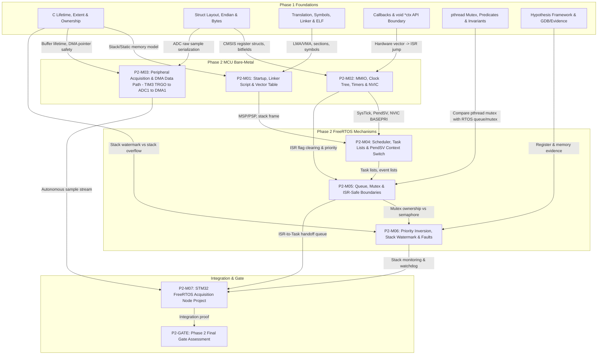
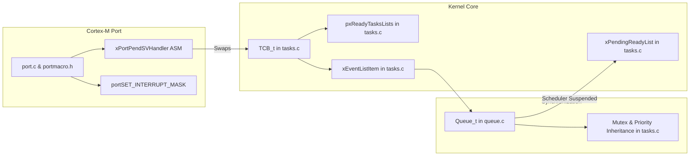
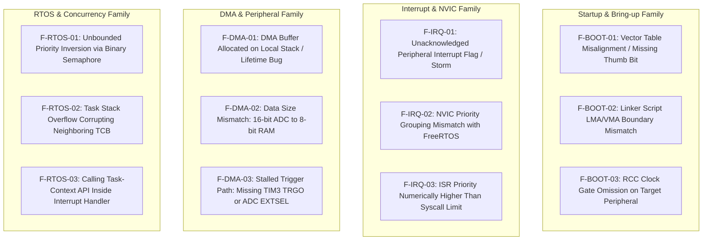
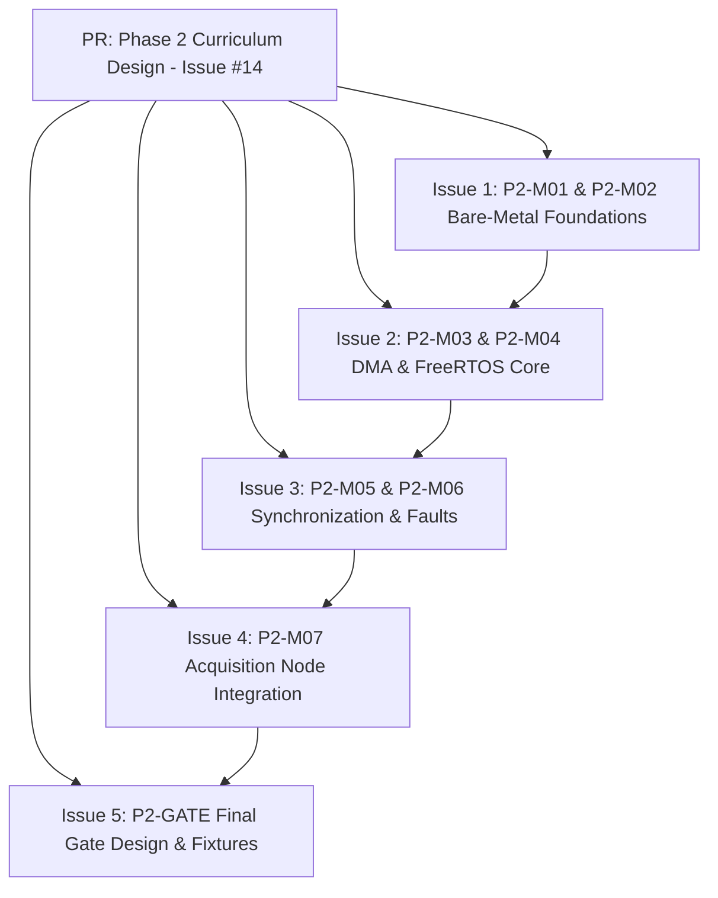

# Phase 2 — STM32 + FreeRTOS Mechanisms Curriculum Design

> Status: **Research Package — Leader review required**  
> Role: Phase Curriculum Designer + Embedded Systems Researcher  
> Checked date: **2026-09-03**  
> Scope: 4 weeks, **34.5 h mandatory planned work** (strictly bounded within ~34–35 h MUST envelope)  
> Hardware Target: **STM32F103C8T6 silicon contract** across defined board profile (8 MHz HSE / 64 MHz HSI fallback, PC13 User LED, SWD) + ST-Link V2 + 2-channel oscilloscope / 8-channel logic analyzer  
> Toolchain Baseline: **Arm GNU Toolchain 13.3.rel1** (`arm-none-eabi-gcc` 13.3.1 20240614, Binutils 2.42, GDB 14.2, Newlib 4.4.0)  
> Verification: Curriculum, lab, and project designs are **UNVERIFIED** until physical execution on hardware target; no fabricated register or oscilloscope evidence is presented.  
> Canonical authority: None. This document establishes the technical blueprint for Phase 2; the Leader decides what becomes canonical.

---

# Part 1 — Executive Design & Exit Capability

## 1.1 Context & Purpose

In the target career path:

$$\text{Embedded Systems Engineer} \longrightarrow \text{Embedded Linux / BSP / Driver} \longrightarrow \text{SoC / Platform}$$

Phase 2 closes the critical gap between bare-metal C runtime mechanics and preemptive operating system kernels. Moving into Embedded Linux, U-Boot, and Linux kernel drivers without understanding hardware exceptions, memory-mapped registers, clock configuration, interrupt priority masking, and scheduler context switching leads to severe conceptual deficits. 

Phase 1 established durable foundations in C storage duration, object lifetimes, pointers, ELF linking, POSIX processes, file descriptors, and multithreading invariants. Phase 2 takes those concepts down to bare silicon and across the RTOS kernel boundary.

## 1.2 Bound & Non-Goals

Phase 2 is **strictly mechanism-first**. It is not:
- an STM32 HAL API cookbook or peripheral enumeration course;
- a STM32CubeMX graphical click-and-generate tutorial;
- a full Cortex-M assembly language course;
- a Zephyr OS mainline curriculum;
- an advanced lock-free / multicore SMP RTOS course;
- a network, USB, filesystem, GUI, or bootloader course;
- a Linux/Buildroot/U-Boot course (reserved for Phase 3 and Phase 4).

## 1.3 Target Exit Capability

Upon completing Phase 2, the learner can independently:

1. **Bare-Metal Boot Reasoning (L3 / L4-local link & boot faults):** Explain reset vector fetch, vector table layout, `.data` initialization (LMA to VMA copy), `.bss` zeroing, and runtime initialization (`__libc_init_array()`) from linker script symbols (`_sidata`, `_sdata`, `_edata`, `_sbss`, `_ebss`) and assembly startup code (`startup_stm32f103xb.s`).
2. **Cortex-M3 Architectural Model (L3):** Detail Thread vs Handler mode, MSP vs PSP stack pointer usage, CONTROL and PRIMASK/BASEPRI registers, the 8-register hardware exception frame (`{r0-r3, r12, lr, pc, xpsr}`), and `EXC_RETURN` unstacking mechanics.
3. **Register-Level Peripheral & Clock Control (L4-local):** Configure peripheral registers (RCC, GPIO, TIM, ADC, DMA, USART) directly via CMSIS register structs. Distinguish `volatile` access semantics from hardware synchronization; avoid read-modify-write (RMW) bit hazards using atomic bit manipulation (BSRR/BRR); insert appropriate memory barriers (`DSB`/`ISB`) to guard against write-buffering hazards.
4. **NVIC & Exception Priority Model (L3):** Compute timer prescalers and auto-reload values from the clock tree; configure nested NVIC priorities; distinguish CMSIS logical priority from encoded hardware priority bytes; implement interrupt acknowledge/flag-clear sequences to prevent interrupt storms.
5. **Autonomous DMA Data Paths & ADC Sampling (L2–L3):** Construct hardware-triggered peripheral-to-memory data transfers using Timer 3 TRGO update triggers, calibrated ADC1 regular external triggering (`EXTSEL = 0b100`), valid ADC clock prescaling (`ADCPRE = /6` yielding 12 MHz ADCCLK $\le 14\text{ MHz}$), sample-time selection matched to source impedance, and DMA1 Channel 1 circular double-buffering operating autonomously without CPU intervention; reason about buffer lifetime and pointer alignment.
6. **FreeRTOS Core Mechanics (L3):** Trace task state transitions across `pxReadyTasksLists`, `xDelayedTaskList`, and `xPendingReadyList`; explain SysTick-driven preemption and the PendSV assembly context switch (`{r4-r11}` software stacking on PSP); audit memory allocation (`heap_4.c` as sole dynamic heap vs static `xTaskCreateStatic`).
7. **Synchronization & ISR Boundary (L3):** Implement queue-based pipelines; audit NVIC interrupt priorities against `configMAX_SYSCALL_INTERRUPT_PRIORITY`; enforce correct usage of `FromISR` APIs and `portYIELD_FROM_ISR()`.
8. **Concurrency, Priority Inversion & Safety (L3 / L4-local RTOS faults):** Distinguish binary semaphores from mutexes; reproduce unbounded priority inversion in a controlled 3-task experiment and resolve it using priority inheritance; monitor task stack watermarks (`uxTaskGetStackHighWaterMark`); catch stack overflows via hook functions (`taskCHECK_FOR_STACK_OVERFLOW`); integrate an Independent Watchdog (IWDG).
9. **Measurable HW/SW Debugging (L4-local):** Diagnose complex faults using GPIO timing markers, oscilloscopes/logic analyzers, and SWD live register/memory inspection following the disciplined hypothesis-driven framework:
   $$\text{Symptom} \longrightarrow \text{Own Description} \longrightarrow \text{Hypotheses} \longrightarrow \text{Evidence} \longrightarrow \text{Narrow Scope} \longrightarrow \text{Root Cause} \longrightarrow \text{Fix} \longrightarrow \text{Regression}$$

---

# Part 2 — Dependency Map from Phase 1 to Phase 2



### Direct Transfer Mechanisms:
- **Phase 1 Linker/ELF $\to$ Phase 2 Startup:** In Phase 1 (M03), learners used `readelf -S` and `nm` to inspect `.text`, `.data`, and `.bss`. In P2-M01, learners write the original linker script assigning `.text` to FLASH (`0x08000000`) and `.data` to SRAM (`0x20000000`), implementing the startup assembly loop that copies initialized variables from LMA in FLASH to VMA in SRAM and calls `__libc_init_array()`.
- **Phase 1 Memory Extent $\to$ Phase 2 DMA Buffers:** In Phase 1 (M01/M05), lifetime bugs manifested as dangling pointers on the host stack. In P2-M03, allocating a DMA destination buffer on a local task stack demonstrates hardware memory corruption when the function returns while DMA continues streaming.
- **Phase 1 Concurrency $\to$ Phase 2 RTOS Mutexes:** In Phase 1 (M09), learners investigated POSIX mutexes and condition variable predicate loops. In P2-M05/M06, learners compare the OS mutex (futex-based) with the FreeRTOS embedded mutex (priority-inheritance queue) and contrast cooperative blocking against preemptive ISR-driven wakeups.

---

# Part 3 — Architecture Spine Inside Phase 2

Phase 2 incorporates only the architectural mechanisms of the ARM Cortex-M3 (ARMv7-M) that directly govern bare-metal execution and RTOS context switching. Full cache hierarchies, TLBs, and virtual memory (MMU) are deliberately excluded and deferred to Phase 3/4.

```text
+--------------------------------------------------------------------------------+
|                         CORTEX-M3 EXECUTION MODEL                              |
+--------------------------------------------------------------------------------+
| Mode:      Thread Mode (Tasks)              | Handler Mode (Exceptions / ISRs) |
| Stack:     PSP (Process Stack Pointer)      | MSP (Main Stack Pointer)         |
| Privilege: Privileged (standard non-MPU)    | Always Privileged                |
+--------------------------------------------------------------------------------+
                                       |
                 Exception / Interrupt Entry (Hardware)
                                       v
+--------------------------------------------------------------------------------+
| HARDWARE STACK FRAME (Pushed onto current SP: PSP in Thread Mode)              |
|   SP + 0x00: R0                                                                |
|   SP + 0x04: R1                                                                |
|   SP + 0x08: R2                                                                |
|   SP + 0x0C: R3                                                                |
|   SP + 0x10: R12                                                               |
|   SP + 0x14: LR (Link Register / R14)                                          |
|   SP + 0x18: PC (Return Address / Program Counter)                             |
|   SP + 0x1C: xPSR (Program Status Register, Thumb bit must be 1)               |
+--------------------------------------------------------------------------------+
                                       |
                   PendSV Handler (FreeRTOS Context Switch)
                                       v
+--------------------------------------------------------------------------------+
| SOFTWARE STACK FRAME (Pushed by PendSV assembly onto task's PSP)               |
|   PSP - 0x20: R4, R5, R6, R7, R8, R9, R10, R11                                 |
|   Update pxCurrentTCB->pxTopOfStack = PSP                                      |
|   Select next pxCurrentTCB = vTaskSwitchContext()                              |
|   Load PSP = pxCurrentTCB->pxTopOfStack                                        |
|   Pop R4-R11 from PSP                                                          |
|   Execute: BX 0xFFFFFFFD (EXC_RETURN: Return to Thread mode, restore from PSP) |
+--------------------------------------------------------------------------------+
```

### 1. Register Set, PC, and Stack Pointers (MSP vs PSP)
- **General Purpose Registers:** R0–R12, SP (R13), LR (R14), PC (R15), xPSR.
- **Dual Stack Pointers:** Cortex-M3 physically separates the Main Stack Pointer (MSP) and Process Stack Pointer (PSP). The active pointer is selected by `CONTROL[1]` (`SPSEL`).
- **Reset State:** Upon reset, the core enters Privileged Thread mode using MSP. MSP initial value is fetched directly from address `0x08000000`.
- **RTOS Division of Labor:** FreeRTOS configures the kernel and all exception handlers (ISRs, SysTick, PendSV, SVCall) to use MSP. User tasks run in Thread mode using PSP. Consequently, task stack sizes need only accommodate the task's own call tree and context frame—not worst-case nested interrupt stacks!

### 2. Exception Entry and Return Mechanics
- **Hardware Stacking:** When an exception is accepted, the processor hardware automatically pushes 8 registers `{r0-r3, r12, lr, pc, xpsr}` onto the currently active stack (PSP for tasks). If 8-byte stack alignment is configured (`SCB->CCR[STKALIGN]`), the hardware adds padding if necessary.
- **`EXC_RETURN`:** The hardware loads a special magic value into LR:
  - `0xFFFFFFF1`: Return to Handler mode, use MSP.
  - `0xFFFFFFF9`: Return to Thread mode, use MSP.
  - `0xFFFFFFFD`: Return to Thread mode, use PSP (the standard FreeRTOS task return).
- **Hardware Unstacking:** Executing `BX LR` with an `EXC_RETURN` value triggers hardware unstacking: the 8 registers are restored from the stack indicated by `EXC_RETURN`, and execution resumes at the restored PC.

### 3. NVIC Priority Model: Logical vs Encoded Representation
- **Priority Bits:** Cortex-M allows up to 256 priority levels (8 bits). STM32F103 silicon implements **4 bits** (`__NVIC_PRIO_BITS = 4`), residing in the upper nibble of `NVIC->IP[x][7:4]`.
- **Disambiguating Logical vs Encoded Priority:**
  1. **CMSIS Logical Priority:** A numerical scale from `0` (highest urgency) to `15` (lowest urgency). Passed directly to CMSIS inline functions:
     ```c
     NVIC_SetPriority(TIM2_IRQn, 6); /* Logical priority 6 */
     ```
  2. **Encoded Hardware Byte:** The byte value physically written into `NVIC->IP[x]` or `BASEPRI`:
     $$\text{Encoded Byte} = \text{Logical Priority} \ll (8 - \_\_\text{NVIC\_PRIO\_BITS}) = \text{Logical Priority} \ll 4$$
     Thus, logical priority 6 encodes as $6 \ll 4 = \text{0x60}$ (96 decimal). Logical priority 5 encodes as $5 \ll 4 = \text{0x50}$ (80 decimal).
- **FreeRTOS Sycall Boundary Configuration:**
  - `configLIBRARY_MAX_SYSCALL_INTERRUPT_PRIORITY = 5` (CMSIS logical priority).
  - `configMAX_SYSCALL_INTERRUPT_PRIORITY = 0x50` (encoded hardware byte).
  - **Rule:** ISRs with **logical priority 0 to 4** (encoded `0x00` to `0x40`, numerically lower/higher urgency) cannot call any FreeRTOS API, but are never masked by `BASEPRI` during critical sections. ISRs with **logical priority 5 to 15** (encoded `0x50` to `0xF0`, numerically equal/lower urgency) can call `...FromISR()` APIs and are masked when `BASEPRI` is set to `0x50`.

### 4. Memory-Mapped I/O (MMIO), Volatile, and RMW Hazards
- **MMIO Architecture:** Peripherals reside in the 512 MB peripheral region (`0x40000000`–`0x5FFFFFFF`). Registers are accessed via standard 32-bit load/store instructions.
- **The Semantics of `volatile`:** 
  - `volatile` informs the compiler that the memory location can change outside the compiler's knowledge (by hardware) and that writes have external side effects.
  - `volatile` forces the compiler to emit a load or store on every access, preventing dead-store elimination and register caching across sequence points.
  - `volatile` does **not** make multi-byte access atomic, does **not** prevent CPU out-of-order write buffering, and does **not** insert bus barriers.
- **Read-Modify-Write (RMW) Hazards:**
  ```c
  /* Non-atomic RMW sequence: compiles to LDR, ORR, STR */
  GPIOC->ODR |= (1 << 13);
  ```
  If an interrupt fires between the `LDR` and `STR` and modifies `ODR`, the interrupt's write is overwritten and lost when the interrupted code completes its `STR`.
  - **The Atomic Hardware Fix:** STM32 GPIOs provide dedicated atomic set/reset registers: `BSRR` (Bit Set/Reset Register) and `BRR` (Bit Reset Register). Writing a `1` to `BSRR` bit `n` sets pin `n`; writing to bit `n+16` resets pin `n`. This is a single atomic bus write requiring no lock or interrupt disabling.

### 5. Memory Ordering and Barrier Concepts
- Cortex-M3 utilizes an internal write buffer between the core and the AHB bus matrix.
- **Write-Buffer Delay Hazard:** When software writes to disable an interrupt flag in a peripheral register, the write may sit in the write buffer while the processor executes the next instructions. If the ISR executes `BX LR` immediately, the interrupt controller (NVIC) may still see the active interrupt line from the peripheral, triggering an unwanted tail-chained re-entry into the same ISR.
- **Barriers:**
  - `DSB` (Data Synchronization Barrier): Ensures all explicit memory transfers complete before subsequent instructions execute.
  - `ISB` (Instruction Synchronization Barrier): Flushes the pipeline, ensuring following instructions are refetched from memory/cache.
  - In CMSIS: `__DSB()` is placed immediately following peripheral interrupt flag clears before ISR exit.

---

# Part 4 — Bounded FreeRTOS Source Walkthrough Plan

Rather than reading large source files linearly, learners perform targeted source audits of specific functions and structures in `FreeRTOS-Kernel` V11.3.0 (`9b777ae`).



| Source File | Function / Struct Focus | Pedagogical Question Answered |
|---|---|---|
| **`FreeRTOS-Kernel/tasks.c`** | `struct tskTaskControlBlock` (TCB) | Where is task execution state saved? How are stack bounds, priority, and list links organized in memory? |
| **`FreeRTOS-Kernel/tasks.c`** | `prvAddNewTaskToReadyList()` | How does a newly created or unblocked task link into `pxReadyTasksLists[uxPriority]`? |
| **`FreeRTOS-Kernel/tasks.c`** | `vTaskSwitchContext()` | How does the scheduler select the highest priority ready task (`taskSELECT_HIGHEST_PRIORITY_TASK`)? |
| **`FreeRTOS-Kernel/tasks.c`** | `xTaskIncrementTick()` | What happens on each timer tick? How are delayed tasks in `pxDelayedTaskList` audited and woken up? |
| **`FreeRTOS-Kernel/tasks.c`** | `vTaskPlaceOnEventList()` | How does a blocked task remove itself from the ready list and sleep on a queue's event list? |
| **`FreeRTOS-Kernel/tasks.c`** | `uxTaskGetStackHighWaterMark()` | How does the kernel inspect stack memory to calculate the minimum unused stack space since task creation? |
| **`FreeRTOS-Kernel/include/stack_macros.h`** | `taskCHECK_FOR_STACK_OVERFLOW()` | How does the kernel detect stack pointer corruption or canary overwrite (`0xA5`) before invoking `vApplicationStackOverflowHook()`? |
| **`FreeRTOS-Kernel/portable/GCC/ARM_CM3/port.c`** | `xPortStartScheduler()` | How are PendSV and SysTick interrupt priorities configured in the NVIC before launching the first task? |
| **`FreeRTOS-Kernel/portable/GCC/ARM_CM3/port.c`** | `prvPortStartFirstTask()` & `vPortSVCHandler()` | How does SVC 0 kick off the first task and configure PSP? (Standard non-MPU ARM_CM3 port runs tasks in Privileged Thread mode). |
| **`FreeRTOS-Kernel/portable/GCC/ARM_CM3/port.c`** | `xPortPendSVHandler()` | Exactly which registers are pushed by hardware vs software? How does `pxTopOfStack` get swapped? |
| **`FreeRTOS-Kernel/portable/GCC/ARM_CM3/port.c`** | `vPortValidateInterruptPriority()` | How does the kernel assert that an ISR calling RTOS APIs has a priority $\ge$ `configMAX_SYSCALL_INTERRUPT_PRIORITY`? |
| **`FreeRTOS-Kernel/portable/GCC/ARM_CM3/portmacro.h`** | `portSET_INTERRUPT_MASK_FROM_ISR()` | How does writing to `BASEPRI` implement nestable, bounded-jitter critical sections? |
| **`FreeRTOS-Kernel/queue.c`** | `struct QueueDefinition` | What are the physical components of a queue (storage buffer, head/tail pointers, waiting senders/receivers lists)? |
| **`FreeRTOS-Kernel/queue.c`** | `xQueueGenericSend()` & `Receive()` | How does a task copy data into the queue, unblock a waiting receiver, or block itself if the queue is full? |
| **`FreeRTOS-Kernel/queue.c`** | `xQueueGenericSendFromISR()` | How does an ISR unblock a waiting task directly to `pxReadyTasksLists` (or defer to `xPendingReadyList` if scheduler is suspended), and communicate preemption requirement via `*pxHigherPriorityTaskWoken`? |
| **`FreeRTOS-Kernel/tasks.c`** | `xTaskPriorityInherit()` & `xTaskPriorityDisinherit()` | Where does priority inheritance modify `pxTCB->uxPriority` when a high-priority task contends for a mutex? |
| **`FreeRTOS-Kernel/list.c`** | `vListInsertEnd()`, `vListInsert()`, `uxListRemove()` | How do circular doubly-linked lists provide $O(1)$ ready-list insertion and priority-ordered event list queuing? |
| **`FreeRTOS-Kernel/portable/MemMang/heap_4.c`** | `pvPortMalloc()` & `vPortFree()` | How does first-fit block coalescing prevent memory fragmentation? Contrast with static allocation (`xTaskCreateStatic`). |

---

# Part 5 — Complete Module Sequence

## P2-M01 — Reset, Startup, Linker Script, and Vector Table

- **Module ID:** `P2-M01`
- **Title:** Reset, Startup, Linker Script, and Vector Table
- **Why Now:** Firmware engineers must not treat MCU startup as vendor black-box magic. Understanding how the CPU transitions from power-on reset to `main()` connects C variables with physical memory and demystifies the vector table before introducing interrupts.
- **Prerequisites:** Phase 1 M03 (ELF, sections, symbols, Make).
- **Mental Model:** Flash memory holds the cold immutable image; RAM is volatile scratchpad. Startup code is the physical bridge that loads the initial stack pointer, configures vector addresses, copies initialized data from Flash to RAM, zeroes uninitialized variables, calls standard C runtime constructors via `__libc_init_array()`, and jumps into compiled C code.
- **Minimal Theory:**
  - Armv7-M boot sequence: CPU reads 32-bit initial MSP value from `0x08000000`, then reads initial PC (Reset Vector address) from `0x08000004`.
  - Bit 0 of vector addresses must be `1` to indicate Thumb state; loading an even address into PC triggers an immediate `UsageFault` (INVSTATE).
  - Linker script `MEMORY` and `SECTIONS` commands: defining `FLASH (rx)` (64 KB at `0x08000000`) and `RAM (rwx)` (20 KB at `0x20000000`).
  - Section placement: `.isr_vector` at Flash origin; `.text` and `.rodata` in Flash; `.data` loaded in Flash (LMA) but executed in RAM (VMA); `.bss` allocated in RAM.
  - Startup runtime initialization sequence:
    ```text
    Reset_Handler:
      1. Set initial MSP = _estack (hardware loads vector 0; assembly ensures consistency)
      2. Call SystemInit() (basic clock and bus initialization)
      3. Copy initialized data (.data) from Flash (LMA _sidata) to SRAM (VMA _sdata .. _edata)
      4. Zero uninitialized data (.bss _sbss .. _ebss)
      5. Call __libc_init_array() (executes C runtime constructors and .init_array)
      6. Branch to main()
      7. Infinite trap loop if main() returns (Default_Handler loop)
    ```
  - `__libc_init_array()` Policy: It iterates over `.preinit_array` and `.init_array` section tables to invoke static initialization routines (e.g. `__attribute__((constructor))`). Calling it explicitly ensures standard C language compliance. Phase 2 is strictly C-only; no C++ runtime (`libsupc++`), static C++ object constructors, or exception/RTTI overhead are introduced.
  - Linker script provenance: An original pedagogical 64 KB linker script (`stm32f103c8tx_flash.ld`) is authored from scratch. The vendor template in ST repositories carries an Ac6 non-redistribution notice and specifies 128 KB Flash; it is strictly a read-only comparison reference and is not redistributed.
- **Official Source:**
  - ST RM0008, Section 3.3 (Embedded SRAM) & Section 3.4 (Flash memory).
  - ST PM0056 (Rev 7, Dec 2024), Section 2.1 (Processor modes and stacks) & Section 2.2 (Memory model).
  - Armv7-M Architecture Reference Manual (DDI 0403E.e), Section B1.5.3 (Reset behavior).
  - GNU Binutils LD Manual (Linker Scripts: Memory Layout & Section Placement).
- **Exact Upstream Source Path:**
  - `cmsis_device_f1/Source/Templates/gcc/startup_stm32f103xb.s` (Lines 45–140: `g_pfnVectors` & `Reset_Handler`).
- **Labs:**
  - **Objective:** Build a complete, bootable bare-metal firmware image from an empty directory using an original 64 KB linker script, minimal assembly startup implementing the exact startup sequence (`SystemInit -> copy .data -> zero .bss -> __libc_init_array -> main`), and `main.c` that toggles an LED via register addresses.
  - **Prerequisites:** GNU Arm toolchain (`arm-none-eabi-gcc` 13.3.rel1), Make, OpenOCD, GDB.
  - **Environment:** Linux host or WSL2, STM32F103C8T6 target (onboard LED e.g. PC13 active LOW), ST-Link V2 SWD debugger.
  - **Estimated Time:** 2.0 h.
  - **AI Mode:** AI-Hint (only for linker script syntax reference).
  - **Build:** `arm-none-eabi-gcc -mcpu=cortex-m3 -mthumb -O2 -g3 -Wall -Wextra -Werror -ffunction-sections -fdata-sections -T stm32f103c8tx_flash.ld -Wl,--gc-sections --specs=nano.specs --specs=nosys.specs startup.s main.c -o firmware.elf`.
  - **Procedure:**
    1. Write `stm32f103c8tx_flash.ld` declaring Flash at `0x08000000` (64K) and RAM at `0x20000000` (20K).
    2. Write `startup.s` with vector table containing `_estack` and `Reset_Handler`.
    3. Implement `.data` copy loop and `.bss` clear loop in assembly. Call `bl __libc_init_array`.
    4. Write `main()` configuring PC13 to toggle the LED.
    5. Flash target with OpenOCD; inspect registers in GDB before and after `Reset_Handler`.
  - **Expected Observation:** GDB halts at `Reset_Handler`; stepping through the copy loop initializes global variables in RAM; `__libc_init_array` executes cleanly; target boots into `main()`.
  - **Actual Verification Status:** `UNVERIFIED` (curriculum design baseline).
  - **Questions:** Why does the PC register in GDB display an even address when the vector table contains an odd address? What occurs if `.bss` is not zeroed?
  - **Failure Modes:** Target enters infinite `HardFault_Handler` due to missing Thumb bit; global variables evaluate to zero because `.data` copy loop bounds are inverted.
  - **Debug Strategy:** Connect GDB; issue `x/8wx 0x08000000` to inspect vector table; verify SP and PC match ELF symbols via `arm-none-eabi-nm`.
  - **Challenge:** Implement a stack canary in the linker script (`_stack_canary`) and verify in `main()` that initial stack allocation has not overflowed.
  - **Cleanup:** Erase Flash via OpenOCD.
  - **Sources:** PM0056 Section 2.1; RM0008 Section 3.
- **Expected Evidence:** Disassembly listing showing vector table at `0x08000000`, `arm-none-eabi-readelf -l firmware.elf` showing LMA vs VMA addresses, GDB register dump at `main()`.
- **Challenge:** Reconstruct a working startup file and linker script entirely from memory in a blank directory within 25 minutes.
- **Deliberate Fault:** Vector alignment fault: place `.isr_vector` with misaligned address or clear bit 0 of the Reset Vector function pointer.
- **Gate:** AI-Free: Diagnose an unfamiliar non-booting ELF image in the startup/linker/memory-initialization family, extract the vector table and linker map, identify the offset/boundary error, fix the linker script, and achieve clean execution of `main()`.
- **Mastery Target:** L3 Linker/Startup reasoning, L4-local boot fault debugging.
- **AI Mode:** AI-Hint for lab; AI-Free for Gate.
- **Estimated Hours:** 3.5 h MUST, 1.0 h SHOULD.
- **Career Relevance:** Essential for BSP bring-up, custom bootloader development, and memory partitioning in production firmware.

---

## P2-M02 — MMIO, Clock Tree, Hardware Timers, and NVIC Mechanism

- **Module ID:** `P2-M02`
- **Title:** MMIO, Clock Tree, Hardware Timers, and NVIC Mechanism
- **Why Now:** Preemptive RTOS scheduling requires hardware timers and interrupt handling. Before using an RTOS tick, learners must understand peripheral bus clocks, NVIC interrupt grouping, and the hazards of manipulating shared hardware registers.
- **Prerequisites:** P2-M01 (bare-metal boot and register access).
- **Mental Model:** The MCU is a synchronized clock distribution network feeding independent memory-mapped peripheral state machines. Interrupts are hardware-invoked subroutines prioritized by the NVIC; failing to acknowledge an interrupt in the peripheral register results in an infinite execution lockup (interrupt storm).
- **Minimal Theory:**
  - Clock Tree: HSI (8 MHz internal RC) vs HSE (8 MHz crystal) $\to$ PLL multiplier ($\times 9$) $\to$ SYSCLK (72 MHz) $\to$ AHB divider (/1, 72 MHz) $\to$ APB1 divider (/2, 36 MHz max, timer clock $\times 2 = 72\text{ MHz}$) and APB2 divider (/1, 72 MHz max). (Document fallback to 64 MHz via HSI if HSE is absent).
  - APB Peripheral Clock Gating: Peripherals cannot be read or written until their clock is enabled in `RCC->APB1ENR` or `RCC->APB2ENR`.
  - Timers: Counter (`CNT`), Prescaler (`PSC`), Auto-Reload (`ARR`).
    $$f_{\text{update}} = \frac{f_{\text{timer\_clock}}}{(\text{PSC} + 1) \times (\text{ARR} + 1)}$$
  - NVIC Architecture: Interrupt Set-Enable (`NVIC->ISER`), Clear-Enable (`NVIC->ICER`), Priority Registers (`NVIC->IP`), and Application Interrupt and Reset Control Register (`SCB->AIRCR`).
  - NVIC Priority Encoding: Logical priority $0..15$ passed to `NVIC_SetPriority(IRQn, prio)` maps to encoded hardware byte `prio << 4`.
  - Read-Modify-Write (RMW) Hazards: Why bitwise operations on `GPIOx->ODR` fail under concurrent interrupt preemption, and how atomic `GPIOx->BSRR` resolves it.
- **Official Source:**
  - ST RM0008, Section 6 (RCC), Section 9 (GPIO), Section 10 (Interrupts and Events), Section 14 (TIM2/3/4).
  - ST PM0056 (Rev 7, Dec 2024), Section 4.3 (NVIC) & Section 4.4 (SCB).
  - Armv7-M Architecture Reference Manual (DDI 0403E.e), Section B3.4 (NVIC).
- **Exact Upstream Source Path:**
  - `cmsis_device_f1/Include/stm32f103xb.h` (Peripheral structure typedefs: `RCC_TypeDef`, `GPIO_TypeDef`, `TIM_TypeDef`).
  - `CMSIS_5/CMSIS/Core/Include/core_cm3.h` (`NVIC_SetPriority()`, `NVIC_EnableIRQ()`).
- **Labs:**
  - **Objective:** Configure the PLL clock tree to 72 MHz; configure TIM2 to generate an update interrupt exactly every 1.0 ms; toggle PA1 inside `TIM2_IRQHandler`; observe timing on an oscilloscope or logic analyzer; verify RMW race conditions.
  - **Prerequisites:** P2-M01.
  - **Environment:** STM32F103C8T6, ST-Link V2, oscilloscope or logic analyzer connected to PA1 and PA2.
  - **Estimated Time:** 2.5 h.
  - **AI Mode:** AI-Hint.
  - **Build:** `make clean && make`.
  - **Procedure:**
    1. Configure Flash latency to 2 wait states for 72 MHz operation (`FLASH->ACR`).
    2. Enable HSE, wait for `HSERDY`; configure PLL multiplier to 9; switch SYSCLK to PLL.
    3. Enable TIM2 clock in `RCC->APB1ENR`. Set `TIM2->PSC = 71` and `TIM2->ARR = 999` for 1000 Hz.
    4. Enable TIM2 update interrupt (`TIM2->DIER |= TIM_DIER_UIE`).
    5. Set CMSIS logical priority for `TIM2_IRQn` to 6 (`NVIC_SetPriority(TIM2_IRQn, 6)`, encoded byte `0x60`) and enable it in `NVIC->ISER`.
    6. In `TIM2_IRQHandler`, toggle PA1 using `BSRR` and clear `TIM2->SR = ~TIM_SR_UIF`.
    7. In `main()`, rapidly toggle PA2 using non-atomic `ODR |= ...; ODR &= ...;` while TIM2 interrupts preempt it.
  - **Expected Observation:** PA1 generates a stable 500 Hz square wave (1.0 ms toggle interval) verified on oscilloscope; PA2 exhibits occasional missing edges or glitches due to RMW preemption.
  - **Actual Verification Status:** `UNVERIFIED` (curriculum design baseline).
  - **Questions:** What occurs if the Flash wait state is set to 0 before switching SYSCLK to 72 MHz? Why must `TIM2->SR` be cleared before exiting the ISR?
  - **Failure Modes:** CPU enters infinite ISR loop because `UIF` flag was not cleared; timer runs at half expected speed because APB1 prescaler clock doubling rule was overlooked.
  - **Debug Strategy:** Read `RCC->CFGR` in GDB to confirm active clock source; read `TIM2->SR` to verify interrupt flag clearing; inspect `SCB->ICSR` for pending interrupt status.
  - **Challenge:** Configure a second timer with a higher preemption priority than TIM2; measure interrupt nesting latency using two oscilloscope channels.
  - **Cleanup:** Reset peripheral clocks via `RCC->APB1RSTR` and `RCC->APB2RSTR`.
  - **Sources:** RM0008 Sections 6, 9, 14; PM0056 Section 4.3.
- **Expected Evidence:** Oscilloscope capture of 1.0 ms timer pulse on PA1; GDB printout of `RCC->CR`, `RCC->CFGR`, `TIM2->PSC`, `TIM2->ARR`.
- **Challenge:** Implement a software PWM on 4 pins using a single timer channel and output compare registers without HAL libraries.
- **Deliberate Fault:** Omit clearing `TIM2->SR = ~TIM_SR_UIF` in the ISR; observe target execution hanging in the ISR with main thread starved.
- **Gate:** AI-Free: Given a system where the timer interrupt fires at an erratic frequency and the main loop halts, inspect peripheral registers in GDB, diagnose clock tree misconfiguration and missing flag acknowledgment, and restore deterministic 1 kHz timing.
- **Mastery Target:** L4-local register & MMIO interaction, L3 NVIC interrupt handling.
- **AI Mode:** AI-Hint for lab; AI-Free for Gate.
- **Estimated Hours:** 4.5 h MUST, 1.0 h SHOULD.
- **Career Relevance:** Directly maps to writing Linux peripheral drivers, setting up hardware interrupt handlers, and diagnosing hardware lockups in production.

---

## P2-M03 — Peripheral Acquisition, ADC Sampling Contract, and DMA Data Path

- **Module ID:** `P2-M03`
- **Title:** Peripheral Acquisition, ADC Sampling Contract, and DMA Data Path
- **Why Now:** Real embedded nodes cannot waste CPU cycles polling ADC samples or copying serial bytes. DMA is the standard hardware mechanism for high-throughput, low-jitter data acquisition. However, DMA only works when the underlying peripheral clock, sample timing, and calibration are strictly verified.
- **Prerequisites:** P2-M02 (clocks, peripherals, and interrupts).
- **Mental Model:** Direct Memory Access (DMA) is an autonomous bus master coexisting with the CPU. It moves data blocks between peripheral registers and SRAM across the AHB bus matrix. The CPU initiates the transaction and configures circular boundaries; the DMA controller handles data transfers silently in the background, signaling the CPU only when half-buffer or full-buffer milestones are reached.
- **Minimal Theory:**
  - STM32F103 DMA1 Architecture: 7 independent channels; fixed hardware request mapping (DMA1 Channel 1 is dedicated to ADC1).
  - DMA Channel Registers: Peripheral Address (`CPAR`), Memory Address (`CMAR`), Number of Data items (`CNDTR`), Configuration (`CCR`).
  - Transfer Configuration: Data direction (Peripheral-to-Memory), Circular mode (`CIRC`), Memory increment (`MINC`), Peripheral/Memory data size (16-bit to 16-bit matching ADC resolution).
  - **Canonical Hardware Trigger Chain on STM32F103:**
    $$\text{TIM3 Update} \longrightarrow \text{TIM3 TRGO (MMS=010)} \longrightarrow \text{ADC1 Regular Trigger (EXTSEL=100, EXTTRIG=1)} \longrightarrow \text{ADC1 DMA Request} \longrightarrow \text{DMA1 Channel 1}$$
    *Note: RM0008 Section 11 Table 65 strictly maps ADC1/ADC2 regular external triggers: `000` TIM1_CC1, `001` TIM1_CC2, `010` TIM1_CC3, `011` TIM2_CC2, `100` TIM3_TRGO, `101` TIM4_CC4. TIM2 TRGO does not exist for regular channels. TIM3 TRGO (`EXTSEL=100`) is the canonical update trigger.*
  - **ADC Clock Prescaler & Operating Limit:**
    - Per ST RM0008 and DS5319: $f_{\text{ADC}} \le 14\text{ MHz}$.
    - In the **72 MHz profile** ($f_{\text{PCLK2}} = 72\text{ MHz}$), leaving `ADCPRE` at reset default (`/2` $\to$ 36 MHz) or `/4` (18 MHz) produces an out-of-spec clock violating electrical limits.
    - Software must explicitly configure:
      $$\text{RCC->CFGR[ADCPRE]} = \text{0b10 (Divide by 6)} \implies f_{\text{ADCCLK}} = \frac{72\text{ MHz}}{6} = 12\text{ MHz} \le 14\text{ MHz}$$
    - In the **64 MHz HSI fallback profile** ($f_{\text{PCLK2}} = 64\text{ MHz}$), divide-by-6 yields $f_{\text{ADCCLK}} \approx 10.67\text{ MHz} \le 14\text{ MHz}$. Implementations must calculate $f_{\text{ADCCLK}} = f_{\text{PCLK2}} / \text{prescaler}$ rather than hardcode an assumed frequency.
  - **ADC Sample Time & Conversion Time Math:**
    - Total conversion time per sample:
      $$T_{\text{conv}} = T_{\text{sample}} + 12.5\text{ ADC clock cycles}$$
    - Channel 0 (PA0) sample time is configured in `ADC1->SMPR2[SMP0[2:0]]`.
    - At $f_{\text{ADCCLK}} = 12\text{ MHz}$, 1 cycle = $83.33\text{ ns}$.
    - Selecting `0b101` (55.5 cycles) yields $T_{\text{conv}} = 55.5 + 12.5 = 68\text{ cycles} \approx 5.67~\mu\text{s}$, well within the 10 kHz sample period ($100~\mu\text{s}$).
  - **Source Impedance ($R_{\text{AIN}}$) Compatibility Note:**
    - RM0008 Section 11.3.11 and DS5319 Table 49 define maximum external input impedance $R_{\text{AIN}}$ vs sample cycles.
    - At $T_{\text{sample}} = 1.5\text{ cycles}$, the datasheet permits only a low external source impedance. A 10 kΩ potentiometer wired as a divider has a worst-case Thevenin resistance of about 2.5 kΩ at midscale, not 10 kΩ; other unbuffered sensors or resistor networks may be substantially higher impedance.
    - The canonical 55.5-cycle setting is intentionally conservative for the lab and accommodates higher-impedance sources within the datasheet table. Learners must calculate the actual source impedance rather than infer it from a potentiometer's end-to-end resistance.
  - **Explicit Hardware Calibration Sequence (RM0008 Section 11.4):**
    - Calibration must be executed after power-up before enabling regular conversions to eliminate internal analog offset:
      1. Set `ADON = 1` in `ADC1->CR2` to power up the converter. Wait $t_{\text{STAB}}$ stabilization time (~1 $\mu\text{s}$).
      2. Set `RSTCAL = 1` in `ADC1->CR2` to reset calibration registers.
      3. Wait in software loop until `(ADC1->CR2 & ADC_CR2_RSTCAL) == 0`.
      4. Set `CAL = 1` in `ADC1->CR2` to launch internal calibration.
      5. Wait in software loop until `(ADC1->CR2 & ADC_CR2_CAL) == 0`.
      6. Configure TIM3 TRGO external trigger (`EXTSEL = 0b100`, `EXTTRIG = 1`), enable DMA (`ADC_CR2_DMA = 1`).
  - Ping-Pong (Double) Buffering: Buffer split into two halves:
    $$\text{Buffer} = [\text{Half 0} \mid \text{Half 1}]$$
    - DMA Half-Transfer Complete (HT) interrupt fires when Half 0 is full; CPU processes Half 0 while DMA autonomously fills Half 1.
    - DMA Transfer Complete (TC) interrupt fires when Half 1 is full; CPU processes Half 1 while DMA wraps around to overwrite Half 0.
  - Buffer Lifetime Hazard: Declaring a DMA buffer with automatic storage duration (on a local stack) leads to memory corruption if the function returns while DMA continues. DMA buffers must have static storage duration or persistent heap lifetime.
- **Official Source:**
  - ST RM0008, Section 11 (ADC: Table 65 trigger mapping, Section 11.3.11 $R_{\text{AIN}}$, Section 11.4 calibration) & Section 13 (DMA controller).
  - ST Datasheet DS5319 (Rev 20, Jul 2025), Section 5.3.18 (12-bit ADC electrical limits, $f_{\text{ADC}} \le 14\text{ MHz}$).
- **Exact Upstream Source Path:**
  - `cmsis_device_f1/Include/stm32f103xb.h` (DMA structure `DMA_Channel_TypeDef`, ADC structure `ADC_TypeDef`).
- **Labs:**
  - **Objective:** Configure the 72 MHz clock tree with `ADCPRE = /6` (12 MHz ADCCLK); execute the hardware ADC calibration sequence; configure PA0 sample time to 55.5 cycles ($R_{\text{AIN}}$ compatibility); configure TIM3 TRGO to trigger ADC1 regular conversions at 10 kHz; configure DMA1 Channel 1 in circular mode to transfer 16-bit ADC samples into a 128-element double buffer (`uint16_t adc_buffer[2][64]`); handle Half-Transfer and Transfer-Complete interrupts; output debug markers on PA3 (HT) and PA4 (TC); inspect memory and registers in GDB while CPU sleeps (`__WFI()`).
  - **Prerequisites:** P2-M02.
  - **Environment:** STM32F103C8T6, analog input signal on PA0 (potentiometer or function generator), logic analyzer / scope on PA3 and PA4.
  - **Estimated Time:** 2.5 h.
  - **AI Mode:** AI-Hint.
  - **Build:** `make clean && make`.
  - **Procedure:**
    1. Enable clocks for GPIOA, TIM3, ADC1, and DMA1 in RCC.
    2. Configure `RCC->CFGR` bits [15:14] (`ADCPRE`) to `0b10` (PCLK2 divided by 6 $\to$ 12 MHz).
    3. Configure PA0 as analog input (`GPIO_CRL_CNF0 = 00`, `MODE0 = 00`).
    4. Configure `ADC1->SMPR2` bits [2:0] (`SMP0`) to `0b101` (55.5 cycles).
    5. Power on ADC1 (`ADC_CR2_ADON = 1`), delay for stabilization. Reset calibration (`RSTCAL = 1`) and poll until 0. Start calibration (`CAL = 1`) and poll until 0.
    6. Configure TIM3 for 10 kHz update event and output trigger on TRGO (`TIM_CR2_MMS = 010` Update).
    7. Configure ADC1: external trigger conversion on TIM3 TRGO (`ADC_CR2_EXTSEL = 100`, `ADC_CR2_EXTTRIG = 1`), DMA mode enabled (`ADC_CR2_DMA = 1`).
    8. Configure DMA1 Channel 1: `CPAR = (uint32_t)&ADC1->DR`, `CMAR = (uint32_t)adc_buffer`, `CNDTR = 128`, `CIRC = 1`, `MINC = 1`, `PSIZE = 01` (16-bit), `MSIZE = 01` (16-bit), `HTIE = 1`, `TCIE = 1`.
    9. Enable `DMA1_Channel1_IRQn` in NVIC. In `main()`, enter low-power sleep `while(1) { __WFI(); }`.
    10. In `DMA1_Channel1_IRQHandler`, if `HTIF` is set, assert marker PA3; if `TCIF` is set, assert marker PA4; clear flags in `DMA1->IFCR`.
  - **Expected Observation:** 
    - Buffer-half event rate: with 10 ksample/s and 64 samples per half, each event (HT or TC) occurs at $\frac{10000}{128} = 78.125\text{ events/sec}$.
    - If emitting a pulse per event: observed pulse repetition frequency is **78.125 Hz**.
    - If toggling pin once per event: pin state inverts every 12.8 ms, producing a square wave with period $25.6\text{ ms}$ and frequency **39.0625 Hz**.
    - GDB memory inspection (`x/128hx adc_buffer`) shows smooth analog conversions tracking potentiometer rotation.
  - **Actual Verification Status:** `UNVERIFIED` (curriculum design baseline).
  - **Questions:** What happens if `MSIZE` is configured as 8-bit while `PSIZE` is 16-bit? Why does leaving ADCPRE at divide-by-2 violate the datasheet?
  - **Failure Modes:** DMA transfers zero samples because `ADC_CR2_DMA` bit or `EXTTRIG` was not set; DMA transfers corrupt values because peripheral address was set to `&ADC1` instead of `&ADC1->DR`.
  - **Debug Strategy:** Read `DMA1_Channel1->CNDTR` in GDB: if it is decremented, DMA is running; if stalled at 128, check TIM3 TRGO, `ADC_CR2_EXTSEL`, and `ADC_CR2_EXTTRIG` configuration; inspect `DMA1->ISR` for Transfer Error (`TEIF`); inspect `RCC->CFGR` ADCPRE bits.
  - **Challenge:** Implement a rolling moving average filter on the inactive half-buffer inside the DMA ISR and measure execution time as a percentage of total buffer period.
  - **Cleanup:** Disable DMA channel (`DMA1_Channel1->CCR &= ~DMA_CCR_EN`) and ADC.
  - **Sources:** RM0008 Sections 11, 13; DS5319 Section 5.3.18.
- **Expected Evidence:** Logic analyzer capture showing precise 78.125 Hz event rate or 39.0625 Hz toggle square wave; GDB register dump decoding `RCC->CFGR[ADCPRE]` (12 MHz), `ADC1->SMPR2[SMP0]` (55.5 cycles), verified `CAL==0`, and memory dump of `adc_buffer`.
- **Challenge:** Modify the DMA configuration to read from two interleaved ADC channels (temperature sensor and PA0) in scan mode and verify channel alignment in memory.
- **Deliberate Fault:** Allocate `adc_buffer` as a local stack array inside an initialization function that exits; observe unpredictable data corruption as subsequent function calls overwrite the buffer while DMA transfers continue.
- **Gate:** AI-Free: Diagnose an unfamiliar stalled DMA data path in the clock/trigger/DMA configuration family where `CNDTR` does not decrement; trace the fault through TIM TRGO configuration, ADC trigger selection, and DMA request enabling; fix the register configuration and prove autonomous circular acquisition.
- **Mastery Target:** L2–L3 DMA data path mastery, L4-local peripheral trigger debugging.
- **AI Mode:** AI-Hint for lab; AI-Free for Gate.
- **Estimated Hours:** 4.5 h MUST, 1.0 h SHOULD.
- **Career Relevance:** Direct foundation for Linux Industrial I/O (IIO) drivers, audio ALSA ring buffers, and zero-copy network DMA drivers.

---

## P2-M04 — FreeRTOS Scheduler, Task Lifecycle, Lists, and Cortex-M Context Switch

- **Module ID:** `P2-M04`
- **Title:** FreeRTOS Scheduler, Task Lifecycle, Lists, and Cortex-M Context Switch
- **Why Now:** Having mastered bare-metal exception frames, stack pointers, and timer interrupts, the learner is prepared to understand how an RTOS multiplexes the physical CPU across multiple execution contexts.
- **Prerequisites:** P2-M01 (stack frames, MSP/PSP), P2-M02 (SysTick, PendSV, NVIC).
- **Mental Model:** A task is an infinite loop equipped with a private stack and a Task Control Block (TCB). The scheduler is a state machine moving TCBs between linked lists (Ready, Delayed, Suspended, Pending Ready). Context switching is simply the deliberate preservation and restoration of CPU register state across task stacks using the PendSV exception.
- **Minimal Theory:**
  - Task States: Running, Ready, Blocked (delay or event), Suspended.
  - FreeRTOS Task Lists: `pxReadyTasksLists[uxPriority]` (one doubly-linked list per priority level), `xDelayedTaskList1`, `xDelayedTaskList2`, `xPendingReadyList`.
  - The System Tick: SysTick interrupt invokes `xTaskIncrementTick()`. If a blocked task's delay expires and its priority is $\ge$ currently running task, `xSwitchRequired` is flagged.
  - PendSV (Pended Servicing): PendSV is configured with the lowest interrupt priority (`0xFF`). It runs only after all hardware ISRs complete, preventing interrupt latency inflation. Triggered via `SCB->ICSR[PENDSVSET]`.
  - Context Switch Mechanics in `xPortPendSVHandler`:
    1. Read current task's PSP: `mrs r0, psp`.
    2. Hardware has already stacked `{r0-r3, r12, lr, pc, xpsr}` on PSP.
    3. Software manually pushes remaining registers: `stmdb r0!, {r4-r11}`.
    4. Save updated stack pointer into `pxCurrentTCB->pxTopOfStack`.
    5. Call `vTaskSwitchContext()` to select new `pxCurrentTCB`.
    6. Load new `pxCurrentTCB->pxTopOfStack` into `r0`.
    7. Software pops `{r4-r11}`: `ldmia r0!, {r4-r11}`.
    8. Write new stack pointer to PSP: `msr psp, r0`.
    9. Return from exception via `bx r14` (`EXC_RETURN = 0xFFFFFFFD`); hardware automatically unrolls `{r0-r3, r12, lr, pc, xpsr}` from new task's PSP.
  - Standard ARM_CM3 Privilege Model: Standard non-MPU FreeRTOS ARM_CM3 port runs tasks in Privileged Thread mode on PSP.
- **Official Source:**
  - FreeRTOS-Kernel Upstream V11.3.0 (`tasks.c`, `portable/GCC/ARM_CM3/port.c`, `list.c`).
  - Armv7-M Architecture Reference Manual, Section B1.5 (Exception entry and return).
  - ST PM0056 (Rev 7, Dec 2024), Section 2.1 (Stack pointers) & Section 4.4.4 (ICSR).
- **Exact Upstream Source Path:**
  - `FreeRTOS-Kernel/tasks.c`: `vTaskSwitchContext()` and `xTaskIncrementTick()` in the pinned V11.3.0 source.
  - `FreeRTOS-Kernel/portable/GCC/ARM_CM3/port.c`: `xPortPendSVHandler()` and `prvPortStartFirstTask()` in the pinned V11.3.0 source.
- **Labs:**
  - **Objective:** Integrate the FreeRTOS kernel into the bare-metal project; create two tasks with different priorities that toggle GPIO pins at distinct intervals; set a breakpoint in `xPortPendSVHandler` in GDB; manually inspect the hardware and software stack frames on PSP and verify register restoration.
  - **Prerequisites:** P2-M01, P2-M02.
  - **Environment:** STM32F103C8T6, OpenOCD + GDB, logic analyzer on PA1 and PA2.
  - **Estimated Time:** 3.0 h.
  - **AI Mode:** AI-Hint (for GDB navigation).
  - **Build:** `make clean && make`.
  - **Procedure:**
    1. Add `FreeRTOS-Kernel` sources (`tasks.c`, `list.c`, `queue.c`, `portable/GCC/ARM_CM3/port.c`, `heap_4.c`) to Makefile.
    2. Write minimal `FreeRTOSConfig.h` with `configCPU_CLOCK_HZ = 72000000`, `configTICK_RATE_HZ = 1000`, `configMAX_PRIORITIES = 5`, `configMINIMAL_STACK_SIZE = 128`.
    3. Remap or alias FreeRTOS exception handlers to vector table: `vPortSVCHandler` $\to$ `SVC_Handler`, `xPortPendSVHandler` $\to$ `PendSV_Handler`, `xPortSysTickHandler` $\to$ `SysTick_Handler`.
    4. Create `Task_A` (priority 2, toggles PA1 every 5 ms via `vTaskDelay(pdMS_TO_TICKS(5))`).
    5. Create `Task_B` (priority 1, toggles PA2 continuously with CPU burn loop).
    6. Start scheduler (`vTaskStartScheduler()`).
    7. In GDB: `b xPortPendSVHandler`, step through `mrs r0, psp` and inspect memory at PSP (`x/16wx $r0`); confirm saved PC points to `Task_A` or `Task_B`.
  - **Expected Observation:** Logic analyzer shows PA1 preemption of PA2; GDB confirms that at entry to `xPortPendSVHandler`, PSP points to 16 words containing `{r4-r11}` followed by `{r0-r3, r12, lr, pc, xpsr}`.
  - **Actual Verification Status:** `UNVERIFIED` (curriculum design baseline).
  - **Questions:** Why must `configKERNEL_INTERRUPT_PRIORITY` be set to the lowest priority (`0xFF`)? What happens if `SVC_Handler` is omitted from the vector table?
  - **Failure Modes:** CPU faults immediately upon `vTaskStartScheduler()` because vector table still points to dummy default handlers for SysTick or SVC; system hangs because `configTOTAL_HEAP_SIZE` exceeds available SRAM.
  - **Debug Strategy:** Check `SCB->CFSR` and `SCB->HFSR` in GDB if HardFault occurs; verify `pxCurrentTCB` in GDB to determine which task was running before crash.
  - **Challenge:** Implement a basic task switch execution profiler using DWT cycle counter (`DWT->CYCCNT`) inside `traceTASK_SWITCHED_IN()` and `traceTASK_SWITCHED_OUT()` macros.
  - **Cleanup:** Halt GDB and reset target.
  - **Sources:** FreeRTOS Kernel source; PM0056 Section 2.1.
- **Expected Evidence:** GDB session transcript showing register values at `xPortPendSVHandler`; logic analyzer capture proving preemptive task switching.
- **Challenge:** Implement a bare-bones 2-task cooperative context switcher in raw assembly without FreeRTOS to prove complete understanding of the mechanism before using the kernel.
- **Deliberate Fault:** Set PendSV priority to `0` (highest); observe that nested hardware interrupts are blocked during context switches, causing timer jitter or missed peripheral events.
- **Gate:** AI-Free: Given an unfamiliar fault in the stack/context/scheduling family (e.g. invalid stack pointer alignment or corrupt exception return code), analyze the stack dump in GDB, identify the register corruption, and pinpoint the root cause.
- **Mastery Target:** L3 FreeRTOS kernel mechanics, L3 Cortex-M port architecture.
- **AI Mode:** AI-Hint for lab; AI-Free for Gate.
- **Estimated Hours:** 5.0 h MUST, 1.0 h SHOULD.
- **Career Relevance:** Fundamental for understanding real-time scheduling guarantees, RTOS porting, Linux process context switching, and debugging task crash dumps.

---

## P2-M05 — Queue, Mutex, and ISR-Safe Synchronization Boundaries

- **Module ID:** `P2-M05`
- **Title:** Queue, Mutex, and ISR-Safe Synchronization Boundaries
- **Why Now:** Real embedded applications require safe, deterministic communication across task-to-task and ISR-to-task boundaries. Misusing synchronization APIs across the interrupt boundary is one of the most common causes of silent firmware corruption.
- **Prerequisites:** P2-M02 (NVIC priorities), P2-M04 (scheduler and task states).
- **Mental Model:** A queue is a protected, bounded ring buffer combined with two wait-lists (tasks blocked waiting to send, tasks blocked waiting to receive). A mutex is a specialized queue of length 1 featuring ownership and priority inheritance. Interrupt handlers must never block; they use non-blocking `FromISR` APIs and request deferred task preemption via `portYIELD_FROM_ISR()`.
- **Minimal Theory:**
  - Queue Memory Model: Storage area allocated contiguously; data is copied by value (`memcpy`), avoiding ownership hazards for small payloads; pointers are sent for large payloads.
  - ISR Unblocking & `xPendingReadyList`:
    - In `xQueueGenericSendFromISR()`, when a task waiting on the queue is unblocked, the kernel invokes `xTaskRemoveFromEventList()`.
    - If the scheduler is **running normally** (`uxSchedulerSuspended == 0`), the unblocked task is added **directly to `pxReadyTasksLists[uxPriority]`**.
    - If the scheduler is **suspended** (`uxSchedulerSuspended != 0`), the unblocked task is placed onto **`xPendingReadyList`**, deferring ready-list insertion until `xTaskResumeAll()`.
    - If the unblocked task has a priority $\ge$ currently running task, `*pxHigherPriorityTaskWoken` is set to `pdTRUE`.
    - The ISR calls `portYIELD_FROM_ISR(xHigherPriorityTaskWoken)`, which asserts `PENDSVSET`. As soon as the ISR exits, PendSV executes immediately, switching context directly to the unblocked task.
  - NVIC Priority Configuration:
    - CMSIS Logical Priority: values `0` (highest) to `15` (lowest) configured via `NVIC_SetPriority(IRQn, prio)`.
    - Encoded Hardware Byte: `prio << 4`.
    - `configLIBRARY_MAX_SYSCALL_INTERRUPT_PRIORITY = 5` (encoded `0x50`).
    - An ISR with **logical priority 0 to 4** (encoded `0x00` to `0x40`) must never call any FreeRTOS API!
    - An ISR with **logical priority 5 to 15** (encoded `0x50` to `0xF0`) can safely call `...FromISR()` APIs.
  - Task API from ISR Failure Mechanism:
    - FreeRTOS non-ISR APIs (e.g. `xQueueSend()`) assume execution in Thread mode with a valid task context and may block.
    - With `configASSERT` enabled, the ARM_CM3 task-context critical-section path detects nonzero active exception state and halts deterministically (via `configASSERT( __get_IPSR() == 0 )` or port priority assertion). Without assertions, the misuse is unsupported and no specific crash form is guaranteed.
  - Mutex vs Binary Semaphore:
    - Binary Semaphore: Signaling mechanism. Can be given by one entity (e.g. ISR) and taken by another (task). No ownership tracking; no priority inheritance.
    - Mutex: Mutual exclusion mechanism. Must be unlocked by the exact task that locked it (`pxMutexHolder`). Implements priority inheritance in `tasks.c` to prevent unbounded priority inversion.
- **Official Source:**
  - FreeRTOS-Kernel Upstream V11.3.0 (`queue.c`, `tasks.c`).
  - FreeRTOS Official Documentation: "Mastering the FreeRTOS Real Time Kernel" Chapters 4 (Queue Management) & 7 (Interrupt Management).
- **Exact Upstream Source Path:**
  - `FreeRTOS-Kernel/queue.c`: `xQueueGenericSend()`, `xQueueGenericSendFromISR()`, and `xQueueGenericReceive()` in the pinned V11.3.0 source.
- **Labs:**
  - **Objective:** Build an ISR-to-Task pipeline: configure a periodic timer ISR to enqueue an incrementing sequence number using `xQueueSendFromISR()`; unblock a consumer task that verifies sequence continuity; test system behavior when ISR priority violates `configMAX_SYSCALL_INTERRUPT_PRIORITY`; test `configASSERT` detection of calling task APIs from interrupt context.
  - **Prerequisites:** P2-M03, P2-M04.
  - **Environment:** STM32F103C8T6, OpenOCD + GDB, logic analyzer on ISR pin (PA1) and Task pin (PA2).
  - **Estimated Time:** 2.5 h.
  - **AI Mode:** AI-Hint.
  - **Build:** `make clean && make`.
  - **Procedure:**
    1. Create a queue `xQueue = xQueueCreate(10, sizeof(uint32_t))`.
    2. Configure TIM2 interrupt with CMSIS logical priority 6 (`NVIC_SetPriority(TIM2_IRQn, 6)`, encoded byte `0x60`, valid syscall priority when `configMAX_SYSCALL` is `0x50`).
    3. In `TIM2_IRQHandler`, call `xQueueSendFromISR(xQueue, &val, &xHigherPriorityTaskWoken)`.
    4. Call `portYIELD_FROM_ISR(xHigherPriorityTaskWoken)`. Toggle PA1.
    5. In `Task_Consumer` (priority 3), block on `xQueueReceive(xQueue, &rx_val, portMAX_DELAY)`. Toggle PA2 upon unblocking.
    6. Measure $\Delta t$ between PA1 falling and PA2 rising on logic analyzer (ISR-to-Task latency).
    7. Intentionally change TIM2 logical priority to 2 (`NVIC_SetPriority(TIM2_IRQn, 2)`, encoded `0x20`, higher priority than syscall limit) and observe assertion in `vPortValidateInterruptPriority()`.
    8. Call `xQueueSend()` inside the ISR with assertions enabled; capture `__get_IPSR()` and assertion halt in GDB.
  - **Expected Observation:** Logic analyzer shows Task_Consumer unblocking within microseconds of ISR exit; setting invalid priority or calling non-ISR API triggers `configASSERT`.
  - **Actual Verification Status:** `UNVERIFIED` (curriculum design baseline).
  - **Questions:** Why cannot `xQueueSend()` be called inside an ISR? What occurs if `portYIELD_FROM_ISR` is omitted?
  - **Failure Modes:** Task misses packets because queue is full; kernel triggers assertion because NVIC priority was configured with wrong priority group bits (`SCB->AIRCR`).
  - **Debug Strategy:** Set breakpoint in `vPortValidateInterruptPriority()`; print `ulCurrentInterrupt` and `ucCurrentPriority` in GDB.
  - **Challenge:** Replace the queue with Direct-to-Task Notifications (`vTaskNotifyGiveFromISR` / `ulTaskNotifyTake`) and compare context switch latency and RAM footprint.
  - **Cleanup:** Reset NVIC priorities to safe defaults.
  - **Sources:** FreeRTOS Kernel `queue.c`; PM0056 Section 4.3.
- **Expected Evidence:** Logic analyzer trace showing exact ISR-to-task handover timing; GDB session capturing priority validation assertion.
- **Challenge:** Implement a thread-safe circular memory pool where only pointers are passed through the queue, with zero dynamic memory allocation after startup.
- **Deliberate Fault:** Seed an invalid priority configuration where an interrupt calling RTOS APIs runs at logical priority 2 (`0x20`); observe kernel assertion and diagnostic evidence.
- **Gate:** AI-Free: Audit an unfamiliar firmware source in the synchronization and interrupt-boundary family exhibiting random deadlocks and queue packet corruption; identify two NVIC priority configuration defects and one missing `portYIELD_FROM_ISR` call; verify correct execution with GDB and logic analyzer traces.
- **Mastery Target:** L3 synchronization mechanisms, L3 ISR handoff protocol.
- **AI Mode:** AI-Hint for lab; AI-Free for Gate.
- **Estimated Hours:** 4.5 h MUST, 1.0 h SHOULD.
- **Career Relevance:** Directly transfers to Linux interrupt bottom-half processing (threaded IRQs, workqueues), device driver ring buffers, and real-time audio/telemetry pipelines.

---

## P2-M06 — Priority Inversion, Inheritance, Stack Watermark, and Timing Debugging

- **Module ID:** `P2-M06`
- **Title:** Priority Inversion, Inheritance, Stack Watermark, and Timing Debugging
- **Why Now:** Multi-task systems frequently fail due to timing and concurrency defects: priority inversion starving critical tasks, or undetected stack exhaustion causing silent memory corruption. Engineers must master diagnosis of these failure modes before deploying integrated systems.
- **Prerequisites:** P2-M04 (scheduler), P2-M05 (mutexes and queues).
- **Mental Model:** 
  - *Unbounded Priority Inversion:* A low-priority task holds a shared resource needed by a high-priority task. A medium-priority task preempts the low-priority task (because it needs no lock), indirectly starving the high-priority task for an unbounded duration.
  - *Priority Inheritance:* When a high-priority task blocks on a mutex held by a low-priority task, the kernel temporarily boosts the low-priority task to the high-priority level until the mutex is released.
  - *Stack Watermark:* Stacks grow downward. The kernel fills each allocated stack with a known pattern (`0xA5`). The high-water mark is determined by scanning upward from the stack limit to find the lowest untouched `0xA5` byte.
- **Minimal Theory:**
  - Mars Pathfinder Bug: The textbook real-world priority inversion failure (information bus mutex shared between meteorological task and attitude control task, interrupted by communications task).
  - Priority Inheritance Mechanism in `tasks.c`:
    ```c
    /* Inside xTaskPriorityInherit() in tasks.c */
    if( pxTCB->uxPriority < pxCurrentTCB->uxPriority ) {
        pxTCB->uxPriority = pxCurrentTCB->uxPriority;
        /* Move TCB to appropriate ready list if already ready */
    }
    ```
  - Binary Semaphore vs Mutex for Locking: Why using a binary semaphore for resource mutual exclusion fails: semaphores have no owner, so priority inheritance cannot function!
  - Stack Sizing & Overflow Detection:
    - Method 1: Check if SP is within stack bounds during context switch (`pxCurrentTCB->pxTopOfStack <= pxCurrentTCB->pxStack`).
    - Method 2: Check if the last 16 bytes of the stack still contain `0xA5` (`taskCHECK_FOR_STACK_OVERFLOW` in `include/stack_macros.h` invoking `vApplicationStackOverflowHook`).
    - Stack Watermark API: `uxTaskGetStackHighWaterMark()`.
  - Independent Watchdog (IWDG): Dedicated low-speed internal clock (LSI ~40 kHz). Requires periodic refresh (`IWDG->KR = 0xAAAA`); resets CPU if a deadlock or infinite loop stalls the health monitoring task.
- **Official Source:**
  - FreeRTOS-Kernel Upstream V11.3.0 (`tasks.c`, `queue.c`, `include/stack_macros.h`).
  - ST RM0008, Section 24 (Independent Watchdog - IWDG).
  - "Mastering the FreeRTOS Real Time Kernel", Chapter 8 (Resource Management).
- **Exact Upstream Source Path:**
  - `FreeRTOS-Kernel/tasks.c`: `xTaskPriorityInherit()`, `xTaskPriorityDisinherit()`, and `uxTaskGetStackHighWaterMark()` in the pinned V11.3.0 source.
  - `FreeRTOS-Kernel/include/stack_macros.h` (`taskCHECK_FOR_STACK_OVERFLOW`).
- **Labs:**
  - **Objective:** Construct a 3-task setup (High, Medium, Low) sharing a resource; demonstrate unbounded priority inversion using a binary semaphore; resolve it using a Mutex with priority inheritance; deliberately trigger a stack overflow and verify hook execution; configure the IWDG.
  - **Prerequisites:** P2-M04, P2-M05.
  - **Environment:** STM32F103C8T6, logic analyzer on Task High (PA1), Task Medium (PA2), Task Low (PA3).
  - **Estimated Time:** 2.5 h.
  - **AI Mode:** AI-Hint.
  - **Build:** `make clean && make`.
  - **Procedure:**
    1. Create `Task_Low` (prio 1), `Task_Med` (prio 2), `Task_High` (prio 3).
    2. Shared lock: `xSemaphoreCreateBinary()`.
    3. `Task_Low` takes lock, starts prolonged computation.
    4. `Task_High` awakens and blocks on lock.
    5. `Task_Med` awakens and executes continuous work.
    6. Observe on logic analyzer: `Task_High` is starved while `Task_Med` runs, despite `Task_High` having higher priority (unbounded priority inversion).
    7. Replace binary semaphore with `xSemaphoreCreateMutex()`.
    8. Observe on logic analyzer: `Task_Low` inherits priority 3, completes its critical section immediately, releases mutex, and `Task_High` runs without delay from `Task_Med`.
    9. In `Task_Low`, allocate a 256-byte local array on a 128-byte stack; verify CPU halts in `vApplicationStackOverflowHook()`.
  - **Expected Observation:** Logic analyzer waveform proves that priority inheritance caps `Task_High` latency to exactly the duration of `Task_Low`'s critical section.
  - **Actual Verification Status:** `UNVERIFIED` (curriculum design baseline).
  - **Questions:** Why can't priority inheritance prevent all latency? What is deadlocking and how does lock ordering prevent it?
  - **Failure Modes:** Priority inheritance fails because a binary semaphore was used; stack overflow silently corrupts adjacent TCB because `configCHECK_FOR_STACK_OVERFLOW` was not set to 2.
  - **Debug Strategy:** Inspect `pxCurrentTCB->uxPriority` and `pxCurrentTCB->uxBasePriority` in GDB during lock contention; check `vApplicationStackOverflowHook` parameters.
  - **Challenge:** Implement priority ceiling protocol manually and compare worst-case blocking time against priority inheritance.
  - **Cleanup:** Reset watchdog and restore safe stack allocations.
  - **Sources:** FreeRTOS `tasks.c`; RM0008 Section 24.
- **Expected Evidence:** Logic analyzer traces capturing both the failure (priority inversion) and the fix (priority inheritance); GDB stack memory dump showing `0xA5` fill pattern.
- **Challenge:** Create a circular deadlock scenario with two mutexes acquired in reverse order; write a lightweight deadlock detector that audits lock acquisition timestamps.
- **Deliberate Fault:** Allocate a local structure larger than the task stack; observe `vApplicationStackOverflowHook` capturing the corrupted task name and TCB pointer.
- **Gate:** AI-Free: Given an unfamiliar firmware image in the concurrency, priority inversion, and stack watermark family experiencing timing jitter and resets, inspect GDB memory dumps, identify a stack watermark violation in one task and a priority inversion hazard on a shared logging resource, and implement the permanent architectural fix.
- **Mastery Target:** L3 concurrency & resource management, L4-local RTOS fault debugging.
- **AI Mode:** AI-Hint for lab; AI-Free for Gate.
- **Estimated Hours:** 4.0 h MUST, 0.5 h SHOULD.
- **Career Relevance:** Essential knowledge for embedded software architecture, functional safety (automotive/aerospace), and resolving concurrency bugs in multithreaded systems.

---

# Part 6 — Time Budget Sum Table & Schedule Protection

| Module / Project ID | Title | MUST Hours | SHOULD Hours | Cumulative MUST | Primary Verification Milestone |
|---|---|---:|---:|---:|---|
| **P2-M01** | Reset, Startup, Linker Script, and Vector Table | 3.5 h | 1.0 h | 3.5 h | Bare-metal boot, memory copy loops, `__libc_init_array`, linker map |
| **P2-M02** | MMIO, Clock Tree, Hardware Timers, and NVIC Mechanism | 4.5 h | 1.0 h | 8.0 h | 72 MHz PLL clock, 1 kHz timer ISR, atomic BSRR |
| **P2-M03** | Peripheral Acquisition, ADC Sampling Contract, and DMA | 4.5 h | 1.0 h | 12.5 h | TIM3-TRGO ADC+DMA autonomous stream, ADCPRE, calibration |
| **P2-M04** | FreeRTOS Scheduler, Task Lifecycle, and Context Switch | 5.0 h | 1.0 h | 17.5 h | Preemptive task scheduling, PendSV frame audit |
| **P2-M05** | Queue, Mutex, and ISR-Safe Synchronization Boundaries | 4.5 h | 1.0 h | 22.0 h | Queue pipeline, `FromISR` handoff, priority audit |
| **P2-M06** | Priority Inversion, Inheritance, Stack Watermark & Debugging | 4.0 h | 0.5 h | 26.0 h | Priority inversion proof, stack overflow hook |
| **P2-M07** | STM32 FreeRTOS Acquisition Node Integration Project | 5.0 h | 1.0 h | 31.0 h | End-to-end multi-task node acceptance, priority inversion test |
| **P2-GATE** | Phase 2 Final Gate Assessment | 3.5 h | 0.0 h | **34.5 h** | AI-Free 4-part transfer examination |
| **Total** | **Phase 2 Complete Curriculum Envelope** | **34.5 h** | **6.5 h** | **34.5 h** | **Comprehensive MCU/RTOS Mechanism Mastery** |

### Schedule Protection Rules:
1. **The 34.5 h Hard Cap:** Total mandatory workload is strictly capped at **34.5 h**, leaving an average of ~4.5–5.5 h/week unscheduled buffer against a nominal 14 h/week capacity.
2. **Buffer Insulation:** Unscheduled hours absorb hardware toolchain installation, OpenOCD driver issues on Windows/WSL2, SWD wiring glitches, and oscilloscope probe calibration.
3. **No Content Creep:** If a learner struggles with timing or interrupts, SHOULD activities (e.g. software PWM, assembly cooperative switcher, heap allocator comparisons) are dropped immediately. MUST modules are never expanded.

---

# Part 7 — Lab Matrix & Verification Integrity

| Lab ID | Module | Lab Title | Target Environment | Build Command | Key Measurable Observation | Verification Status |
|---|---|---|---|---|---|---|
| **L2-01** | P2-M01 | Bare-Metal Startup & Linker Script | STM32F103 + ST-Link | `make -C lab01` | GDB register dump at `main()` matching linker symbols | `UNVERIFIED` |
| **L2-02** | P2-M02 | 72 MHz Clock Tree & 1 kHz Timer ISR | STM32F103 + Oscilloscope | `make -C lab02` | Precise 1.0 ms square wave on PA1; RMW glitch on PA2 | `UNVERIFIED` |
| **L2-03** | P2-M03 | Autonomous ADC + DMA Double Buffer | STM32F103 + Logic Analyzer | `make -C lab03` | 78.125 Hz pulse rate / 39.0625 Hz square wave; ADCCLK 12 MHz; calibrated ADC | `UNVERIFIED` |
| **L2-04** | P2-M04 | FreeRTOS Scheduler & PendSV Stacking | STM32F103 + GDB | `make -C lab04` | Inspection of `{r4-r11}` and hardware frame on PSP | `UNVERIFIED` |
| **L2-05** | P2-M05 | ISR-to-Task Queue Pipeline & Priority Audit | STM32F103 + Logic Analyzer | `make -C lab05` | Measured $\Delta t$ ISR-to-task latency; `configASSERT` on bad priority | `UNVERIFIED` |
| **L2-06** | P2-M06 | Priority Inversion & Inheritance Proof | STM32F103 + Logic Analyzer | `make -C lab06` | Waveform proving priority inheritance caps task latency | `UNVERIFIED` |
| **L2-07** | P2-M07 | Integrated Acquisition Node Full System | Full hardware testbench | `make -C project` | Continuous telemetry streaming, 0 dropped frames, controlled priority inheritance test | `UNVERIFIED` |

### Verification Integrity Protocol:
- All labs in this curriculum design document are explicitly marked **`UNVERIFIED`**.
- No fabricated register listings, oscilloscope screen captures, or GDB terminal outputs are included in this design PR.
- In subsequent implementation PRs, a lab or project may be marked **`VERIFIED`** if and only if physical execution on the target hardware produces repeatable, documented evidence.

---

# Part 8 — Required Physical & Debug Evidence

Phase 2 mandates the collection and interpretation of physical hardware signals alongside software debugger state.

```text
[Hardware Event] -----------------------------------------------------> [Oscilloscope / Logic Analyzer]
TIM3 Update -> ADC Trigger -> DMA Complete ISR (PA1 HIGH)                     |
                                     |                                         |---> Measure Delta-t:
                                     v                                         |     ISR-to-Task Latency
Task Unblocked -> PendSV Context Switch -> Processing Task Starts (PA2 HIGH) --+
                                     |
                                     v
[SWD / GDB Live Inspection] <--------+
  - info registers (MSP, PSP, PRIMASK, BASEPRI)
  - p *pxCurrentTCB
  - x/16wx $psp
  - print uxTaskGetStackHighWaterMark(NULL)
```

### 1. Physical Instrumentation Methods
- **GPIO Timing Markers:** Designate high-speed GPIO pins (PA1–PA4) as debug markers. Use single-cycle atomic bit set/reset instructions (`BSRR`/`BRR`) to minimize marker overhead ($< 30\text{ ns}$ at 72 MHz).
- **Oscilloscope / Logic Analyzer Channels:**
  - Channel 1 (PA1): DMA Half-Transfer / Transfer-Complete ISR entry and exit (or `Task_Process` marker).
  - Channel 2 (PA2): Acquisition Processing Task entry and exit (or `Task_Compute` marker).
  - Channel 3 (PA3): Logging / USART Communication Task active window (or `Task_Health` marker).
  - Channel 4 (PA4): Shared Mutex held window (`xDiagMutex`).
- **SWD / JTAG Live Inspection:** Halting or live-sampling the target via GDB to inspect peripheral register banks (`x/8wx 0x40012400` for ADC1) and FreeRTOS kernel data structures (`p pxReadyTasksLists`).

### 2. Epistemological Boundaries of Measurement
The curriculum explicitly teaches learners what physical measurements **prove** and what they **do not prove**:

| Measurement | What It Proves | What It Does NOT Prove |
|---|---|---|
| **GPIO pulse width around ISR** | Proves the execution duration of that specific ISR execution on that specific run with the current compiler optimization level. | Does **not** prove Worst-Case Execution Time (WCET); does not account for branch variations, bus contention, or wait states. |
| **$\Delta t$ from ISR pin to Task pin** | Bounds the observed ISR-to-Task handoff latency under the tested schedule. | Does **not** guarantee bounded latency across all possible schedules or under burst interrupt loading from other peripherals. |
| **Stack High-Water Mark (`0xA5`)** | Proves the maximum stack depth reached up to the moment of sampling. | Does **not** prove the stack will never overflow under worst-case nested interrupt preemption or rare code paths. |
| **GDB register dump at breakpoint** | Proves CPU register and memory state at that exact clock cycle while halted. | Does **not** prove runtime timing correctness; halting with GDB alters real-time peripheral states and timer overflows. |

---

# Part 9 — Seeded Fault Pool & Postmortem Protocol

Every serious debugging exercise in Phase 2 utilizes a controlled, deterministic seeded fault. Learners must follow the mandatory 8-step postmortem protocol:

$$\text{Symptom} \longrightarrow \text{Description} \longrightarrow \text{3–5 Hypotheses} \longrightarrow \text{Evidence} \longrightarrow \text{Narrow Scope} \longrightarrow \text{Root Cause} \longrightarrow \text{Fix} \longrightarrow \text{Regression}$$

### Seeded Fault Pool (Instructional Families for Modules):



1. **Startup & Bring-up Family:**
   - `F-BOOT-01`: Vector table entry has bit 0 cleared (even address); triggers immediate `UsageFault` (INVSTATE) upon reset.
   - `F-BOOT-02`: Linker script calculates `.data` copy length using incorrect symbol subtraction; initialized globals retain stale Flash contents or zero.
   - `F-BOOT-03`: Peripheral register write has no effect because peripheral clock in `RCC->APB2ENR` was not enabled prior to configuration.
2. **Interrupt & NVIC Family:**
   - `F-IRQ-01`: Timer interrupt handler omits clearing `TIMx->SR = ~TIM_SR_UIF`; CPU executes infinite ISR loops, starving Thread mode.
   - `F-IRQ-02`: NVIC priority grouping allocates one or more implemented priority bits to subpriority instead of preemption priority; the ARM_CM3 port's `vPortValidateInterruptPriority()` grouping assertion rejects this configuration. Do not treat `PRIGROUP != 3` as the rule: for a 4-bit implementation, multiple raw PRIGROUP encodings can still result in all implemented bits being preemption bits.
   - `F-IRQ-03`: Peripheral ISR calling FreeRTOS API is assigned CMSIS logical priority 2 (encoded `0x20`, higher priority than syscall limit `0x50`); caught by assertion in `vPortValidateInterruptPriority()`.
3. **DMA & Peripheral Family:**
   - `F-DMA-01`: DMA buffer declared as local variable in setup function; stack frame reuse causes random data corruption as DMA continues writing.
   - `F-DMA-02`: DMA memory width is configured as 8-bit while the ADC data register supplies a 12-bit result through the peripheral transfer width; the stored sample representation is truncated/mismatched relative to the intended `uint16_t` buffer contract.
   - `F-DMA-03`: TIM3 runs and ADC is enabled, but `ADC_CR2[EXTSEL]` is not set to `0b100` (TIM3 TRGO) or `EXTTRIG` is 0; DMA transfer counter (`CNDTR`) remains static.
4. **RTOS & Concurrency Family:**
   - `F-RTOS-01`: Shared telemetry resource protected by binary semaphore; medium-priority compute task starves high-priority telemetry task indefinitely.
   - `F-RTOS-02`: A task's local working set exceeds that task's configured stack depth; the stack approaches or crosses its allocated bounds and is detected by the configured FreeRTOS stack-overflow checks / watermark evidence. `configMINIMAL_STACK_SIZE` is not a universal per-task stack limit.
   - `F-RTOS-03`: ISR calls `xQueueSend()` instead of `xQueueSendFromISR()`; with `configASSERT` enabled, the ARM_CM3 task-context critical-section path detects nonzero active exception state and halts deterministically. Without assertions, the misuse is unsupported and no specific crash form is guaranteed.

*Note: The fault pool above defines instructional families for modules. The Phase 2 Final Gate evaluates unfamiliar variants within these families; exact seeds and fixtures remain isolated in reviewer materials.*

---

# Part 10 — Phase 2 Integration Project: STM32 FreeRTOS Acquisition Node

The canonical capstone project is the **STM32 FreeRTOS Acquisition Node** (`P2-M07`). It integrates all bare-metal and RTOS mechanisms into a cohesive, evidence-backed embedded subsystem.

```mermaid
graph TD
    subgraph Normal Acquisition Pipeline - Queue-Driven, No Application Mutex
        TIMER[TIM3 TRGO Update @ 1 kHz] -->|EXTSEL=100 ADCPRE=/6| ADC[ADC1 Regular Channel PA0 - SMP0 55.5 cycles]
        ADC -->|DMA Request| DMA[DMA1 Channel 1 Circular Buffer 2x64]
        DMA -->|Half-Transfer / Transfer-Complete IRQ| ISR[DMA1_Channel1_IRQHandler]
        ISR -->|xQueueSendFromISR| ACQ_Q[xAcqQueue: Ping-Pong Buffer Tokens]
        ISR -->|portYIELD_FROM_ISR| SCHED[FreeRTOS Scheduler]
        ACQ_Q -->|xQueueReceive| TASK_PROC[Processing Task: Priority 3]
        TASK_PROC -->|Batch Statistics: min/max/avg/isqrt| LOG_Q[xLogQueue: Telemetry Records]
        LOG_Q -->|xQueueReceive| TASK_COMM[Communication Task: Priority 2]
        TASK_COMM -->|Direct Register I/O| USART[USART1 Interrupt/Polling TX @ 115200]
    end

    subgraph Controlled Diagnostic Priority-Inversion Experiment
        TASK_HEALTH[Health Task: Priority 1] -->|1. Takes Mutex & Holds 5ms| DIAG_MUTEX[xDiagMutex: Shared Diagnostic Record]
        TASK_PROC -.->|2. Urgent Alarm: Blocks on Mutex| DIAG_MUTEX
        TASK_COMPUTE[Compute Task: Priority 2] -.->|3. CPU Work: Preempts Health if Binary Semaphore| SCHED
        TASK_HEALTH -->|Inspect Watermarks| WATERMARK[uxTaskGetStackHighWaterMark]
        TASK_HEALTH -->|Periodic Refresh| IWDG[Independent Watchdog Timer]
    end
```

### 1. Data Flow & Ownership Architecture
1. **Acquisition Stage (Queue-Driven Fast Path, No Application Mutex):**
   - TIM3 update event generates TRGO pulses at 1.0 kHz.
   - ADC1 regular channel PA0 converts on TIM3 TRGO (`EXTSEL = 0b100`, `EXTTRIG = 1`).
   - Clock contract: `RCC->CFGR[ADCPRE] = 0b10` (/6) ensuring $f_{\text{ADCCLK}} = 12\text{ MHz} \le 14\text{ MHz}$.
   - Sampling contract: `ADC1->SMPR2[SMP0] = 0b101` (55.5 cycles) ensuring compatibility with high-impedance $10\text{ k}\Omega$ bench sources ($R_{\text{AIN}} \le 50\text{ k}\Omega$).
   - Calibration contract: explicit power-on, stabilization delay, `RSTCAL`, and `CAL` executed prior to acquisition.
   - DMA1 Channel 1 autonomously streams 16-bit samples into a persistent 128-sample circular buffer (`uint16_t g_adc_pool[2][64]`).
2. **ISR Handoff Stage:** 
   - When Half 0 is filled (64 samples), DMA fires Half-Transfer interrupt. ISR packages `{ buffer_index = 0, count = 64, timestamp = xTaskGetTickCountFromISR() }` into an acquisition message and posts to `xAcqQueue` via `xQueueSendFromISR()`.
   - When Half 1 is filled, Transfer-Complete interrupt posts `{ buffer_index = 1, ... }`.
   - ISR calls `portYIELD_FROM_ISR()`.
3. **Processing Stage (`Task_Process`, Priority 3):** Blocks on `xAcqQueue`. Upon wakeup, computes batch statistics (minimum, maximum, average, integer RMS via `isqrt()`). Formats a fixed-size `TelemetryRecord_t`. Posts record to `xLogQueue`. The normal acquisition path has no application-level mutex dependency; FreeRTOS queue operations still use kernel synchronization and are not described as lock-free.
4. **Communication Stage (`Task_Comm`, Priority 2):** Blocks on `xLogQueue`. Formats fixed-size ASCII or binary telemetry frames and transmits via **USART1 interrupt-driven or polling TX** (115200 baud) using direct CMSIS register operations (`USART1->DR`, `USART1->SR`).
5. **Controlled Priority Inversion Experiment:**
   - To test real-time concurrency without imposing a meaningless lock on the fast acquisition path, a shared diagnostic snapshot buffer `g_diag_snapshot` guarded by `xDiagMutex` is introduced:
     - **Low-priority `Task_Health` (Priority 1):** Periodically (or upon diagnostic command) acquires `xDiagMutex`, starts writing a multi-field diagnostic block, and holds the lock for a bounded 5 ms delay. Drives GPIO marker PA3 HIGH while holding the lock.
     - **High-priority `Task_Process` (Priority 3):** Upon detecting a batch anomaly or test trigger, attempts to write an urgent alarm snapshot into `g_diag_snapshot`. Calls `xSemaphoreTake(xDiagMutex, portMAX_DELAY)`. Because `Task_Health` holds the lock, `Task_Process` blocks. Drives GPIO marker PA1 LOW.
     - **Medium-priority `Task_Compute` (Priority 2):** A CPU-bound workload task that becomes runnable while `Task_Health` is in its critical section. Drives GPIO marker PA2 HIGH.
   - **Experiment A (Binary Semaphore / No Inheritance):** When `xDiagMutex` is initialized as a binary semaphore (`xSemaphoreCreateBinary`), `Task_Compute` preempts `Task_Health` (Priority 2 > Priority 1), running its 20 ms loop and starving `Task_Process` (Priority 3) for the entire duration (unbounded priority inversion).
   - **Experiment B (FreeRTOS Mutex / With Priority Inheritance):** When `xDiagMutex` is initialized with `xSemaphoreCreateMutex()`, FreeRTOS kernel immediately elevates `Task_Health`'s effective priority to 3 (`xTaskPriorityInherit()`). `Task_Compute` cannot preempt `Task_Health`. `Task_Health` finishes within 5 ms, releases the mutex, its priority drops back to 1 (`xTaskPriorityDisinherit()`), and `Task_Process` runs immediately.
6. **Health Stage (`Task_Health`, Priority 1):** Runs periodically every 500 ms. Audits stack watermarks of all tasks via `uxTaskGetStackHighWaterMark()`. Verifies that acquisition packet counter is incrementing. Refreshes the Independent Watchdog (`IWDG`). If any task deadlocks or starves, IWDG resets the MCU within the configured timeout window.

### 2. Concrete Resource & Memory Budget (Design Targets)

> [!NOTE]
> All numerical figures below are **DESIGN TARGET / UNVERIFIED (SUBJECT TO PHYSICAL TARGET CALIBRATION)**. Exact values depend on compiler optimization, FreeRTOSConfig flags, and board crystal tolerances. Implementation PRs must measure them using `arm-none-eabi-size`, linker `.map`, and runtime APIs.

- **Target Platform:** STM32F103C8T6 silicon (64 KB Flash, 20 KB SRAM).
- **Design Target Flash Footprint:**
  - Startup, Vector Table, CMSIS: ~1.5 KB
  - FreeRTOS Kernel (`tasks`, `queue`, `list`, `port`, `heap_4`): ~8.0 KB
  - Application Drivers & Logic: ~4.5 KB
  - Total Flash: **~14.0 KB** ($< 22\%$ of 64 KB Flash).
- **Design Target SRAM Footprint:**
  - Static variables & DMA buffer (`2 * 64 * 2 = 256` bytes): ~1.0 KB
  - FreeRTOS Heap (`configTOTAL_HEAP_SIZE`): **9.0 KB**
    - `Task_Process` stack (256 words): 1024 bytes + TCB (approx. 84 bytes)
    - `Task_Comm` stack (256 words): 1024 bytes + TCB
    - `Task_Health` stack (128 words): 512 bytes + TCB
    - Timer / Idle task stacks: ~1200 bytes
    - Queues (`xAcqQueue` [4 items], `xLogQueue` [4 items], Mutex): ~500 bytes
  - MSP Main/Interrupt Stack: **1.5 KB**
  - Design Headroom: **~8.5 KB** ($> 42\%$ SRAM headroom).

### 3. Observable Memory Lifecycle & Acceptance Contract
Instead of relying on host-style leak tools, the MCU project enforces an observable embedded memory contract:
- **Initialization Invariant:** All application-owned RTOS tasks, queues, semaphores, mutexes, and DMA buffers are created during initialization. Kernel-owned Idle/Timer task creation performed inside scheduler startup is accounted for before the steady-state baseline is recorded.
- **Zero Steady-State Churn:** After scheduler initialization reaches the defined steady-state baseline, application code performs no `pvPortMalloc()` / `vPortFree()` churn.
- **Single Heap Rule:** FreeRTOS `heap_4` is the sole dynamic memory manager. Application code does not invoke standard libc `malloc()` or `free()`.
- **Observable Evidence:** `xPortGetFreeHeapSize()` remains constant across steady-state cycles and `xPortGetMinimumEverFreeHeapSize()` does not decrease after the recorded steady-state baseline. These observations bound heap churn on the exercised path; they do not prove absence of arbitrary memory corruption.
- **Stack Watermark Lower Bound:** Minimum stack high-water mark across all tasks $\ge 32$ words under full acquisition load.
- **Latency Design Target:** Observed $\Delta t$ from DMA HT/TC pin high to `Task_Process` pin high $\le 15~\mu\text{s}$ at 72 MHz (subject to physical calibration).
- **Priority Inversion Verification:** In the controlled diagnostic experiment, `Task_Health` (prio 1), `Task_Compute` (prio 2), and `Task_Process` (prio 3) interact through `xDiagMutex`; scope captures and GDB register dumps confirm that priority inheritance caps `Task_Process` blocking time to $\le 6\text{ ms}$, whereas binary semaphore causes prolonged starvation ($\ge 25\text{ ms}$).
- **Fault Recovery Design Target:** Simulated task lockup triggers IWDG reset; system recovers cleanly within $\le 1200\text{ ms}$.

---

# Part 11 — Phase 2 Gate Specification

The Phase 2 Gate is an **AI-Free**, transfer-oriented examination designed to verify operational mastery before advancing to Embedded Linux.

```text
+--------------------------------------------------------------------------------+
|                         PHASE 2 FINAL GATE SPECIFICATION                       |
+--------------------------------------------------------------------------------+
| Duration:    3.5 Hours                                                         |
| Policy:      AI-Free (Strict). Official Manuals, Datasheets & Source Allowed.  |
| Passing:     Overall >= 75%; Part Floors: Part A/B/C >= 60%, Part D >= 70%.   |
+--------------------------------------------------------------------------------+
                                       |
    +----------------------------------+----------------------------------+
    |                                  |                                  |
    v                                  v                                  v
[Part A: Startup/Linker Family] [Part B: Peripheral/DMA Family] [Part C: FreeRTOS Core Family]
  - Linker script reasoning       - GDB peripheral dump          - PendSV stack walkthrough
  - Vector table alignment        - TIM3 TRGO/ADC/DMA diagnosis  - TCB list traversal
  - LMA/VMA memory copy audit     - Fix configuration stall      - NVIC vs BASEPRI audit
  - Weight: 25% (Floor: 60%)      - Weight: 25% (Floor: 60%)     - Weight: 25% (Floor: 60%)
                                       |
                                       +----------------------------------+
                                                                          |
                                                                          v
                                                               [Part D: HW/SW Debugging Family]
                                                                 - Unfamiliar system fault
                                                                 - Formulate 3-5 hypotheses
                                                                 - Scope/GDB evidence chain
                                                                 - Fix concurrency/stack bug
                                                                 - Weight: 25% (Floor: 70%)
```

### Competency Families & Structure:
- **Part A — Bare-Metal Startup & Linker Reasoning Family (25% / Floor 60%):**
  - Given an unfamiliar linker script and assembly startup file containing seeded defects in the startup/linker/memory-initialization family, calculate physical LMA/VMA addresses, identify why the CPU fails to boot, correct the code, and prove clean transition to `main()`.
- **Part B — Peripheral Register & DMA Data-Path Family (25% / Floor 60%):**
  - Given an active GDB session attached to an MCU with an unfamiliar stalled data path in the clock/trigger/DMA family (e.g. TIM3 TRGO, ADCPRE prescaler, ADC calibration, or DMA configuration), inspect register maps, calculate actual sampling frequency, fix configuration bits, and achieve continuous circular DMA acquisition.
- **Part C — FreeRTOS Scheduling & Context Switch Family (25% / Floor 60%):**
  - Given a GDB breakpoint halted at `xPortPendSVHandler`, inspect CPU registers and memory. Reconstruct the stacked `{r0-r3, r12, lr, pc, xpsr}` and `{r4-r11}` frames on PSP. Inspect `pxCurrentTCB` and traversal of `pxReadyTasksLists`. Audit an unfamiliar NVIC priority assignment against `configMAX_SYSCALL_INTERRUPT_PRIORITY`.
- **Part D — Concurrency, Priority Inversion & HW/SW Debugging Family (25% / Floor 70%):**
  - Given a firmware build exhibiting timing jitter, starvation, or watchdog resets in the synchronization/stack/timing family, formulate 3–5 hypotheses, collect register/memory/waveform evidence, identify the root cause, implement the fix, and document regression evidence.

### Hard Disqualification Conditions:
- Guess-and-check modification of code without hypothesis-driven justification.
- Any unresolved HardFault or memory corruption.
- Inability to explain register values stacked on PSP during context switch.

### Isolation & Calibration:
- Reference solutions, rubrics, and concrete fault fixtures reside strictly in `gates/phase-2-gate/reviewer/`.
- Learner workspace receives only the unassisted problem fixtures and clear acceptance criteria.
- Gate scoring is calibrated during the first learner trial; threshold adjustments require Leader sign-off.

---

# Part 12 — Tooling & Build Strategy

Phase 2 enforces a transparent, standard, Make-first build workflow.

### 1. Toolchain Baseline: Arm GNU Toolchain 13.3.rel1
- **Exact Pinned Release:** **Arm GNU Toolchain 13.3.rel1** (Released July 2024).
- **Official Source:** `https://developer.arm.com/downloads/-/arm-gnu-toolchain-downloads`
- **Component Versions:**
  - `arm-none-eabi-gcc`: 13.3.1 20240614
  - GNU Binutils (`ld`, `objdump`, `readelf`, `size`): 2.42
  - GDB: 14.2
  - Newlib: 4.4.0
- **Host Packages:**
  - Linux / WSL2: `arm-gnu-toolchain-13.3.rel1-x86_64-arm-none-eabi.tar.xz`
  - Windows: `arm-gnu-toolchain-13.3.rel1-mingw-w64-i686-arm-none-eabi.zip`
- Toolchain identity must be verified by `arm-none-eabi-gcc --version`.

### 2. Runtime Contract: Option B (newlib-nano runtime with original startup)
- **Startup Call Sequence:** The original assembly startup file (`startup_stm32f103xb.s`) enforces an explicit execution sequence:
  ```text
  Reset_Handler:
    1. Hardware loads the initial MSP from vector-table entry 0 (`_estack`); the course startup does not pretend this hardware action is performed by ordinary assembly instructions.
    2. Call SystemInit() (configures basic clock/bus state)
    3. Copy initialized data (.data) from Flash (LMA _sidata) to SRAM (VMA _sdata .. _edata)
    4. Zero uninitialized data (.bss _sbss .. _ebss)
    5. Call __libc_init_array() (executes C runtime constructors and .init_array)
    6. Branch to main()
    7. Trap if main() ever returns (Default_Handler loop)
  ```
- **`__libc_init_array()` Decision:**
  - Why it exists: `__libc_init_array()` walks the `.preinit_array` and `.init_array` section tables to invoke C initialization functions (`__attribute__((constructor))`). Calling it explicitly ensures standard C runtime semantics are respected.
  - C-Only Boundary: Phase 2 is strictly C-only. No C++ static object constructors, no `libsupc++`, no exceptions, and no RTTI are introduced.
- **Linker Script:** Original 64 KB linker script (`stm32f103c8tx_flash.ld`).
- **Flags:**
  ```makefile
  CFLAGS = -mcpu=cortex-m3 -mthumb -O2 -g3 -Wall -Wextra -Werror \
           -ffunction-sections -fdata-sections \
           -DSTM32F103xB
  LDFLAGS = -mcpu=cortex-m3 -mthumb -T stm32f103c8tx_flash.ld \
            -Wl,--gc-sections -Wl,-Map=$(BUILD_DIR)/output.map \
            --specs=nano.specs --specs=nosys.specs
  ```
- **Heap Ownership Contract (FreeRTOS `heap_4` vs Libc Heap):**
  - **Single Heap Rule:** FreeRTOS application allocation uses `heap_4` / `pvPortMalloc()` from `static uint8_t ucHeap[configTOTAL_HEAP_SIZE]`.
  - **Exclusion of Libc Heap:** Mandatory coursework **strictly prohibits** `malloc()`, `calloc()`, `realloc()`, and `free()` from standard libc.
  - `--specs=nosys.specs` stubs `_sbrk()`, but the linker map must verify that `_sbrk` is never called and no libc heap memory region is allocated or grown into SRAM.
- **I/O & Syscall Policy:**
  - USART telemetry is written with **explicit peripheral register driver code** (CMSIS `USART1->DR`, `USART1->SR`), not through `printf` or host file descriptors.
  - Mandatory real-time paths must not depend on host-style file/syscall behavior. `--specs=nosys.specs` supplies placeholder syscall stubs purely to satisfy bare-metal linking.
- **Link & Memory Evidence Contract:**
  - Implementation PRs must inspect `output.map` and `arm-none-eabi-readelf -s` to confirm:
    - Symbol `__libc_init_array` is linked;
    - Symbol `_sbrk` is a stub and libc `malloc` is absent;
    - Symbol `ucHeap` contains the full FreeRTOS heap pool;
    - Section addresses and sizes match the 64 KB Flash / 20 KB SRAM target contract.
- **Math Policy:** Statistics calculations (min, max, average, RMS) use **integer / fixed-point arithmetic** (such as integer square root `isqrt()`), avoiding floating-point emulation overhead and libm dependencies on Cortex-M3.

### 3. Debugging Infrastructure
- **OpenOCD (Open On-Chip Debugger):**
  ```bash
  openocd -f interface/stlink.cfg -f target/stm32f1x.cfg
  ```
- **GDB Client:**
  ```bash
  arm-none-eabi-gdb firmware.elf -ex "target extended-remote :3333" -ex "load" -ex "monitor reset halt"
  ```

### 4. STM32CubeMX Isolation Policy
- STM32CubeMX may be consulted **only** as an offline reference tool to verify clock tree multiplication factors or pin multiplexing conflicts.
- Auto-generated HAL code is strictly prohibited in mandatory coursework. All peripheral interactions use direct CMSIS register access.

---

# Part 13 — Hardware Platform & Verification Integrity

### 1. Three-Layer Hardware Specification

```text
+--------------------------------------------------------------------------------+
| 1. MCU SILICON TARGET CONTRACT                                                 |
|    - Device: STM32F103C8T6 (ARM Cortex-M3 @ 72 MHz max)                        |
|    - Memory: 64 KB Flash, 20 KB SRAM                                           |
|    - Peripherals: TIM3 TRGO update trigger, ADC1 regular group, DMA1 Ch1       |
|                   USART1, NVIC (4-bit priority), SysTick, IWDG, atomic BSRR    |
+--------------------------------------------------------------------------------+
                                       |
                                       v
+--------------------------------------------------------------------------------+
| 2. BOARD PROFILE LAYER                                                         |
|    - Primary: STM32F103C8T6 Minimal Development Board ("Blue Pill" / Core)     |
|      * HSE: 8.000 MHz crystal (with documented fallback to 64 MHz HSI via PLL) |
|      * User LED: PC13 (active LOW)                                             |
|      * Test Points: PA1–PA4 (GPIO markers), PA0 (ADC1 analog in), PA9/10 (USART)|
|      * Debug: 4-pin SWD header (3.3V, GND, SWDIO, SWCLK)                       |
|    - Alternative: ST Nucleo-F103RB (64-pin, onboard ST-Link, User LED on PA5)  |
+--------------------------------------------------------------------------------+
                                       |
                                       v
+--------------------------------------------------------------------------------+
| 3. LAB EQUIPMENT INVENTORY                                                     |
|    - Debugger: ST-Link V2 (or CMSIS-DAP / J-Link) with SWD cable               |
|    - Signal Observation: 2-channel oscilloscope or 8-channel logic analyzer    |
|    - Signal Source: 10 kOhm potentiometer (connected to 3.3V/GND) or generator |
+--------------------------------------------------------------------------------+
```

Learners must verify their specific board profile (crystal presence/frequency, LED pin/polarity, SWD header) before flashing. If the learner does not possess SWD debug hardware or a basic logic analyzer/oscilloscope, those items are prerequisites for physical verification.

### 2. Verification Hierarchy
The curriculum distinguishes five distinct levels of verification integrity:
1. **Host Build Verification:** Code compiles cleanly with `-Wall -Wextra -Werror`.
2. **Target Compile/Link Verification:** Image links cleanly against `stm32f103c8tx_flash.ld`; memory layout verified via `arm-none-eabi-size` and `.map` file.
3. **Target Run Verification:** Image flashes to STM32F103C8T6 via OpenOCD; CPU boots and executes `main()`.
4. **Debugger/Register Verification:** GDB halts target via SWD; live registers, memory addresses, and TCB states match expected values.
5. **Physical Scope/Logic Evidence:** External pins probed with oscilloscope or logic analyzer; physical waveforms confirm timing, jitter, and frequency.

---

# Part 14 — AI Policy Progression

Phase 2 enforces a strict, progressive AI policy designed to transition the learner from guided exploration to complete independent mastery:

| Curriculum Stage | Permitted AI Mode | Authorized Usage Scope | Prohibited Actions |
|---|---|---|---|
| **Early Labs (P2-M01 to P2-M03)** | **AI-Hint / AI-Assisted** | Explaining cryptic linker syntax; navigating peripheral register tables in RM0008; GDB command help. | Copy-pasting boilerplate drivers; asking AI to generate complete startup or DMA code. |
| **RTOS Labs (P2-M04 to P2-M06)** | **AI-Hint** | Explaining FreeRTOS internal macros; clarifying list manipulation logic in `tasks.c`. | Asking AI to analyze GDB crash dumps or identify priority inversion bugs before learner forms hypotheses. |
| **Module Challenges** | **AI-Hint** | Socratic questions only. Learner must formulate 3 hypotheses before prompting. | Requesting direct code solutions or bug diagnoses. |
| **Module Gates** | **AI-Free** | **None.** Full offline independence. Official manuals and upstream source allowed. | Any interaction with AI tools or external forums. |
| **Acquisition Node Project** | **AI-Assisted** (Post-pass only) | Code review, refactoring advice, and English documentation polish after verification. | Generating project architecture or debugging concurrency faults. |
| **Phase 2 Final Gate** | **AI-Free (Strict)** | **None.** Complete offline evaluation under exam conditions. | Any AI usage results in immediate exam failure. |

> [!CAUTION]
> Copying and pasting compiler/runtime errors directly into AI without independently inspecting GDB registers or hardware state is strictly prohibited.

---

# Part 15 — Source Ledger

All materials in Phase 2 derive strictly from authoritative Tier 0 and Tier 1 specifications, revalidated as of 2026-09-03:

| ID | Title / Source | Organization | Type | Version / Date | Exact Path / Section | Pedagogical Utility & Licensing |
|---|---|---|---|---|---|---|
| **S-01** | STM32F10xxx Reference Manual (RM0008) | STMicroelectronics | Primary Vendor Manual | DocID 13902 Rev 21 (Feb 2021) | Sections 3, 6, 9, 10, 11 (Table 65, 11.3.11, 11.4), 13, 14, 24 | Register definitions for RCC, GPIO, NVIC, ADC1 regular trigger (EXTSEL=100), ADCPRE, ADC calibration, DMA1, TIM3, IWDG. |
| **S-02** | STM32F10xxx Cortex-M3 Programming Manual (PM0056) | STMicroelectronics | Primary Vendor Manual | DocID 15491 Rev 7 (Dec 2024) | Sections 2.1, 2.2, 4.3, 4.4 | Cortex-M3 core registers, NVIC interface, SysTick, SCB, ICSR. |
| **S-03** | STM32F103x8/xB Datasheet (DS5319) | STMicroelectronics | Primary Datasheet | DocID 13587 Rev 20 (31 Jul 2025) | Section 2, Section 5.3.18 | Pinout multiplexing, electrical limits ($f_{\text{ADC}} \le 14\text{ MHz}$, $R_{\text{AIN}}$ specs). |
| **S-04** | Armv7-M Architecture Reference Manual | Arm Limited | Primary Architecture Spec | ARM DDI 0403E.e (Issue E.e, Mar 2021) | Sections B1.4, B1.5, B3.2, B3.4 | Exception model, stack frame layout, instruction execution states. |
| **S-05** | Cortex-M3 Devices Generic User Guide | Arm Limited | Primary User Guide | ARM DUI 0552A (2010) | Chapter 2 (Processor), Chapter 4 (Peripherals) | NVIC priority grouping, EXC_RETURN definitions, CONTROL register. |
| **S-06** | FreeRTOS-Kernel Upstream Source | FreeRTOS / AWS | Upstream Source Code | Release V11.3.0 (`9b777ae`) | `tasks.c`, `queue.c`, `list.c`, `portable/GCC/ARM_CM3/` | Reference implementation of preemptive scheduler, queues, mutexes. (MIT License). |
| **S-07** | CMSIS Core (Cortex-M) | Arm Limited / CMSIS | Upstream Source Code | CMSIS_5 v5.9.0 | `CMSIS/Core/Include/core_cm3.h` | Hardware register structs and NVIC inline helper functions. (Apache-2.0). |
| **S-08** | STM32F1xx CMSIS Device Headers | STMicroelectronics | Upstream Source Code | `cmsis_device_f1` v4.3.5 | `Include/stm32f103xb.h`, `Source/Templates/gcc/startup_stm32f103xb.s` | Peripheral base addresses, bit definitions, startup file. Repository component license: Apache-2.0; retain per-file notices. |
| **S-09** | Original 64 KB Linker Script | Repository Author | Course Source Code | `stm32f103c8tx_flash.ld` (2026) | Entire file | Original pedagogical linker script for 64 KB C8 target. (MIT License). ST Ac6 template is read-only reference, not redistributed. |
| **S-10** | Arm GNU Toolchain 13.3.rel1 | Arm Limited | Toolchain Distribution | 13.3.rel1 (Jul 2024) | GCC 13.3.1, Binutils 2.42, GDB 14.2 | Pinned compiler/linker baseline. (GPL-3.0 / LGPL-3.0). |
| **S-11** | Mastering the FreeRTOS Real Time Kernel | Richard Barry / FreeRTOS | Official Guide | 2020 Edition | Chapters 3, 4, 7, 8 | Task management, queue mechanisms, interrupt priorities. |

---

# Part 16 — Career Mapping & Linux Driver Transfer Bridge

Phase 2 establishes concrete evidence for firmware internships and builds the architectural bridge to Embedded Linux:

```text
Cortex-M Exception Model ----------> Armv7-A / Armv8-A Exception Levels (EL0/EL1)
Direct Register MMIO --------------> Linux readl() / writel() & ioremap()
Timer TRGO / DMA Data Path --------> Linux Industrial I/O (IIO) & DMA Engine API
FreeRTOS ISR Handoff --------------> Linux Hard-IRQ to Threaded IRQ / Workqueue
FreeRTOS Mutex & Inheritance -------> Linux kernel rt_mutex & futex
Stack High-Water Mark -------------> Linux Kernel Stack Bounds & KASAN
GPIO Oscilloscope Instrumentation --> Hardware bring-up, logic analyzer bus tracing
```

### Internship & Interview Evidence Portfolio:
1. **Bare-Metal Boot Fluency:** Ability to explain every line of a linker script and startup file on a whiteboard; explaining how `.data`, `.bss`, and `__libc_init_array()` are initialized without runtime libraries.
2. **Interrupt & Concurrency Rigor:** Articulating why RMW operations fail on shared registers; demonstrating how `BASEPRI` masking implements bounded-jitter critical sections.
3. **Autonomous Data Movement:** Demonstrating a working ADC+DMA circular double-buffered acquisition node running at 1 kHz with live oscilloscope timing evidence.
4. **Real-Time Determinism:** Explaining priority inversion, reproducing it on real hardware with a logic analyzer, and demonstrating priority inheritance resolution in FreeRTOS source code.

---

# Part 17 — Implementation Issue Decomposition Plan

To maintain coherent PR sizes and facilitate rigorous code review, implementation of Phase 2 is decomposed into five downstream GitHub issues:



### Proposed Issue Breakdown:
1. **Issue 1 (`tutorial/p2-m01-m02`): Bare-Metal Foundations (Startup, Linker, MMIO, Clock, NVIC)**
   - Implement `P2-M01` (original 64 KB linker script, assembly startup executing `SystemInit -> copy .data -> zero .bss -> __libc_init_array -> main`, vector table, memory copy loops).
   - Implement `P2-M02` (72 MHz clock tree, 1 kHz timer interrupt, GPIO atomic BSRR/BRR, RMW fault lab).
   - Estimated Load: 8.0 h MUST.
2. **Issue 2 (`tutorial/p2-m03-m04`): Peripheral DMA, ADC Contract & FreeRTOS Core Scheduler**
   - Implement `P2-M03` (TIM3 update $\to$ TIM3 TRGO $\to$ ADC1 regular conversion with `ADCPRE = /6` [12 MHz], sample time $\ge 55.5\text{ cycles}$, hardware calibration sequence, and DMA1 Channel 1 circular ping-pong buffer with HT/TC interrupts).
   - Implement `P2-M04` (FreeRTOS kernel Make integration with `heap_4` as sole heap, `tasks.c` walkthrough, PendSV context switch frame verification in GDB).
   - Estimated Load: 9.5 h MUST.
3. **Issue 3 (`tutorial/p2-m05-m06`): Synchronization, Priority Inversion & RTOS Faults**
   - Implement `P2-M05` (Queue pipeline, ISR-to-task handoff, NVIC vs `configMAX_SYSCALL` priority audit, `configASSERT` validation).
   - Implement `P2-M06` (Unbounded priority inversion reproduction, priority inheritance fix, stack watermark & overflow hook).
   - Estimated Load: 8.5 h MUST.
4. **Issue 4 (`project/p2-m07-acquisition-node`): Integrated Acquisition Node Project**
   - Implement `P2-M07` full system:
     - Normal lock-free acquisition pipeline: TIM3-ADC-DMA $\to$ `Task_Process` $\to$ `Task_Comm` (direct register USART1 TX) $\to$ `Task_Health` + IWDG.
     - Controlled diagnostic priority inversion experiment: `Task_Health` (prio 1), `Task_Compute` (prio 2), `Task_Process` (prio 3) contending on `xDiagMutex`.
   - Full automated testbench, Makefile, and physical GPIO timing evidence documentation.
   - Estimated Load: 5.0 h MUST.
5. **Issue 5 (`gate/phase-2-final-gate`): Phase 2 Final Gate Assessment Package**
   - Implement `P2-GATE` test fixtures across the four competency families, learner workspace export script, reviewer answer keys, and grading rubric.
   - Estimated Load: 3.5 h MUST.
