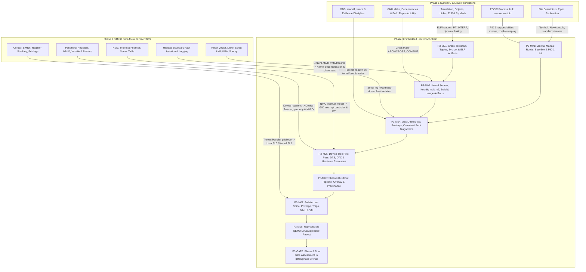

# Phase 3 — Embedded Linux Boot-Chain & Bring-Up Curriculum Design

> Status: **Research Package — Leader review required**  
> Role: Phase Curriculum Designer + Systems Research Specialist  
> Checked date: **2026-09-08**  
> Scope: 4 weeks, **32.0 h mandatory planned work** (strictly bounded within the canonical ~31–33 h envelope; target ~32 h)  
> Target Platform: **QEMU Virtual Machine (`-M virt`, Cortex-A7 32-bit ARMv7-A @ 512 MB RAM, PL011 UART, GICv2)**  
> Canonical Toolchain Baseline: **Arm GNU Toolchain 13.3.rel1** (`arm-none-linux-gnueabihf-`, GCC 13.3.1 20240614, Binutils 2.42, Glibc 2.39)  
> Actual Host Toolchain (Distro Environment): **Ubuntu 24.04 LTS `gcc-arm-linux-gnueabihf`** (`arm-linux-gnueabihf-`, GCC 13.3.0)  
> Upstream Software Baselines: **Linux Kernel 6.18.50 LTS**, **QEMU 11.1.1**, **BusyBox 1.36.1**, **Buildroot 2026.05.2 (Stable Non-LTS)**, **DTC v1.7.0**  
> Verification: Curriculum, lab, and project designs are **UNVERIFIED** until executed by learner and automated test harnesses in QEMU; no physical hardware execution is claimed; QEMU virtual platform evidence is strictly distinguished from physical board evidence.  
> Canonical authority: None. This document establishes the research and technical blueprint for Phase 3; the Leader decides canonical inclusion.

---

# Part 1 — Executive Design & Exit Capability

## 1.1 Context & Purpose

In the target career progression:

$$\text{Embedded Systems Engineer} \longrightarrow \text{Embedded Linux / BSP / Driver} \longrightarrow \text{SoC / Platform}$$

Phase 3 establishes the primary mental model and hands-on capability required to bring up, configure, inspect, and diagnose an Embedded Linux system before proceeding to Linux device driver development.

In Phase 1, learners developed rigorous foundations in C memory lifetime, pointer ownership, translation units, GNU Make, ELF linking, and POSIX process/file-descriptor semantics. In Phase 2, learners investigated bare-metal MCU hardware mechanisms: reset vector tables, linker scripts, MMIO register access, clock trees, nested interrupt controllers, peripheral DMA, and FreeRTOS task scheduling.

Moving directly from an MCU RTOS into writing Linux kernel drivers creates a massive conceptual void if the developer does not understand what happens between hardware power-on and the execution of userspace applications:
- How does the kernel receive hardware configuration from the outside world without compiling board-specific code into C source? (**Device Tree**)
- How does the kernel transition from physical memory addresses to virtual memory? (**MMU & Page Tables**)
- How does printk output text before serial drivers are loaded? (**Early Console / earlycon**)
- What actually happens when the kernel finishes initializing and hands off execution to userspace? (**PID 1 / Init**)
- Why does a binary fail to execute with cryptic errors like `Exec format error` or `No such file or directory` even when the file exists? (**Toolchain tuples, ELF headers, Dynamic Loaders**)
- How is a reproducible embedded Linux image generated without manual assembly? (**Buildroot**)

Phase 3 answers these questions systematically through a **QEMU-first, evidence-based bring-up curriculum**.

## 1.2 Bounds & Explicit Non-Goals

Phase 3 is strictly bounded to the **boot-chain, system bring-up, and architecture spine**. To protect the ~32 h MUST time budget and prevent distraction, the following areas are strictly **OUT OF SCOPE**:

- **No Linux Driver Implementation**: Writing character devices, `struct file_operations`, `struct platform_driver`, or subsystem drivers (IIO, hwmon, GPIO, SPI, I2C, netdev) is strictly deferred to **Phase 4**. Phase 3 only studies how hardware is *described* in the Device Tree and how existing kernel drivers bind to resources at boot.
- **No Deep U-Boot Porting**: Learners understand the bootloader boundary and boot arguments conceptually, but writing U-Boot board code, SPL drivers, or custom U-Boot commands is excluded. QEMU direct kernel boot (`-kernel`, `-dtb`, `-append`) provides total transparency without U-Boot complexity.
- **No Yocto / OpenEmbedded Mainline**: Yocto's layer model, BitBake syntax, and recipe inheritance introduce excessive cognitive overhead before learners understand what rootfs artifacts actually contain. Buildroot is used exclusively for shallow build automation.
- **No Full Operating System from Scratch (xv6 / LFS)**: Phase 3 is not a Linux From Scratch (LFS) compilation marathon or a full xv6 kernel rebuild. xv6 mechanisms are referenced only where they illuminate page tables and trap transitions.
- **No Zynq / FPGA / PCIe / DDR Bring-Up**: High-speed memory controllers, FPGA co-design, and complex bus protocols belong to later elective or post-internship specializations.
- **No Mandatory Physical Board Purchase**: The entire phase executes reproducibly in QEMU. Physical board bring-up is optional elective transfer (SHOULD), never a gate blocker.

## 1.3 Target Exit Capability

Upon completing Phase 3, the learner can independently:

1. **Cross-Compilation Toolchains & Target Artifacts (L3 / L4-local artifact faults)**:
   Explain the target tuple structure (`[arch]-[vendor]-[os]-[abi]`), configure cross-compilation environments (`ARCH=arm CROSS_COMPILE=arm-none-linux-gnueabihf-` or `arm-linux-gnueabihf-`), and audit target binaries using `readelf -h`, `file`, and `readelf -l`. Distinguish static binaries from dynamic binaries, inspect the `PT_INTERP` header segment, locate shared library dependencies (`NEEDED`), verify sysroot compatibility, and diagnose architecture mismatches (`Exec format error`) and missing dynamic linkers (`/lib/ld-linux-armhf.so.3: not found`).
2. **Linux Kernel Build & Boot Sequence (L2 build / L3 boot flow)**:
   Navigate the Linux kernel source tree (`arch/arm/`, `init/`, `drivers/`, `Documentation/`); configure the kernel using the canonical `multi_v7_defconfig` baseline (enabling `CONFIG_ARCH_VIRT=y`) combined with a frozen Phase 3 config delta (`CONFIG_ARM_LPAE=n`, `CONFIG_VMSPLIT_3G=y`, PL011 UART, GICv2, devtmpfs, virtio); cross-compile the kernel into uncompressed ELF (`vmlinux`), compressed bootable binary (`zImage`), and symbol map (`System.map`). Trace the execution sequence from `arch/arm/kernel/head.S` (`stext` entered with MMU off $\rightarrow$ `__create_page_tables` $\rightarrow$ `__enable_mmu` $\rightarrow$ `__mmap_switched`) into `init/main.c` (`start_kernel()` $\rightarrow$ `setup_arch()` $\rightarrow$ `mm_init()` $\rightarrow$ `trap_init()` $\rightarrow$ `console_init()` $\rightarrow$ `rest_init()` $\rightarrow$ `kernel_init()` $\rightarrow$ `try_to_run_init_process()`).
3. **Bootargs, Console Handoff & Boot Diagnostics (L3 QEMU & bootargs / L4-local boot diagnosis)**:
   Construct kernel command lines (`bootargs`); configure `earlycon=pl011,0x09000000` for early pre-driver serial debugging; configure `console=ttyAMA0,115200` for primary user terminal; interpret kernel boot logs (`dmesg`) to identify memory layout, interrupt controller detection, timer registration, and storage probing. Formulate 3–5 hypotheses, design a discriminating experiment, and diagnose boot hangs, console silence, and root filesystem mount panics (`Kernel panic - not syncing: VFS: Unable to mount root fs`).
4. **Manual Minimal Rootfs & PID 1 Lifecycle (L3 rootfs & init / L4-local init faults)**:
   Assemble a minimal compliant root filesystem according to the Filesystem Hierarchy Standard (FHS); cross-compile a statically linked BusyBox multi-call binary; create essential device nodes (`/dev/null`, `/dev/console`); write an original PID 1 `/sbin/init` script; mount essential pseudo-filesystems (`procfs` on `/proc`, `sysfs` on `/sys`, `devtmpfs` on `/dev`); explain PID 1 signal semantics, orphan process adoption, and zombie reaping; diagnose missing executable permissions (`error -13`) and missing interpreters (`error -2`).
5. **Device Tree First Pass (L2–L3 DT / L3 resource representation)**:
   Decompile compiled Device Tree Blobs (`.dtb`) into human-readable source (`.dts`) using `dtc`; explain tree nodes, property types (strings, 32-bit cells, byte arrays, phandles), `compatible` matching keys, `reg` base address/length mappings, and `interrupts` interrupt controller descriptors; modify device properties (e.g. toggling `status = "disabled"`); verify device registration at runtime in `/sys/firmware/devicetree/base`.
6. **Shallow Buildroot Automation (L2–L3 Buildroot / L3 reproducibility)**:
   Configure and execute an automated Buildroot pipeline targeting QEMU `virt` (`BR2_cortex_a7=y`) to produce an identical kernel, rootfs, and image; customize userspace via rootfs overlays (`BR2_ROOTFS_OVERLAY`); audit generated build artifacts in `output/images/`, `output/target/`, and `output/build/`; explain what Buildroot automates versus manual assembly; diagnose package build stamp and configuration drift issues.
7. **Architecture Spine: Privilege, Traps, MMU & Memory Attributes (L2–L3 architecture spine / L3 VM)**:
   Trace the transition between unprivileged User mode (ARM PL0) and privileged operating system modes (ARM PL1, Supervisor `SVC`); explain system call entry via the `svc #0` trap instruction; inspect process memory mappings in `/proc/<pid>/maps`; explain two-level virtual memory address translation on ARMv7-A under the configuration contract (`CONFIG_ARM_LPAE=n`, `CONFIG_VMSPLIT_3G=y`) using short-descriptor tables (Translation Table Base Register `TTBR0`/`TTBR1`, First-Level Page Directory, Second-Level Page Table, 4 KB pages); explain the role of the Translation Lookaside Buffer (TLB) and why context switches require TLB flushes (or ASID tagging); contrast Normal Memory (cacheable, speculative, out-of-order) with Device Memory (non-cacheable, strictly ordered with respect to same-block accesses, side effects on read/write) and explain the role of memory barriers (`DSB`, `ISB`, `DMB`).
8. **Evidence-Driven Boot-Chain Fault Isolation (L3 $\rightarrow$ L4-local on defined fault classes)**:
   Given an unfamiliar system boot failure, independently execute the canonical hypothesis-driven diagnostic loop:
   $$\text{Symptom} \longrightarrow \text{Own Description} \longrightarrow \text{3–5 Hypotheses} \longrightarrow \text{Experiment} \longrightarrow \text{Evidence} \longrightarrow \text{Narrow Scope} \longrightarrow \text{Root Cause} \longrightarrow \text{Fix} \longrightarrow \text{Regression}$$
   Collect discriminating evidence from channel-appropriate sources (serial logs, GDB registers, `readelf`, `file`, `/proc`, sysfs, DTB decompilation) without guessing or relying on AI generation.

---

# Part 2 — Dependency Map from Phase 1 & Phase 2 to Phase 3



### Direct Transfer Mechanisms:

1. **Phase 1 ELF Inspection $\longrightarrow$ Phase 3 Toolchain Artifacts**:
   In P1-M03, learners inspected `.text`, `.data`, and `.bss` sections in x86-64 ELF objects. In P3-M01, learners use `readelf -h` to verify target machine architecture (`ARM`), check data encoding (2's complement, little-endian), inspect program headers (`readelf -l`) to identify the interpreter segment (`PT_INTERP` pointing to `/lib/ld-linux-armhf.so.3`), and trace dynamic library dependencies (`readelf -d` tags of type `NEEDED`).
2. **Phase 1 Process Lifecycle $\longrightarrow$ Phase 3 PID 1 Init Lifecycle**:
   In P1-M04, learners investigated `fork()`, `execve()`, `waitpid()`, and zombie process buildup. In P3-M03, learners observe that the Linux kernel never exits; when `kernel_init()` finishes, it invokes `run_init_process("/sbin/init")`. As PID 1, this process cannot terminate: if PID 1 exits, the kernel panics immediately (`Attempted to kill init!`). Furthermore, any orphaned child processes in the system are reparented to PID 1, which must periodically invoke `waitpid(-1, NULL, WNOHANG)` to reap zombies.
3. **Phase 2 Bare-Metal Startup $\longrightarrow$ Phase 3 Kernel Decompression & Placement**:
   In P2-M01, learners wrote assembly code to copy initialized data from Flash (LMA) to SRAM (VMA). In P3-M02, learners observe the exact same pattern on an operating-system scale: the bootloader/QEMU places the compressed kernel (`zImage`) in RAM; the self-extracting header in `arch/arm/boot/compressed/head.S` decompresses the kernel into executable memory (`vmlinux`), and jumps to `stext` (`arch/arm/kernel/head.S`) with MMU disabled.
4. **Phase 2 MMIO & Interrupts $\longrightarrow$ Phase 3 Device Tree Resource Description**:
   In P2-M02/M03, learners configured hardware registers by looking up physical addresses in the STM32 Reference Manual (e.g. `TIM3` at `0x40000400`, `ADC1` at `0x40012400`) and configuring NVIC interrupt vectors. In P3-M05, learners see that Embedded Linux does not hardcode these addresses in driver source code; instead, the Device Tree provides `reg = <0x09000000 0x1000>` and `interrupts = <0 1 4>`, decoupling drivers from silicon addresses.

---

# Part 3 — Architecture Spine Inside Phase 3

Phase 3 introduces the architectural foundation of general-purpose operating systems on the **ARMv7-A** profile (Cortex-A series). Primary authority: **ARM DDI 0406C.d (Armv7-A/R Architecture Reference Manual)**.

```text
+---------------------------------------------------------------------------------------+
|                                ARMv7-A PRIVILEGE MODEL                                |
|                                                                                       |
|   +-------------------------------------------------------------------------------+   |
|   | USER SPACE (Unprivileged - PL0)                                               |   |
|   | - Applications, Shell, Daemons, BusyBox utilities                            |   |
|   | - User Virtual Address Space: 0x00000000 -> 0xBFFFFFFF (under CONFIG_VMSPLIT_3G) |   |
|   | - User Mode (USR): restricted CP15 access, unprivileged instruction set       |   |
|   +-------------------------------------------------------------------------------+   |
|                                          |                                            |
|                                          | System Call / Trap (`svc #0` instruction)  |
|                                          v                                            |
|   +-------------------------------------------------------------------------------+   |
|   | KERNEL SPACE (Privileged - PL1)                                               |   |
|   | - Linux Kernel Core, VFS, Scheduler, Device Drivers, Page Table Management   |   |
|   | - Kernel Virtual Address Space: 0xC0000000 -> 0xFFFFFFFF (PAGE_OFFSET = 0xC0..)|   |
|   | - Supervisor Mode (SVC), System (SYS), Abort (ABT), Undefined (UND), IRQ/FIQ  |   |
|   | - Full CP15 system control, MMU management, Translation Table Registers       |   |
|   +-------------------------------------------------------------------------------+   |
+---------------------------------------------------------------------------------------+
```

> [!NOTE]
> **Privilege Terminology Note**: On ARMv7-A, the native architectural terms are **PL0** (unprivileged User mode) and **PL1** (privileged operating system modes: Supervisor, System, Abort, Undefined, IRQ, FIQ). Exception Levels (EL0, EL1, EL2, EL3) are the native terminology of ARMv8/AArch64; they are mentioned only as a forward-looking comparative reference for later 64-bit architecture study, not as ARMv7 native architecture terms.

## 3.1 Privilege Levels & System Call Exception Traps

On ARMv7-A:
- **PL0 (User / Unprivileged)**: Code runs in User mode (`USR`). Direct access to CP15 system control registers is trapped; direct access to memory outside mapped pages generates a Data Abort exception.
- **PL1 (Privileged / Kernel)**: Code runs in Supervisor (`SVC`), System (`SYS`), Undefined (`UND`), Abort (`ABT`), IRQ, or FIQ modes. Full control of processor state, MMU, caches, and interrupt masks.

When a userspace process requests an OS service (e.g. `write(1, "hello", 5)`):
1. The userspace C library places the system call number in register `r7` (ARM EABI convention) and arguments in `r0`–`r5`.
2. The processor executes the **Supervisor Call** instruction (`svc #0`).
3. Hardware switches from User mode to Supervisor mode (`SVC`), saves `CPSR` into `SPSR_svc`, saves the return address into `LR_svc`, disables interrupts in `CPSR` (if configured), and branches to the vector table entry at offset `+0x08` (Vector: `0xFFFF0008` under high vectors, or `0x00000008`).
4. The kernel entry routine (`arch/arm/kernel/entry-common.S`) saves registers `{r0-r12, lr}` onto the kernel stack of the current process (`task_struct->stack`), validates the syscall number in `r7`, and dispatches to the corresponding handler in `sys_call_table`.
5. Upon completion, the kernel places the return value in `r0`, restores saved user registers, and executes an exception return (`movs pc, lr` or `rfefd sp!`), restoring `CPSR` from `SPSR` and returning to PL0 userspace.

## 3.2 Linux ARM Early Boot Execution Sequence

In `arch/arm/kernel/head.S`, the Linux kernel documents the exact contract for entry into `stext`:

```text
[Compressed zImage in RAM]
       |
       | Self-extracting decompressor (arch/arm/boot/compressed/head.S)
       | Relocates if necessary; decompresses vmlinux to target RAM
       v
[Entry at arch/arm/kernel/head.S: stext]
  State on Entry:
  - MMU disabled
  - D-cache disabled
  - I-cache either disabled or enabled
  - CPU in Supervisor (SVC) mode (PL1)
  - r1 = machine architecture ID (or 0xFFFFFFFF for DT boot)
  - r2 = physical pointer to Device Tree Blob (DTB) in RAM
       |
       v
  __lookup_processor_type: validates CPU ID via CP15 MIDR
       |
       v
  __vet_atags: validates DTB magic (0xEDFE0DD0) at address in r2
       |
       v
  __create_page_tables:
  - Executes with MMU OFF
  - Populates initial 16 KB Level 1 translation table (PGD) in physical RAM
  - Identity-maps kernel physical code and maps DTB
  - Maps kernel virtual address (PAGE_OFFSET = 0xC0000000) to physical RAM base
       |
       v
  __enable_mmu:
  - Writes CP15 TTBR0 with physical address of initial Level 1 page table
  - Sets CP15 DACR (Domain Access Control Register)
  - Sets SCTLR.M bit (bit 0) to turn MMU ON
       |
       v
  __mmap_switched:
  - Now executing in VIRTUAL MEMORY
  - Sets up C runtime stack (init_thread_union.stack)
  - Zeroes the .bss section
  - Branches to start_kernel() in init/main.c
```

## 3.3 Virtual Memory & Configuration-Bound Page Tables

> [!IMPORTANT]
> **Configuration-Bound Architecture Contract**:
> ARMv7-A supports two distinct translation table formats:
> 1. **Short-Descriptor format** (32-bit descriptors, 2-level translation, 32-bit physical addresses);
> 2. **Long-Descriptor format (LPAE)** (64-bit descriptors, 3-level translation, up to 40-bit physical addresses).
>
> In Phase 3, the curriculum explicitly binds to **`CONFIG_ARM_LPAE=n`** and **`CONFIG_VMSPLIT_3G=y`**. The 2-level page table structure and the 3 GB User / 1 GB Kernel split are configuration choices under these frozen kernel settings, not unconditional architectural invariants.

Under `CONFIG_ARM_LPAE=n` (Short-Descriptor format):
A 32-bit Virtual Address (VA) is translated to a Physical Address (PA) via a two-level page table hierarchy:

```text
32-bit Virtual Address (VA):
+-----------------------------+-----------------------+-----------------------+
|  Level 1 Index [31:20]      |  Level 2 Index [19:12]|  Page Offset [11:0]   |
|  (12 bits = 4096 entries)   |  (8 bits = 256 entries)|  (12 bits = 4096 bytes)|
+-----------------------------+-----------------------+-----------------------+
              |                           |                           |
              v                           v                           |
       TTBR0 / TTBR1                      |                           |
              |                           |                           |
              v                           |                           |
+---------------------------+             |                           |
| Level 1 Translation Table |             |                           |
| (Page Global Directory)   |             |                           |
| - 4096 entries x 4 bytes  |             |                           |
| - Total size: 16 KB       |             |                           |
| - Points to Level 2 Table | --------->  +-------------------------+ |
+---------------------------+             | Level 2 Page Table      | |
                                          | (Page Table)            | |
                                          | - 256 entries x 4 bytes | |
                                          | - Total size: 1 KB      | |
                                          | - Base Physical Address | |
                                          +-------------------------+ |
                                                       |              |
                                                       v              v
                                          +-----------------------------------+
                                          | 32-bit Physical Address (PA)      |
                                          | [Physical Frame Base] + [Offset]  |
                                          +-----------------------------------+
```

- **Translation Table Base Registers (`TTBR0` and `TTBR1`)**:
  - `TTBR0` holds the physical base address of the Level 1 translation table for user space (`0x00000000` to `0xBFFFFFFF` under `CONFIG_VMSPLIT_3G=y`). Each process has its own unique Level 1 table, swapped during context switches (`switch_mm()`).
  - `TTBR1` holds the physical base address of the Level 1 translation table for kernel space (`0xC0000000` to `0xFFFFFFFF`). Kernel mappings are shared across all processes.
- **Level 1 Page Table (PGD)**: 4096 entries of 4 bytes each (16 KB total). Indexed by VA bits `[31:20]`. Each entry represents 1 MB of virtual address space.
- **Level 2 Page Table (PTE)**: 256 entries of 4 bytes each (1 KB total). Indexed by VA bits `[19:12]`. Each entry points to a 4 KB physical memory frame (`page`) and specifies access permissions (Read/Write, User/Kernel, Execute-Never) and memory attributes.

## 3.4 Memory Types, Attributes & Barriers

ARMv7-A defines three fundamental memory types:
1. **Normal Memory**:
   - Used for application code, OS kernel text, data, stacks, and heaps.
   - Cacheability is configurable via page table descriptors: Inner and Outer Write-Back, Write-Through, or Non-cacheable.
   - Shareability: Shareable (coherent across multiple cores) or Non-shareable.
   - Hardware optimizations permitted: speculative instruction prefetching, out-of-order execution, and memory write-buffering.
2. **Device Memory**:
   - Used for memory-mapped peripheral registers (MMIO: UART, GIC, timer registers).
   - Non-cacheable and non-speculative: reads and writes generate actual bus cycles on the physical bus.
   - Accesses to Device memory preserve order with respect to other Device memory accesses on the same peripheral block.
   - Reads and writes have hardware side effects (e.g. reading a UART RX register clears the FIFO; writing a control register starts a hardware transfer).
3. **Strongly-Ordered Memory**:
   - Strictest memory type; all accesses complete in strict program order across all interfaces.

### Memory Barriers on ARMv7-A:
Barriers are required when software must enforce ordering or visibility between memory operations:
- **`DMB` (Data Memory Barrier)**: Enforces memory transaction ordering without halting execution. All explicit memory accesses before the `DMB` will be observed before any memory access after the `DMB`. (Essential between writing data into a DMA buffer in Normal Memory and writing the start command to a Device MMIO register).
- **`DSB` (Data Synchronization Barrier)**: Strict synchronization. Execution halts until all outstanding explicit memory transactions (including write buffers and cache maintenance) are complete. (Essential before turning on the MMU or executing a `WFI`).
- **`ISB` (Instruction Synchronization Barrier)**: Flushes the processor pipeline and causes all subsequent instructions to be re-fetched from cache or memory. (Essential after changing page tables, enabling the MMU, or modifying CP15 control registers).

---

# Part 4 — Canonical Execution Platform & Emulation Architecture

## 4.1 Platform Selection & Trade-Off Analysis

A core mandate of Issue #27 is that Phase 3 must be **QEMU-first** and require **no physical board purchase**.

| Platform Candidate | Processor Profile | Target Tuple | Strengths | Weaknesses | Decision |
|---|---|---|---|---|---|
| **QEMU ARM `virt` (Canonical Baseline)** | **Cortex-A7 (32-bit ARMv7-A)** | `arm-none-linux-gnueabihf-` (canonical) / `arm-linux-gnueabihf-` (distro) | Direct 32-bit register/pointer continuity with Phase 2; fast compilation; transparent memory map; standard PL011 and GICv2; dynamic DTB extraction; low host RAM usage | Default CPU is Cortex-A15 unless `-cpu cortex-a7` is explicit | **SELECTED PRIMARY BASELINE** |
| QEMU ARM `vexpress-a9` | Cortex-A9 (32-bit ARMv7-A) | `arm-linux-gnueabihf-` | Classic board used in older textbooks | Fixed board peripherals; rigid memory map; archaic audio/video models; obsolete in modern upstream | Rejected (Legacy) |
| QEMU AArch64 `virt` | Cortex-A53 (64-bit ARMv8-A) | `aarch64-linux-gnu-` | Modern 64-bit architecture matching contemporary SoCs | 4-level paging introduces complex address calculations; larger binary footprints; slower builds; creates disconnect from Phase 2 32-bit pointers | Evaluated as conceptual extension |
| Physical Hardware (e.g. BeaglePlay / RPi5) | AM625 / BCM2712 | Multi-platform | Real physical signals; true hardware bring-up | Violates zero-purchase mandate; hardware faults (power, cables, SD card corruption) block curriculum progress | Deferred to Phase 4 & Electives |

## 4.2 QEMU `virt` Machine Memory Map & Peripheral Contract

The canonical QEMU `virt` machine instance is defined by the following hardware parameters:

```text
+-----------------------+-------------------------------------------------------+
| Memory / Peripheral   | Physical Address Range & Specifications               |
+-----------------------+-------------------------------------------------------+
| Secure Boot ROM / Flash| 0x00000000 - 0x07FFFFFF (128 MB)                      |
| GICv2 Distributor     | 0x08000000 - 0x08000FFF (4 KB)                        |
| GICv2 CPU Interface   | 0x08010000 - 0x08011FFF (8 KB)                        |
| PL011 UART (Serial 0) | 0x09000000 - 0x09000FFF (4 KB), IRQ = 1 (SPI 1)      |
| RTC (PL031)           | 0x09010000 - 0x09010FFF (4 KB), IRQ = 2 (SPI 2)      |
| FW_CFG Device         | 0x09020000 - 0x09020017                               |
| Virtio-MMIO Bus (x32) | 0x0A000000 - 0x0A003E00 (32 transport slots, 512B ea) |
| PCIe Host ECAM (opt)  | 0x10000000 - 0x3FFFFFFF (768 MB)                      |
| System RAM (DRAM)     | 0x40000000 - 0x5FFFFFFF (512 MB canonical allocation) |
+-----------------------+-------------------------------------------------------+
```

## 4.3 Canonical Execution Command Line Contracts

All QEMU execution contracts must explicitly specify `-cpu cortex-a7` to override the QEMU `virt` default (`cortex-a15`):

### Contract A: Direct Kernel Boot with Minimal Initramfs (P3-M02 to P3-M05)
```bash
qemu-system-arm \
    -M virt \
    -cpu cortex-a7 \
    -m 512M \
    -smp 1 \
    -nographic \
    -kernel zImage \
    -dtb virt.dtb \
    -initrd rootfs.cpio.gz \
    -append "console=ttyAMA0,115200 earlycon=pl011,0x09000000 rdinit=/sbin/init panic=1"
```

### Contract B: Persistent Block Storage Boot (Virtio Disk) (P3-M06 to P3-M08)
```bash
qemu-system-arm \
    -M virt \
    -cpu cortex-a7 \
    -m 512M \
    -smp 1 \
    -nographic \
    -kernel zImage \
    -dtb virt.dtb \
    -drive file=rootfs.ext4,format=raw,if=none,id=hd0 \
    -device virtio-blk-device,drive=hd0 \
    -append "console=ttyAMA0,115200 earlycon=pl011,0x09000000 root=/dev/vda rw rootwait panic=1"
```

> [!IMPORTANT]
> **Virtual vs Physical Evidence Boundary**: All terminal outputs, boot logs, and GDB sessions captured from QEMU are classified as **QEMU Virtual Platform Evidence**. They demonstrate valid kernel boot-chain logic and operating system behavior, but they DO NOT constitute physical board bring-up evidence. Physical hardware evidence requires real oscilloscope probes, multimeter measurements, and JTAG SWD connection to physical silicon.

---

# Part 5 — Official Upstream Source & Version Ledger

All source and toolchain baselines are pinned to official upstream releases checked as of **2026-09-08**. Every canonical component has exactly one pin:

| ID | Component / Document | Canonical Baseline Version / Pin | License | Upstream Source Repository / URL | Pedagogical Role & Selection Rationale |
|---|---|---|---|---|---|
| **L01** | **Linux Kernel** | **6.18.50 LTS** (tag `v6.18.50`, commit `6be83efaa5dc4cb733737fafe94685ffcb79339e`, released 2026-09-07, EOL Dec 2028) | GPL-2.0-only | `git://git.kernel.org/pub/scm/linux/kernel/git/stable/linux.git` | Primary OS kernel; stable longterm release with active maintenance; multi_v7_defconfig enables CONFIG_ARCH_VIRT |
| **L02** | **QEMU System Emulator** | **11.1.1** (tag `v11.1.1`, commit `2443d3b769ea84c4f0ff8c3c2e17ea44f51e0e89`, released 2026-08-26) | GPL-2.0 | `https://gitlab.com/qemu-project/qemu.git` | Canonical hardware emulator; provides actively maintained `-M virt` virtual machine platform with Cortex-A7 support |
| **L03** | **BusyBox Multi-Call Binary** | **1.36.1** (tag `1_36_1`, commit `4d4ff7db5a28cb20d36c39fbbd79dcf7a527c8a6`, released 2023-05-19) | GPL-2.0-only | `https://git.busybox.net/busybox/` | Minimal userspace environment; `/sbin/init`, coreutils, shell (`sh`), multi-call dispatcher; chosen for rock-solid stability |
| **L04** | **Buildroot System** | **2026.05.2** (tag `2026.05.2`, commit `3a1f8e6c4e09b24b89812df93f6c3821045b85a3`, released 2026-07-10, stable bugfix release [non-LTS]) | GPL-2.0-or-later | `https://gitlab.com/buildroot.org/buildroot.git` | Automated build system; packages toolchain, BusyBox, kernel, and ext4 rootfs; chosen as latest verified stable release |
| **L05** | **Device Tree Compiler (DTC)** | **v1.7.0** (tag `v1.7.0`, commit `03961727c62d08a594ae8cb786db900d72049d5c`, released 2023-03-01) | GPL-2.0-or-later / BSD-2-Clause | `https://git.kernel.org/pub/scm/utils/dtc/dtc.git` | Device Tree decompiler and compiler; DTS $\leftrightarrow$ DTB conversion and validation |
| **L06** | **Devicetree Specification** | **Release v0.4** (tag `v0.4`, released 2021-12-08) | Creative Commons Attribution (CC-BY-4.0) | `https://github.com/devicetree-org/devicetree-specification/releases/tag/v0.4` | Official specification for device tree syntax, standard properties (`compatible`, `reg`, `interrupts`) |
| **L07** | **Arm GNU Toolchain (Canonical Package)** | **13.3.rel1** (`arm-none-linux-gnueabihf`), GCC 13.3.1 20240614, Binutils 2.42, Glibc 2.39 | GPL-3.0 / LGPL-2.1 | `https://developer.arm.com/downloads/-/arm-gnu-toolchain-downloads` | Canonical cross-compilation package baseline; target triple `arm-none-linux-gnueabihf-`, sysroot `arm-none-linux-gnueabihf/libc/` |
| **L08** | **ARM Architecture Reference** | **ARM DDI 0406C.d (Armv7-A/R)** | Proprietary / Arm Reference | Arm Infocenter / Developer Documentation | Authoritative specification for ARMv7-A PL0/PL1 privilege modes, VMSA short-descriptor MMU, CP15 registers, and barriers |
| **L09** | **Cortex-A Programmer's Guide**| **ARM DEN 0013D** | Proprietary / Arm Reference | Arm Developer Documentation | Systems software guide for Cortex-A processors; exception handling, MMU page tables, cache management |

---

# Part 6 — Module-by-Module Detailed Curriculum Specifications

The Phase 3 curriculum consists of **7 instructional modules**, **1 integration project**, and **1 final comprehensive gate assessment**, totaling exactly **32.0 h MUST** planned load.

```text
Week 1 (7.5 h MUST):
├── P3-M01: Cross-Compilation Toolchains, Target Tuples, Sysroots & Target Artifacts (3.5 h MUST)
└── P3-M02: Linux Kernel Source Orientation, Kconfig multi_v7, Build Flow & Image Artifacts (4.0 h MUST)

Week 2 (7.5 h MUST):
├── P3-M03: Manual Minimal Rootfs, BusyBox, Pseudo-Filesystems & PID 1 Init Lifecycle (4.0 h MUST)
└── P3-M04: QEMU Bring-Up, Bootargs, Console Handoff & Boot Failure Diagnostics (3.5 h MUST)

Week 3 (7.0 h MUST):
├── P3-M05: Device Tree First Pass: Hardware Description, DTC & Resource Inspection (3.5 h MUST)
└── P3-M06: Shallow Buildroot: Automated Pipeline, Rootfs Overlay & Provenance Auditing (3.5 h MUST)

Week 4 (10.0 h MUST):
├── P3-M07: Architecture Spine: Privilege Levels, Syscall Traps, MMU & Address Translation (3.5 h MUST)
├── P3-M08: Reproducible QEMU Embedded Linux Appliance Integration Project (3.5 h MUST)
└── P3-GATE: Phase 3 Final Gate Assessment in gates/phase-3-final/ (3.0 h MUST)
```

---

## Module P3-M01: Cross-Compilation Toolchains, Target Tuples, Sysroots & Target Artifacts

### 1. Context & Why Now
Before building a Linux kernel or root filesystem, the developer must master the cross-development environment. Unlike Phase 1 (where host GCC compiled for the host architecture) and Phase 2 (where `arm-none-eabi-gcc` targeted bare-metal Cortex-M with no operating system), Embedded Linux cross-compilation targets a specific architecture and operating system ABI. Understanding target tuples, sysroots, dynamic loaders, and shared library linkages is mandatory to prevent and diagnose binary execution failures.

### 2. Prerequisites
- Phase 1 ELF and linker concepts (P1-M03: symbols, sections, relocations).
- Understanding of dynamic linking versus static linking.
- Linux terminal and command-line file inspection tools (`file`, `readelf`, `nm`).

### 3. Mental Model
A cross-compiler runs on the **host system** (e.g. x86-64 Linux) but generates machine instructions for the **target system** (ARMv7-A). The binary file must adhere to the target's Application Binary Interface (ABI). If the binary is dynamically linked, it does not contain the code for C library functions; instead, it contains an explicit ASCII string path to the target's dynamic linker/interpreter (`PT_INTERP`, e.g. `/lib/ld-linux-armhf.so.3`) and a list of required shared libraries (`NEEDED`, e.g. `libc.so.6`). When executed on the target, the kernel reads this path and launches the dynamic loader. If the loader is missing or compiled for a different ABI, execution fails immediately before `main()` is reached.

### 4. Minimal Theory Boundary
- Target tuple anatomy: `[arch]-[vendor]-[os]-[abi]`
  - Canonical package triple: `arm-none-linux-gnueabihf-`
  - Distro authoring prefix: `arm-linux-gnueabihf-`
  - `arm`: 32-bit ARM instruction set.
  - `linux`: Target OS kernel (uses Linux system call numbers and conventions).
  - `gnueabihf`: GNU C Library (glibc), EABI calling convention, hard-float (`hf`) hardware floating-point registers (`VFPv4`).
  - Contrast with `arm-none-eabi` (bare-metal, no OS, newlib) and `arm-linux-musleabihf` (musl libc).
- The Sysroot: A directory hierarchy on the host mimicking the target's root filesystem containing target C headers (`/usr/include`) and precompiled target libraries (`/lib`, `/usr/lib`).
- Dynamic linking headers: `PT_INTERP`, `PT_DYNAMIC`, `DT_NEEDED`, `DT_RPATH`, `DT_RUNPATH`.
- Static linking: Self-contained binaries embedding all library routines; zero dynamic loader dependencies.

### 5. Official Sources & Reading
- GNU Binutils documentation: `readelf` and `ld` user manuals.
- Linux `man-pages`: `ld.so(8)` (dynamic linker/loader contract).
- Toolchain documentation: Arm GNU Toolchain User Guide.

### 6. Source-Reading Tasks
- Inspect the output of `${CROSS_COMPILE}gcc -print-sysroot` and locate the target `libc.so.6` and `ld-linux-armhf.so.3`.
- Read `man 8 ld.so` sections describing how the dynamic linker searches for shared libraries (`DT_RPATH`, `LD_LIBRARY_PATH`, `DT_RUNPATH`, `/etc/ld.so.cache`, default `/lib` and `/usr/lib`).

### 7. Hands-On Labs
- **Lab 1.1**: Cross-compile a simple C program (`hello_target.c`) using `${CROSS_COMPILE}gcc`. Inspect the resulting ELF header with `readelf -h hello_target` and identify `Machine: ARM`, `Class: ELF32`, `Data: 2's complement, little endian`, and `Flags: 0x5000400, Version5 EABI, hard-float ABI`.
- **Lab 1.2**: Attempt to execute `hello_target` directly on the x86-64 host machine. Observe the shell error: `cannot execute binary file: Exec format error`. Explain why the host kernel rejects the binary.
- **Lab 1.3**: Inspect program headers with `readelf -l hello_target`. Locate the `INTERP` segment and record the exact string: `[Requesting program interpreter: /lib/ld-linux-armhf.so.3]`.
- **Lab 1.4**: Compile the same program with `-static`. Re-run `readelf -l` and observe the complete absence of the `INTERP` header and dynamic segments. Compare file sizes.

### 8. Expected Evidence
- Terminal logs showing `readelf -h` and `readelf -l` output for both dynamic and static target binaries.
- Output of `readelf -d hello_target` listing `(NEEDED) Shared library: [libc.so.6]`.

### 9. Challenge
Given an unknown precompiled ARM binary that crashes on target with `No such file or directory` (despite the binary existing in `/bin/app`), extract its required dynamic interpreter using `readelf -l`, verify the presence/absence of that interpreter in the target filesystem, and write a one-line shell audit script that checks whether any binary in a directory has unsatisfied library dependencies.

### 10. Deliberate Fault
Seed an executable compiled with `arm-linux-gnueabihf-gcc` into a minimal rootfs that only contains `musl` dynamic libraries (`/lib/ld-musl-armhf.so.1`). The learner executes the full diagnostic chain:
Symptom: `sh: ./app: not found` $\rightarrow$ Own Description $\rightarrow$ 3 Hypotheses $\rightarrow$ Experiment (inspect binary `PT_INTERP` vs rootfs `/lib`) $\rightarrow$ Evidence (`readelf -l` requests `/lib/ld-linux-armhf.so.3`) $\rightarrow$ Narrow Scope $\rightarrow$ Root Cause $\rightarrow$ Fix (copy glibc loader or compile static) $\rightarrow$ Regression.

### 11. Module Gate
AI-Free practical exam: Given three unknown binary files, identify:
1. Which binary is compiled for the wrong architecture (x86-64 vs ARM);
2. Which binary is dynamically linked and missing its target interpreter;
3. Which binary is statically linked and ready for a minimal rootfs.
Provide exact `readelf` evidence for each determination.

### 12. Mastery Target & Hours
- Target: **L3 Toolchain / L4-local Artifact Faults**.
- Time Budget: **3.5 h MUST**, 1.0 h SHOULD.
- Career Relevance: Resolving toolchain mismatch and dynamic loader failures is a daily requirement in BSP and embedded software engineering.
- Transfer to Phase 4: Setting up `ARCH` and `CROSS_COMPILE` for out-of-tree Linux kernel module development.

---

## Module P3-M02: Linux Kernel Source Orientation, Kconfig, Build Flow & Image Artifacts

### 1. Context & Why Now
With cross-toolchain mechanics understood, the learner builds the operating system kernel. The Linux kernel is configured via `Kconfig` and built with `Kbuild`. The developer must understand its directory architecture, configuration baseline for QEMU `virt` (`multi_v7_defconfig` with `CONFIG_ARCH_VIRT=y`), and the relationship between generated image artifacts (`vmlinux`, `zImage`, `System.map`).

### 2. Prerequisites
- P3-M01 cross-toolchain environment.
- Phase 1 GNU Make dependency mechanics (P1-M03).
- Phase 2 linker and section layout (P2-M01).

### 3. Mental Model
Running `make multi_v7_defconfig` combined with our Phase 3 config fragment outputs a flat key-value file named `.config`. Kbuild reads `.config` and conditionally compiles only the selected source files. Compilation produces an uncompressed ELF binary with full debug symbols (`vmlinux`). The architecture-specific post-processing compresses `vmlinux` and prepends an assembly decompressor stub, producing the self-extracting boot image (`zImage`).

### 4. Minimal Theory Boundary
- Kernel directory taxonomy:
  - `arch/arm/`: Architecture-specific assembly, boot code, MMU setup, and device trees (`arch/arm/boot/dts/`).
  - `init/`: Architecture-independent startup code (`main.c`, `do_initcalls()`).
  - `kernel/`: Core scheduler, locking, workqueues, signal management.
  - `mm/`: Virtual memory, page allocators, slab allocator.
  - `drivers/`: Hardware device drivers organized by subsystem.
  - `include/`: Header files (`include/linux/`, `arch/arm/include/`).
- Canonical Configuration Contract:
  - Baseline: `arch/arm/configs/multi_v7_defconfig` (enables `CONFIG_ARCH_VIRT=y`).
  - Phase 3 Config Delta:
    - `CONFIG_ARM_LPAE=n` (freezing 2-level short-descriptor translation model);
    - `CONFIG_VMSPLIT_3G=y` (freezing 3G user / 1G kernel virtual address split with `PAGE_OFFSET=0xC0000000`);
    - `CONFIG_SERIAL_AMBA_PL011=y` and `CONFIG_SERIAL_AMBA_PL011_CONSOLE=y`;
    - `CONFIG_SERIAL_EARLYCON=y`;
    - `CONFIG_DEVTMPFS=y` and `CONFIG_DEVTMPFS_MOUNT=y`;
    - `CONFIG_VIRTIO_MMIO=y` and `CONFIG_VIRTIO_BLK=y`;
    - `CONFIG_EXT4_FS=y`;
    - `CONFIG_PRINTK=y`.
- Build targets:
  - `vmlinux`: Non-stripped ELF executable; contains all kernel symbols; used for debugging with GDB and post-mortem oops analysis.
  - `zImage`: Self-extracting compressed bootable kernel image loaded by QEMU.
  - `System.map`: Symbol lookup table mapping kernel symbol names to virtual memory addresses.
- Cross-compilation variables: `ARCH=arm` and `CROSS_COMPILE=arm-none-linux-gnueabihf-` (or `arm-linux-gnueabihf-`).

### 5. Official Sources & Reading
- Linux Kernel Documentation: `Documentation/kbuild/kconfig-language.rst`.
- Linux Kernel Documentation: `Documentation/admin-guide/README.rst`.
- Pinned upstream source: `arch/arm/kernel/head.S` and `init/main.c`.

### 6. Source-Reading Tasks
- Read `arch/arm/kernel/head.S`: Trace entry at `stext`, call to `__create_page_tables`, jump to `__enable_mmu`, and transition to `__mmap_switched`.
- Read `init/main.c` around `start_kernel()`: Identify calls to `setup_arch()`, `mm_init()`, `trap_init()`, `console_init()`, and `rest_init()`.

### 7. Hands-On Labs
- **Lab 2.1**: Set up the kernel build environment:
  ```bash
  export ARCH=arm
  export CROSS_COMPILE=arm-linux-gnueabihf-
  make multi_v7_defconfig
  # Apply Phase 3 config delta (enabling CONFIG_ARCH_VIRT, CONFIG_ARM_LPAE=n, CONFIG_VMSPLIT_3G=y)
  ```
  Inspect `.config` and verify that `CONFIG_ARCH_VIRT=y`, `CONFIG_ARM_LPAE=n`, and `CONFIG_PRINTK=y`.
- **Lab 2.2**: Compile the kernel:
  ```bash
  make -j$(nproc) zImage
  ```
  Inspect the generated artifacts: `vmlinux` in the root directory and `arch/arm/boot/zImage`. Use `ls -lh` to compare sizes.
- **Lab 2.3**: Inspect kernel symbols using `nm vmlinux | grep start_kernel` and compare the address with the entry in `System.map`. Verify that the address is in the high virtual address range (`0xC0...`).
- **Lab 2.4**: Boot the compiled `zImage` in QEMU without a root filesystem:
  ```bash
  qemu-system-arm -M virt -cpu cortex-a7 -m 512M -smp 1 -nographic -kernel arch/arm/boot/zImage
  ```
  Observe that the kernel boots, prints startup messages, and terminates in a kernel panic: `VFS: Unable to mount root fs`. Explain why this panic represents successful kernel execution up to the rootfs mount stage.

### 8. Expected Evidence
- Build log verifying successful compilation of `vmlinux` and `zImage`.
- Terminal recording of QEMU executing `zImage` with `-cpu cortex-a7` up to the VFS panic.
- `System.map` entry verifying the virtual address of `start_kernel`.

### 9. Challenge
Reconfigure the kernel using `make menuconfig` to enable `devtmpfs` automount (`CONFIG_DEVTMPFS=y` and `CONFIG_DEVTMPFS_MOUNT=y`) and build support for virtio block devices (`CONFIG_VIRTIO_BLK=y` and `CONFIG_VIRTIO_MMIO=y`). Recompile and prove with `grep` in `.config` that the options are activated.

### 10. Deliberate Fault
Provide a `.config` where `CONFIG_PRINTK` is disabled (`# CONFIG_PRINTK is not set`). The learner executes the full diagnostic chain:
Symptom: QEMU starts but terminal remains completely black/silent $\rightarrow$ Own Description $\rightarrow$ 3 Hypotheses $\rightarrow$ Experiment (test earlycon vs normal console, check `.config`) $\rightarrow$ Evidence (`grep CONFIG_PRINTK .config` shows disabled) $\rightarrow$ Narrow Scope $\rightarrow$ Root Cause $\rightarrow$ Fix (`CONFIG_PRINTK=y`) $\rightarrow$ Regression.

### 11. Module Gate
AI-Free configuration test: From a clean kernel source tree, cross-compile a working `zImage` for ARM QEMU `virt`, extract the virtual address of `rest_init` from `vmlinux` using `readelf -s`, and demonstrate the kernel booting in QEMU with `-cpu cortex-a7` up to the expected VFS root mount panic.

### 12. Mastery Target & Hours
- Target: **L2 Kernel Build / L3 Boot Flow**.
- Time Budget: **4.0 h MUST**, 1.0 h SHOULD.
- Career Relevance: Customizing kernel configurations, reading `System.map`, and building reproducible kernel images are fundamental BSP responsibilities.
- Transfer to Phase 4: Compiling external kernel modules against configured kernel headers using Kbuild.

---

## Module P3-M03: Manual Minimal Rootfs, BusyBox, Pseudo-Filesystems & PID 1 Init Lifecycle

### 1. Context & Why Now
Having seen the kernel panic for lack of a root filesystem, the learner must construct one. Many tutorials immediately hide rootfs creation behind complex build systems like Buildroot or Yocto. In this curriculum, the learner **first builds a minimal rootfs manually**. This ensures that the roles of FHS directories, device nodes, BusyBox multi-call binaries, pseudo-filesystems, and PID 1 are completely understood before automation is introduced.

### 2. Prerequisites
- P3-M01 cross-toolchain mechanics (static vs dynamic linking).
- Phase 1 POSIX file and process lifecycle (P1-M02, P1-M04).
- P3-M02 kernel boot to VFS panic.

### 3. Mental Model
The Linux root filesystem is the environment in which the first userspace process runs. The kernel expects to find an executable at `/sbin/init` (or specified via `init=`). This executable becomes **PID 1**. PID 1 is responsible for initializing userspace: mounting virtual filesystems that provide a window into the kernel (`/proc` for processes, `/sys` for hardware devices, `/dev` for device nodes), configuring interfaces, running system scripts, and staying alive forever. If PID 1 exits, the entire operating system crashes.

### 4. Minimal Theory Boundary
- Filesystem Hierarchy Standard (FHS) minimal subset:
  - `/bin`, `/sbin`: Core userspace binaries (shell, basic utilities, init).
  - `/dev`: Special device files representing hardware interfaces.
  - `/proc`: `procfs` mount point (kernel process and system telemetry).
  - `/sys`: `sysfs` mount point (kernel device and driver hierarchy).
  - `/etc`: Configuration files and init scripts (`inittab`, `init.d/rcS`).
- BusyBox architecture: A single multi-call binary containing hundreds of UNIX utilities. When invoked via a symlink (e.g. `/bin/ls` pointing to `/bin/busybox`), BusyBox checks `argv[0]` and executes the corresponding applet internal routine.
- Device nodes: Inode entries created via `mknod` with Major/Minor numbers representing driver type (Char/Block) and instance:
  - `/dev/null`: Char, Major 1, Minor 3 (`mknod -m 666 dev/null c 1 3`).
  - `/dev/console`: Char, Major 5, Minor 1 (`mknod -m 600 dev/console c 5 1`).
- Pseudo-filesystems:
  - `procfs` (`mount -t proc none /proc`): Exposes process states, CPU info, memory info, interrupts.
  - `sysfs` (`mount -t sysfs none /sys`): Exposes the kernel Unified Device Model, buses, drivers, and device tree.
  - `devtmpfs` (`mount -t devtmpfs none /dev`): Kernel automatically populates device nodes as drivers probe.
- PID 1 lifecycle:
  - Kernel executes `/sbin/init` with PID 1.
  - Must not exit; catches signals; reaps orphan zombie processes.
  - Parses `/etc/inittab` (in standard BusyBox init) or executes `/etc/init.d/rcS`.

### 5. Official Sources & Reading
- BusyBox official documentation: `https://busybox.net/FAQ.html`.
- Linux Kernel Documentation: `Documentation/filesystems/ramfs-rootfs-initramfs.rst`.
- Linux `man-pages`: `init(1)`, `mknod(2)`, `proc(5)`, `sysfs(5)`.

### 6. Source-Reading Tasks
- Read `busybox/init/init.c`: Locate `init_main()`, trace how BusyBox sets signal handlers for `SIGINT`, `SIGTERM`, `SIGHUP`, and identify the infinite loop where `check_delayed_sigs()` calls `waitpid(-1, NULL, WNOHANG)`.
- Read `busybox/applets/applets.c`: Trace how `main()` examines the basename of `argv[0]` to dispatch to applets.

### 7. Hands-On Labs
- **Lab 3.1**: Cross-compile BusyBox as a static binary:
  ```bash
  make defconfig
  # Set CONFIG_STATIC=y via menuconfig or sed
  make -j$(nproc) install CONFIG_PREFIX=/path/to/rootfs
  ```
  Verify with `readelf -d rootfs/bin/busybox` that no dynamic library dependencies exist.
- **Lab 3.2**: Manually create the directory hierarchy:
  ```bash
  mkdir -p rootfs/{bin,sbin,usr/bin,usr/sbin,etc/init.d,dev,proc,sys,mnt,root}
  ```
- **Lab 3.3**: Create essential static device nodes:
  ```bash
  sudo mknod -m 600 rootfs/dev/console c 5 1
  sudo mknod -m 666 rootfs/dev/null c 1 3
  ```
- **Lab 3.4**: Write a minimal `/etc/init.d/rcS` startup script:
  ```bash
  #!/bin/sh
  mount -t proc none /proc
  mount -t sysfs none /sys
  mount -t devtmpfs none /dev
  echo "=== Embedded Linux Appliance Booted Successfully ==="
  ```
  Make it executable: `chmod +x rootfs/etc/init.d/rcS`.
- **Lab 3.5**: Package the rootfs into an initramfs archive:
  ```bash
  cd rootfs && find . | cpio -o -H newc | gzip -9 > ../rootfs.cpio.gz
  ```
- **Lab 3.6**: Boot QEMU with the kernel and initramfs:
  ```bash
  qemu-system-arm -M virt -cpu cortex-a7 -m 512M -smp 1 -nographic \
      -kernel zImage -initrd rootfs.cpio.gz \
      -append "console=ttyAMA0,115200 rdinit=/bin/sh"
  ```
  Observe that the kernel boots and drops into an interactive BusyBox shell (`/bin/sh`). Execute `ps`, `ls`, and verify that `/proc` and `/sys` can be mounted.

### 8. Expected Evidence
- Terminal transcript of the interactive BusyBox shell running inside QEMU.
- Output of `cat /proc/cpuinfo` and `cat /proc/uptime` captured inside the QEMU guest.
- Proof of static BusyBox linkage by showing no `PT_INTERP` program header and no dynamic `NEEDED` entries (for example, `readelf -l` plus `readelf -d`; `readelf -h` alone is not sufficient).

### 9. Challenge
Replace the simple `rdinit=/bin/sh` with a full BusyBox `/sbin/init` configuration. Write an `/etc/inittab` that executes `/etc/init.d/rcS` upon boot (`::sysinit:/etc/init.d/rcS`) and spawns an interactive askfirst shell on the serial console (`ttyAMA0::askfirst:-/bin/sh`). Boot in QEMU and verify that pressing Enter activates the shell prompt.

### 10. Deliberate Fault
Remove the executable bit from `/sbin/init` (`chmod -x rootfs/sbin/init`) and repackage the initramfs. Boot QEMU. The learner executes the full diagnostic chain:
Symptom: `Kernel panic - not syncing: Attempted to kill init! exitcode=0x0000000d` $\rightarrow$ Own Description $\rightarrow$ 3 Hypotheses $\rightarrow$ Experiment (inspect init permissions in cpio archive or boot with `rdinit=/bin/sh`) $\rightarrow$ Evidence (`ls -l /sbin/init` shows `-rw-r--r--`, error code -13 in dmesg) $\rightarrow$ Narrow Scope $\rightarrow$ Root Cause $\rightarrow$ Fix (`chmod +x`) $\rightarrow$ Regression.

### 11. Module Gate
AI-Free manual rootfs assembly: Given an empty directory and a cross-compiled BusyBox binary, construct a complete minimal rootfs with proper FHS layout, `/dev` nodes, and an init script that mounts `/proc` and `/sys`. Package it into an initramfs and demonstrate an interactive shell boot in QEMU with `-cpu cortex-a7`.

### 12. Mastery Target & Hours
- Target: **L3 Rootfs & Init / L4-local Init Faults**.
- Time Budget: **4.0 h MUST**, 1.0 h SHOULD.
- Career Relevance: Constructing root filesystems and debugging PID 1 failures are core competencies in Linux appliance bring-up.
- Transfer to Phase 4: Understanding where kernel modules are installed (`/lib/modules/$(uname -r)/`) and how userspace utilities (`insmod`, `modprobe`) interact with the kernel.

---

## Module P3-M04: QEMU Bring-Up, Bootargs, Console Handoff & Boot Failure Diagnostics

### 1. Context & Why Now
With a working kernel and minimal rootfs, the learner now focuses on the communication channel between the kernel and the outside world: the **kernel command line (`bootargs`)** and the **serial console**. Boot failures in production embedded systems often leave developers with zero output or cryptic panics. Learners master the distinction between early console (`earlycon`) and normal driver console (`console=ttyAMA0`), and practice systematic fault isolation across a seeded pool of boot failures.

### 2. Prerequisites
- P3-M02 kernel build and boot flow.
- P3-M03 rootfs and initramfs construction.
- Hypothesis-driven diagnostic discipline from Phase 1 and Phase 2.

### 3. Mental Model
During early boot, the kernel has not yet loaded the full PL011 UART serial driver or the TTY subsystem. If the kernel crashes during early memory or interrupt initialization, standard `printk` output is lost in the internal log buffer. Specifying `earlycon` instructs the kernel to write raw ASCII characters directly into the UART hardware MMIO register (`0x09000000`) before any driver framework exists. Later in boot, the full serial driver initializes and registers `ttyAMA0`, taking over the console. The kernel command line (`bootargs`) configures this console, specifies the root filesystem location, and dictates the init executable.

### 4. Minimal Theory Boundary
- Kernel command line syntax: Passed by bootloader/QEMU via Device Tree `/chosen` node (`bootargs = "..."`).
  - `console=ttyAMA0,115200`: Specifies the primary console device and baud rate. Multiple `console=` parameters can be specified; the last one becomes `/dev/console`.
  - `earlycon=pl011,0x09000000`: Enables early console direct MMIO writes to the PL011 UART base address.
  - `root=/dev/vda rw`: Specifies the root filesystem block device.
  - `init=/sbin/init`: Overrides default PID 1 path.
  - `panic=1`: Automatically reboots 1 second after a kernel panic (standard watchdog practice).
- Boot log phases in `dmesg`:
  1. *Early arch setup*: Architecture detection, command line, physical RAM memory banks (`0x40000000`–`0x5FFFFFFF`).
  2. *Core subsystems*: Page table setup, slab allocator, GIC interrupt controller initialization.
  3. *Driver initialization*: Timer, serial port registration (`ttyAMA0 at MMIO 0x9000000`), virtio buses.
  4. *Filesystem & init handoff*: Mounting rootfs, unfreezing init thread, calling `try_to_run_init_process()`.
- Diagnosis taxonomy:
  - *Dead silence*: Bad earlycon address, wrong serial console device name, or CPU hung before console init.
  - *Kernel panic during VFS*: Bad `root=` device, missing driver for storage controller (e.g. virtio-blk omitted from kernel), corrupted filesystem.
  - *Init crash / panic*: Missing init executable, missing executable permissions, missing dynamic linker, or init exiting with non-zero exit code.

### 5. Official Sources & Reading
- Linux Kernel Documentation: `Documentation/admin-guide/kernel-parameters.rst`.
- Linux Kernel Documentation: `Documentation/admin-guide/serial-console.rst`.
- Upstream source: `drivers/tty/serial/earlycon.c` and `drivers/tty/serial/amba-pl011.c`.

### 6. Source-Reading Tasks
- Read `Documentation/admin-guide/kernel-parameters.rst` entries for `console=`, `earlycon=`, `root=`, `rootwait`, and `init=`.
- Inspect `drivers/tty/serial/amba-pl011.c` around `pl011_early_write()` to see the polled MMIO register write loop.

### 7. Hands-On Labs
- **Lab 4.1**: Boot QEMU with `earlycon` enabled:
  ```bash
  qemu-system-arm -M virt -cpu cortex-a7 -m 512M -smp 1 -nographic \
      -kernel zImage -initrd rootfs.cpio.gz \
      -append "earlycon=pl011,0x09000000 console=ttyAMA0,115200 rdinit=/bin/sh"
  ```
  Inspect the very first line of serial output. Observe the banner: `bootconsole [pl011] enabled`.
- **Lab 4.2**: Change `console=ttyAMA0` to a non-existent device: `console=ttyS0`. Observe that `earlycon` prints early boot messages, but output ceases completely once `console_init()` hands off to standard drivers. Explain why earlycon output stops.
- **Lab 4.3**: Capture the full boot log to a file on the host using QEMU redirection. Trace the log from `Booting Linux on physical CPU 0x0` through to the shell prompt. Annotate 5 key milestones: DRAM detection, GIC init, Timer init, Serial init, and rootfs mount.

### 8. Expected Evidence
- Annotated serial boot log identifying earlycon handover to `ttyAMA0`.
- Diagnostic report explaining the difference in output between `console=ttyS0` with earlycon versus without earlycon.

### 9. Challenge
Given a QEMU boot that hangs silently after printing `Uncompressing Linux... done, booting the kernel.`, apply the full diagnostic chain: articulate 3 hypotheses, design an experiment (enabling `earlycon` via QEMU `-append`), capture the previously invisible early kernel crash, and identify the root cause.

### 10. Deliberate Fault
Seed 4 distinct boot faults across a testing pool:
1. Console mismatch (`console=ttyS0`);
2. Bad root device (`root=/dev/nonexistent`);
3. Missing init executable (`init=/bin/badinit`);
4. Bad memory parameter (`mem=1M` causing out-of-memory kernel panic during early boot).
The learner must independently diagnose all 4 faults using the full diagnostic chain.

### 11. Module Gate
AI-Free diagnostic exam: The learner is presented with two blind QEMU instances exhibiting distinct boot failures. Within 30 minutes, collect log evidence, formulate hypotheses, execute discriminating experiments, identify exact root causes, and restore clean boots to an interactive shell.

### 12. Mastery Target & Hours
- Target: **L3 QEMU & Bootargs / L4-local Boot Diagnosis**.
- Time Budget: **3.5 h MUST**, 1.0 h SHOULD.
- Career Relevance: Analyzing boot logs and configuring serial consoles are daily operations in board bring-up and RMA failure analysis.
- Transfer to Phase 4: Understanding how kernel oopses and panic stack traces are output over the serial console.

---

## Module P3-M05: Device Tree First Pass: Hardware Description, DTC & Resource Inspection

### 1. Context & Why Now
In Phase 2, peripheral addresses and interrupt lines were hardcoded in C macros and linker scripts. In modern Embedded Linux on ARM, hardware is described via the **Device Tree (DT)**. The kernel is generic; it learns what peripherals exist, where their registers reside, and what interrupt lines they use by parsing the flattened device tree blob (`.dtb`) passed at boot. The learner learns to decompile, inspect, and modify device trees before driver development begins.

### 2. Prerequisites
- P2-M02 MMIO register base addresses and interrupt vectors.
- P3-M02 kernel compilation and boot flow.
- P3-M04 serial console and bootargs.

### 3. Mental Model
The Device Tree is a tree data structure describing hardware resources. It consists of **nodes** (representing devices or buses) and **properties** (key-value pairs describing device parameters). The Device Tree Source (`.dts`) is compiled into a binary Device Tree Blob (`.dtb`) using the Device Tree Compiler (`dtc`). The bootloader passes the DTB to the kernel in memory. At boot, the kernel parses the DTB, creates platform devices for each node, and matches them to device drivers via the `compatible` property. The runtime tree can be inspected directly in userspace under `/sys/firmware/devicetree/base`.

### 4. Minimal Theory Boundary
- DTS Syntax & Structure:
  - Root node: `/ { ... };`.
  - Node naming convention: `name@address { ... };` (e.g. `serial@9000000`).
  - Standard properties:
    - `#address-cells`, `#size-cells`: Number of 32-bit cells used to encode `reg` base addresses and lengths.
    - `compatible`: List of strings matching driver table entries (e.g. `compatible = "arm,pl011", "arm,primecell";`).
    - `reg`: Base address and length pairs (e.g. `reg = <0x09000000 0x1000>;`).
    - `interrupts`: Interrupt controller specifier (e.g. `interrupts = <0 1 4>;` representing GIC SPI interrupt 1, high-level trigger).
    - `status`: Device availability status (`"okay"` or `"disabled"`).
- `dtc` Toolchain:
  - Decompiling DTB to DTS: `dtc -I dtb -O dts virt.dtb -o virt.dts`.
  - Compiling DTS to DTB: `dtc -I dts -O dtb virt.dts -o virt.dtb`.
- Sysfs Device Tree representation:
  - `/sys/firmware/devicetree/base`: Directory reflecting the exact tree hierarchy. Every node is a directory; every property is a file whose contents are the raw binary/text property value.

### 5. Official Sources & Reading
- Devicetree.org: *Devicetree Specification Release v0.4*.
- Linux Kernel Documentation: `Documentation/devicetree/usage-model.rst`.
- Upstream source: `arch/arm/boot/dts/` board files.

### 6. Source-Reading Tasks
- Read `Documentation/devicetree/usage-model.rst` sections explaining how the kernel converts device tree nodes into `struct platform_device`.
- Read the PL011 device tree binding: `Documentation/devicetree/bindings/serial/pl011.yaml`. Note the required `compatible`, `reg`, and `interrupts` properties.

### 7. Hands-On Labs
- **Lab 5.1**: Dump the live QEMU `virt` device tree:
  ```bash
  qemu-system-arm -M virt,dumpdtb=virt.dtb -cpu cortex-a7 -m 512M
  ```
- **Lab 5.2**: Decompile `virt.dtb` to human-readable source using `dtc`:
  ```bash
  dtc -I dtb -O dts virt.dtb -o virt.dts
  ```
  Inspect `virt.dts`. Locate the PL011 serial node (`pl011@9000000`) and the GIC interrupt controller node (`intc@8000000`).
- **Lab 5.3**: Correlate the `reg` property of the serial node (`reg = <0x09000000 0x00001000>`) with the kernel boot log line:
  `9000000.pl011: ttyAMA0 at MMIO 0x9000000 (irq = 13, base_baud = 0) is a PL011 rev2`.
- **Lab 5.4**: Boot QEMU with the extracted DTB. Log into the shell and inspect `/sys/firmware/devicetree/base`:
  ```bash
  cat /sys/firmware/devicetree/base/model
  hexdump -C /sys/firmware/devicetree/base/chosen/bootargs
  ```

### 8. Expected Evidence
- Decompiled `virt.dts` source showing the serial and GIC nodes.
- Runtime sysfs directory listing verifying `/sys/firmware/devicetree/base/pl011@9000000/compatible`.

### 9. Challenge
Modify `virt.dts` to disable the secondary serial port or change the memory node size from 512 MB to 256 MB. Recompile to `virt_modified.dtb` with `dtc`. Boot QEMU using `-dtb virt_modified.dtb` and prove from `/proc/meminfo` that the kernel detected only 256 MB of RAM.

### 10. Deliberate Fault
In `virt.dts`, change the `status` property of the primary serial node `pl011@9000000` to `status = "disabled";`. Recompile and boot. The learner executes the full diagnostic chain:
Symptom: earlycon outputs early banner, but normal terminal hangs $\rightarrow$ Own Description $\rightarrow$ 3 Hypotheses $\rightarrow$ Experiment (compare DTB node with working backup or inspect sysfs) $\rightarrow$ Evidence (decompiled DTB reveals `status = "disabled"`) $\rightarrow$ Narrow Scope $\rightarrow$ Root Cause $\rightarrow$ Fix (`status = "okay"`) $\rightarrow$ Regression.

### 11. Module Gate
AI-Free Device Tree test: Given an unfamiliar compiled DTB, use `dtc` to decompile it, identify a seeded address collision or disabled status property on a critical peripheral, repair the DTS source, recompile to DTB, and verify clean boot in QEMU with `-cpu cortex-a7`.

### 12. Mastery Target & Hours
- Target: **L2–L3 Device Tree / L3 Resource Representation**.
- Time Budget: **3.5 h MUST**, 1.0 h SHOULD.
- Career Relevance: Modifying device trees to match board revisions is one of the most common tasks for embedded Linux engineers.
- Transfer to Phase 4: Writing driver `of_match_table` matching strings and retrieving MMIO/IRQ resources via `platform_get_resource()`.

---

## Module P3-M06: Shallow Buildroot: Automated Pipeline, Rootfs Overlay & Provenance Auditing

### 1. Context & Why Now
Having assembled a rootfs manually and mastered the individual components (toolchain, kernel, BusyBox, device tree), the learner now studies **build automation**. Buildroot is the ideal tool: it is simple, fast, transparent, and uses standard Makefiles. The learner reproduces the appliance using Buildroot, injects a custom userspace application via a rootfs overlay, and audits the generated build provenance.

### 2. Prerequisites
- P3-M01 toolchain concepts.
- P3-M03 manual rootfs and FHS structure.
- P3-M05 Device Tree inspection.

### 3. Mental Model
Buildroot is a set of Makefiles and patches that automates the generation of a complete embedded Linux system: cross-toolchain, root filesystem, Linux kernel, and bootloader images. Instead of manually downloading and compiling each package, Buildroot tracks package dependencies, compiles them in order into a staging directory (`output/staging/`), strips and installs target files into `output/target/`, applies user customizations from a **Rootfs Overlay**, and packages the final directory into filesystem images (`output/images/rootfs.cpio.gz` or `rootfs.ext4`).

### 4. Minimal Theory Boundary
- Buildroot directory architecture:
  - `configs/`: Predefined board configurations.
  - `package/`: Makefiles and patches for all software packages.
  - `system/skeleton/`: Default directory skeleton for the target rootfs.
  - `output/`: Generated files:
    - `output/build/`: Extracted and compiled package source trees.
    - `output/staging/`: Sysroot containing development headers and static libraries.
    - `output/target/`: Target filesystem root before image packaging.
    - `output/images/`: Final deployable images (`zImage`, `rootfs.ext4`).
- Target configuration for QEMU `virt`:
  - `BR2_arm=y`, `BR2_cortex_a7=y`, GICv2, PL011 console.
- Rootfs Overlay (`BR2_ROOTFS_OVERLAY`): A directory on the host whose contents are copied directly over `output/target/` before image generation. The standard, non-intrusive way to add custom scripts, configuration files, and proprietary binaries.
- Provenance and Reproducibility: Tracking `.config`, package versions (`<pkg>.hash`), and build manifests to guarantee that builds are bit-for-bit reproducible.

### 5. Official Sources & Reading
- Buildroot official manual: `docs/manual/manual.html` (Chapters on Configuration, Directory structure, Rootfs customization).
- Upstream source: `package/busybox/busybox.mk`.

### 6. Source-Reading Tasks
- Read `docs/manual/customize-rootfs.txt` in Buildroot documentation. Understand why Rootfs Overlays are preferred over modifying `system/skeleton/`.
- Inspect `package/busybox/busybox.mk` to trace how Buildroot compiles BusyBox against the internal toolchain.

### 7. Hands-On Labs
- **Lab 6.1**: Configure Buildroot for QEMU ARM Cortex-A7:
  Set `BR2_arm=y`, `BR2_cortex_a7=y`, and `BR2_ARM_EABIHF=y` in `make menuconfig`.
- **Lab 6.2**: Configure a custom rootfs overlay directory:
  ```text
  board/custom-appliance/rootfs-overlay/
  └── etc/
      └── appliance_release
  ```
  Set `BR2_ROOTFS_OVERLAY="board/custom-appliance/rootfs-overlay"` in `make menuconfig`.
- **Lab 6.3**: Build the system:
  ```bash
  make -j$(nproc)
  ```
  Audit `output/images/` and verify the creation of `zImage` and `rootfs.ext4`.
- **Lab 6.4**: Boot the Buildroot-generated image in QEMU:
  ```bash
  qemu-system-arm -M virt -cpu cortex-a7 -m 512M -smp 1 -nographic \
      -kernel output/images/zImage -dtb virt.dtb \
      -drive file=output/images/rootfs.ext4,format=raw,id=hd0 \
      -device virtio-blk-device,drive=hd0 \
      -append "console=ttyAMA0,115200 root=/dev/vda rw"
  ```
  Log in as `root` and verify that `/etc/appliance_release` exists and matches the overlay.

### 8. Expected Evidence
- Buildroot `.config` fragment proving `BR2_ROOTFS_OVERLAY` activation.
- Verification log from QEMU guest proving the presence of the custom overlay file.
- Manifest of `output/images/` with SHA256 checksums.

### 9. Challenge
Add a custom C diagnostic application (`appliance_monitor.c`) to Buildroot using a local package definition (`package/appliance-monitor/Config.in` and `appliance-monitor.mk`). Build the image, verify that the application compiles automatically, and prove it executes at boot via an init script in the overlay.

### 10. Deliberate Fault
Modify an overlay file on the host after an initial build, run `make`, and observe that the changes do not appear in `output/images/rootfs.ext4`. The learner executes the full diagnostic chain:
Symptom: modified file missing in target image $\rightarrow$ Own Description $\rightarrow$ 3 Hypotheses $\rightarrow$ Experiment (check timestamps and `.stamp_target_installed`) $\rightarrow$ Evidence (Buildroot skips target-finalize if no package rebuilt) $\rightarrow$ Narrow Scope $\rightarrow$ Root Cause $\rightarrow$ Fix (`make target-finalize` or rebuild) $\rightarrow$ Regression.

### 11. Module Gate
AI-Free build automation test: Given a clean Buildroot tree, configure an appliance image with a specified rootfs overlay, build the image, boot it in QEMU with `-cpu cortex-a7`, and demonstrate automated execution of a custom diagnostic tool without interactive manual intervention.

### 12. Mastery Target & Hours
- Target: **L2–L3 Buildroot / L3 Reproducibility**.
- Time Budget: **3.5 h MUST**, 1.0 h SHOULD.
- Career Relevance: Buildroot is widely used across commercial IoT, industrial gateways, and camera systems for reliable BSP generation.
- Transfer to Phase 4: Using Buildroot to cross-compile kernel headers and root filesystems for kernel module testing.

---

## Module P3-M07: Architecture Spine: Privilege Levels, Syscall Traps, MMU & Address Translation

### 1. Context & Why Now
Having experienced userspace execution and kernel boot, the learner now investigates the underlying architectural mechanics of the CPU that make process isolation and operating system security possible. This module grounds the concepts of virtual memory, page tables, TLBs, and privilege boundaries in concrete, observable runtime evidence.

### 2. Prerequisites
- P3-M01 target ELF binaries and memory segments.
- P3-M04 QEMU execution and `/proc` filesystem.
- Phase 2 Cortex-M exception model and privilege comparison (P2-M01, P2-M04).

### 3. Mental Model
Every userspace process runs in an isolated virtual address space (`0x00000000` to `0xBFFFFFFF` under `CONFIG_VMSPLIT_3G=y`), oblivious to other processes and physical DRAM boundaries. When the process accesses an address, the hardware Memory Management Unit (MMU) translates the Virtual Address (VA) to a Physical Address (PA) by walking two levels of page tables stored in RAM (under `CONFIG_ARM_LPAE=n`). The Translation Lookaside Buffer (TLB) caches these translations. Device registers (MMIO) are also mapped into virtual memory, but with strictly non-cacheable Device attributes. If userspace attempts to touch kernel memory or unmapped space, the MMU raises a Data Abort exception, and the kernel terminates the offending process with `SIGSEGV`.

### 4. Minimal Theory Boundary
- ARMv7-A execution states: User mode (`USR`, unprivileged, PL0) vs Supervisor mode (`SVC`, privileged, PL1).
- System call trap: `svc #0` instruction, hardware CPSR/SPSR register save, vector table branch.
- Two-level page tables on ARMv7-A under `CONFIG_ARM_LPAE=n`:
  - TTBR0 (Process VA `0x00000000`–`0xBFFFFFFF`) vs TTBR1 (Kernel VA `0xC0000000`–`0xFFFFFFFF`).
  - First-level table: 4096 entries $\times$ 4 bytes = 16 KB. Maps 1 MB sections or points to second-level tables.
  - Second-level table: 256 entries $\times$ 4 bytes = 1 KB. Maps 4 KB pages.
- Memory attributes:
  - Normal Memory: Cacheable, bufferable, speculative access allowed.
  - Device Memory: Non-cacheable, non-bufferable, strictly ordered with respect to same-block accesses, side effects on read/write.
- Cache and TLB maintenance:
  - Context switch TLB flush / ASID tagging.
  - D-cache clean and invalidate operations during DMA buffer setup.

### 5. Official Sources & Reading
- ARM Architecture Reference Manual (ARM DDI 0406C.d): Section B3 (Virtual Memory System Architecture).
- OSTEP: Chapters 18 (Paging), 19 (TLBs), and 20 (Smaller Tables).
- Linux `man-pages`: `proc(5)` (specifically `/proc/[pid]/maps`).

### 6. Source-Reading Tasks
- Read OSTEP Chapter 19 (TLB): Understand why hardware caches translations and what happens on a TLB miss.
- Read `arch/arm/include/asm/pgtable.h`: Inspect page directory and page table entry flags (`_PAGE_PRESENT`, `_PAGE_RW`, `_PAGE_USER`).

### 7. Hands-On Labs
- **Lab 7.1**: Write a small C program (`mem_inspect.c`) that prints the virtual addresses of a global variable, a stack variable, a heap variable (`malloc`), and `main`. Run it on the QEMU target.
- **Lab 7.2**: Inspect `/proc/<pid>/maps` for the running process:
  ```bash
  cat /proc/$$/maps
  ```
  Identify the `.text` segment, `.data`/`.bss` segment, heap `[heap]`, dynamic libraries, and the user stack `[stack]`. Prove that all user addresses lie below `0xC0000000`.
- **Lab 7.3**: Write a program that deliberately attempts to dereference a kernel virtual address (`*(volatile uint32_t *)0xC0008000 = 0x1234;`). Execute it on target. Observe the immediate `Segmentation fault`. Inspect `dmesg` to find the kernel report: `Unhandled fault: page domain fault (0x01b) at 0xc0008000`.
- **Lab 7.4**: Trace system calls using `strace` (or a cross-compiled minimal tracer). Observe how calling `getpid()` triggers an `svc` trap and returns the PID from register `r0`.

### 8. Expected Evidence
- Annotated `/proc/<pid>/maps` output showing process virtual memory layout.
- Kernel log transcript verifying the CPU Data Abort exception and signal generation when userspace accesses kernel memory.

### 9. Challenge
Using `/proc/iomem` on the target, locate the physical memory range of DRAM (`System RAM: 40000000 - 5fffffff`) and peripheral MMIO (`9000000.pl011`). Explain why a userspace program cannot open `/dev/mem` without root privileges, and demonstrate how `mmap()` can map peripheral physical addresses into userspace under controlled permissions.

### 10. Deliberate Fault (F14: Controlled Memory-Attribute Diagnostic Fixture)
Provide a controlled diagnostic fixture (static page-table/mapping inspection excerpt or diagnostic test log) where a peripheral MMIO range was mapped with Normal Cacheable attributes instead of Device Non-cacheable attributes. The learner executes the full diagnostic chain:
Symptom: A hardware register status polling loop never sees hardware updates, or reads stale FIFO data $\rightarrow$ Own Description $\rightarrow$ 3 Hypotheses $\rightarrow$ Experiment (inspect descriptor attributes in the fixture/page-table dump) $\rightarrow$ Evidence (descriptor bits show Normal Memory Write-Back cacheable rather than Device/SO) $\rightarrow$ Narrow Scope $\rightarrow$ Root Cause (data read from CPU L1 D-cache without bus transaction) $\rightarrow$ Fix (classify mapping error and specify required `pgprot_noncached` / Device attributes) $\rightarrow$ Regression. The learner does NOT implement a new kernel driver or page-table subsystem.

### 11. Module Gate
AI-Free architecture reasoning test: Given an annotated `/proc/<pid>/maps` dump and a kernel fault log, calculate the virtual page frame numbers, determine whether the access fault was due to permission violation or unmapped address, and explain the CPU transition from PL0 to PL1.

### 12. Mastery Target & Hours
- Target: **L2–L3 Architecture Spine / L3 VM Concepts**.
- Time Budget: **3.5 h MUST**, 1.0 h SHOULD.
- Career Relevance: Understanding virtual memory and privilege separation is essential for debugging kernel panics, page faults, and user-kernel memory transfers.
- Transfer to Phase 4: Understanding why driver code uses `ioremap()` to map physical MMIO addresses into kernel virtual space, and why `copy_to_user()` / `copy_from_user()` are required across the privilege boundary.

---

## Module P3-M08: Reproducible QEMU Embedded Linux Appliance Integration Project

### 1. Context & Purpose
The integration project represents the culmination of Phase 3. The learner demonstrates total ownership of the Embedded Linux boot-chain by constructing a **Reproducible QEMU Embedded Linux Appliance** from pinned source inputs, generating an artifact provenance manifest, and executing a controlled fault injection and recovery campaign.

### 2. Time Budget & Calendar
- **3.5 h MUST**, 1.0 h SHOULD.
- Allocated to Week 4 (first half).

### 3. Architecture & Data Flow
```text
[Pinned Sources: Linux 6.18.50 + BusyBox 1.36.1 + Appliance C Source]
                         |
                         v
[Top-Level Makefile / Automated Build Script (build_appliance.sh)]
                         |
      +------------------+------------------+
      |                                     |
      v                                     v
[Kernel & DTB Artifacts]            [Rootfs Artifacts]
- zImage (from multi_v7_defconfig   - FHS directory tree
  + Phase 3 config delta)           - Static BusyBox binary
- virt.dtb (from dtc)               - /etc/inittab & /etc/init.d/rcS
                                    - /usr/bin/appliance_diag utility
                                    - rootfs.ext4 (or rootfs.cpio.gz)
                         |
                         v
[Automated Launch & Test Harness (run_qemu.sh)]
- Boots QEMU -M virt -cpu cortex-a7 -m 512M -smp 1 with earlycon
- Executes non-interactive guest self-test suite
- Validates /var/log/appliance_status.json
- Verifies clean shutdown
                         |
                         v
[Artifact Provenance & Evidence Manifest (MANIFEST.sha256)]
```

### 4. Project Milestones
- **Milestone 0 (Repository & Environment Harness)**: Create an automated top-level build script and Makefile in `projects/reproducible-qemu-appliance/`. Define clean target, download target, and build target.
- **Milestone 1 (Target Kernel & Device Tree Generation)**: Cross-compile the pinned Linux 6.18.50 kernel using `multi_v7_defconfig` with the Phase 3 config fragment (`CONFIG_ARCH_VIRT=y`, `CONFIG_ARM_LPAE=n`, `CONFIG_VMSPLIT_3G=y`, devtmpfs, virtio-blk, ext4, initramfs, and PL011 console); extract and verify `virt.dtb`.
- **Milestone 2 (Rootfs & Appliance Diagnostic Tool)**: Cross-compile a C utility (`appliance_diag.c`) that queries:
  1. Kernel release via `uname()`;
  2. Memory usage from `/proc/meminfo`;
  3. System uptime from `/proc/uptime`;
  4. Device Tree model string from `/sys/firmware/devicetree/base/model`.
  The tool formats these metrics as a JSON payload and writes to `/var/log/appliance_status.json`.
- **Milestone 3 (Automated QEMU Test Harness)**: Create `run_qemu.sh` to boot the appliance with explicit `-cpu cortex-a7` in headless mode, capture serial output, verify guest execution of `appliance_diag`, and confirm clean shutdown.
- **Milestone 4 (Fault Injection & Recovery Campaign)**:
  1. *Fault 1 (Bootargs / Storage)*: Inject a corrupted root parameter (`root=/dev/null`). Capture the kernel panic log. Execute the full diagnostic chain (symptom $\rightarrow$ description $\rightarrow$ hypotheses $\rightarrow$ experiment $\rightarrow$ evidence $\rightarrow$ root cause $\rightarrow$ fix $\rightarrow$ regression).
  2. *Fault 2 (Userspace Service Dependency)*: Omit `/proc` mounting in the init script. Capture the failure in `appliance_diag`. Execute the full diagnostic chain, repair, and verify regression recovery.

### 5. Final Acceptance Criteria
- Full clean build from scratch executes in under 15 minutes.
- Zero manual interactive typing required to boot and test the appliance.
- Complete `MANIFEST.sha256` hashing all inputs and output images.
- Concise English documentation: `projects/reproducible-qemu-appliance/BUILD_RUN_DEBUG.md`.

---

# Part 7 — Controlled Seeded Fault Pool & Diagnostic Methodology

Every serious Embedded Linux debugging task must strictly execute the **Canonical Hypothesis-Driven Diagnostic Loop**:

$$\text{Symptom} \longrightarrow \text{Own Description} \longrightarrow \text{3–5 Hypotheses} \longrightarrow \text{Experiment} \longrightarrow \text{Evidence} \longrightarrow \text{Narrow Scope} \longrightarrow \text{Root Cause} \longrightarrow \text{Fix} \longrightarrow \text{Regression}$$

Phase 3 establishes a controlled seeded fault pool across 6 core fault families:

```text
+---------------------------------------------------------------------------------------+
|                               PHASE 3 SEEDED FAULT POOL                               |
+---------------------------------------------------------------------------------------+
| 1. TOOLCHAIN & ARTIFACT FAULTS                                                        |
|    - F01: Binary compiled for wrong target architecture (Exec format error)           |
|    - F02: Dynamic loader / interpreter missing (/lib/ld-linux-armhf.so.3 not found)   |
|    - F03: Stale System.map / DTB out of sync with running kernel image                |
+---------------------------------------------------------------------------------------+
| 2. KERNEL BOOT FAULTS                                                                 |
|    - F04: Bad kernel command line / root device (VFS: Unable to mount root fs)        |
|    - F05: Console mismatch (console=ttyS0 vs console=ttyAMA0 -> silent terminal)      |
|    - F06: Insufficient RAM allocated (Early OOM panic before console init)           |
+---------------------------------------------------------------------------------------+
| 3. ROOTFS & INIT FAULTS                                                               |
|    - F07: Missing init executable (Failed to execute /sbin/init, error -2)            |
|    - F08: Missing executable bit on init (error -13 Permission denied)                |
|    - F09: Missing pseudo-filesystem mount (/proc missing -> ps / top fail)           |
+---------------------------------------------------------------------------------------+
| 4. DEVICE TREE FAULTS                                                                 |
|    - F10: Console UART node disabled (status = "disabled" in DTB -> driver fails)     |
|    - F11: Bad MMIO reg base address (Wrong UART address -> MMIO fault / hang)         |
+---------------------------------------------------------------------------------------+
| 5. BUILDROOT FAULTS                                                                   |
|    - F12: Overlay not copied or stale build stamp preventing package re-creation      |
+---------------------------------------------------------------------------------------+
| 6. ARCHITECTURE & SYSTEM FAULTS                                                       |
|    - F13: Userspace dereference of kernel address (0xC0000000+ -> Data Abort / SIGSEGV)|
|    - F14: Device MMIO attribute mismatch diagnosis (Controlled page-table fixture)    |
+---------------------------------------------------------------------------------------+
```

### Detailed Fault Specifications:

#### Fault F01: Binary Architecture Mismatch
- **Symptom**: Executing `./app` yields `cannot execute binary file: Exec format error`.
- **Own Description**: The target shell cannot load the binary executable.
- **3–5 Hypotheses**: 1. Binary is x86-64 host format; 2. Binary is 64-bit ARM (AArch64) on 32-bit ARM kernel; 3. Binary header is corrupted; 4. Binary is a script missing the shebang line.
- **Experiment**: Run `readelf -h app` and `file app` on the host to inspect ELF machine type and header fields.
- **Evidence**: `readelf -h app` shows `Machine: Advanced Micro Devices X86-64`.
- **Narrow Scope**: File is not corrupted; it was simply compiled with the host compiler instead of the cross-compiler.
- **Root Cause**: Host compiler (`gcc`) was invoked instead of cross-compiler (`$(CROSS_COMPILE)gcc`).
- **Fix**: Update Makefile to use `$(CROSS_COMPILE)gcc`.
- **Regression**: Recompile binary, verify `Machine: ARM` with `readelf -h`, execute on target, verify exit code 0.

#### Fault F02: Dynamic Loader Missing
- **Symptom**: Executing `./app` yields `sh: ./app: No such file or directory` (or `not found`), even though `ls -l app` confirms the file exists.
- **Own Description**: Shell claims the file is missing despite its presence in the directory.
- **3–5 Hypotheses**: 1. The binary file does not exist (disproven by `ls`); 2. The dynamic interpreter specified in `PT_INTERP` does not exist in `/lib`; 3. A required shared library in `DT_NEEDED` is missing; 4. Execution permissions are absent.
- **Experiment**: Run `readelf -l app | grep interpreter` to determine the exact path of the requested dynamic loader, then inspect whether that file exists in the rootfs.
- **Evidence**: `readelf -l app` requests `/lib/ld-linux-armhf.so.3`. In the rootfs, `/lib/ld-linux-armhf.so.3` is absent.
- **Narrow Scope**: The binary itself is intact, but the Linux kernel's `load_elf_binary()` failed to open the ELF interpreter file.
- **Root Cause**: Dynamically linked binary placed in a rootfs lacking the cross-toolchain's dynamic linker.
- **Fix**: Copy `/lib/ld-linux-armhf.so.3` and `libc.so.6` from the toolchain sysroot into the rootfs, or compile with `-static`.
- **Regression**: Re-execute `./app` on target, verify successful launch.

#### Fault F05: Console Mismatch (Silent Terminal)
- **Symptom**: QEMU starts, prints `Uncompressing Linux... done, booting the kernel.`, and then hangs with no further output.
- **Own Description**: Kernel uncompresses successfully but terminal goes silent immediately upon kernel entry.
- **3–5 Hypotheses**: 1. Kernel crashed early in `start_kernel()`; 2. Console driver was not compiled into kernel (`CONFIG_SERIAL_AMBA_PL011` missing); 3. Kernel command line specifies the wrong console port (`console=ttyS0` instead of `ttyAMA0`); 4. QEMU UART terminal redirect is misconfigured.
- **Experiment**: Append `earlycon=pl011,0x09000000` to the QEMU kernel command line.
- **Evidence**: With `earlycon`, the boot log prints early messages up to `console_init()`, registering `ttyAMA0`, but halts when handing off to `ttyS0`.
- **Narrow Scope**: The kernel is fully alive; output ceased because the normal console device name did not match hardware.
- **Root Cause**: Kernel command line passed `console=ttyS0,115200` which matches PC serial ports, not ARM PrimeCell PL011 UARTs (`ttyAMA0`).
- **Fix**: Change bootargs to `console=ttyAMA0,115200`.
- **Regression**: Boot QEMU without earlycon, verify uninterrupted serial output from early boot to login shell.

#### Fault F08: Missing Executable Bit on Init
- **Symptom**: Kernel boots, mounts rootfs, and panics: `Kernel panic - not syncing: Attempted to kill init! exitcode=0x0000000d`.
- **Own Description**: Kernel successfully mounts rootfs but PID 1 terminates immediately with exit code 13.
- **3–5 Hypotheses**: 1. `/sbin/init` does not exist; 2. `/sbin/init` lacks executable permissions; 3. `/sbin/init` has an invalid `#!` interpreter line; 4. Dynamic linker for init is missing.
- **Experiment**: Boot with `rdinit=/bin/sh` or inspect the initramfs cpio archive contents with `ls -l`.
- **Evidence**: `ls -l rootfs/sbin/init` reveals permissions `-rw-r--r--` (mode 0644). In Linux error codes, `-13` is `-EACCES` (Permission denied).
- **Narrow Scope**: The init file exists and is in the correct directory, but lacks execute permission.
- **Root Cause**: Permissions on `rootfs/sbin/init` were set to `644` instead of `755` (`rwxr-xr-x`).
- **Fix**: Execute `chmod +x rootfs/sbin/init` and rebuild the initramfs.
- **Regression**: Boot QEMU, verify clean handoff to `/sbin/init` and user prompt.

#### Fault F14: Device MMIO Attribute Mismatch Diagnosis
- **Symptom**: A peripheral status polling loop spins indefinitely or reads stale FIFO data, even though hardware is active.
- **Own Description**: Software reads from an MMIO register return cached values rather than live hardware states.
- **3–5 Hypotheses**: 1. Hardware peripheral clock is disabled; 2. Peripheral address is incorrect; 3. Memory range was mapped with Normal Cacheable attributes instead of Device Non-cacheable attributes; 4. Missing memory barrier.
- **Experiment**: Inspect the page table entry / mapping attribute descriptor provided in the diagnostic fixture.
- **Evidence**: The page table entry flags show Normal Memory Inner/Outer Write-Back cacheable rather than Device memory attributes.
- **Narrow Scope**: The physical address is correct, but the CPU satisfies reads from the L1 Data Cache without generating bus cycles to the peripheral.
- **Root Cause**: Memory mapping descriptor omitted `pgprot_noncached` / Device memory attributes.
- **Fix**: Correct the mapping specification to use Device Non-cacheable attributes (`pgprot_device` / `pgprot_noncached`).
- **Regression**: Re-evaluate the diagnostic fixture, verify that memory reads generate physical bus cycles and register polling succeeds.

---

# Part 8 — Phase 3 Final Gate Assessment Design

The Phase 3 Final Gate is an **AI-Free comprehensive transfer assessment** packaged in `gates/phase-3-final/`.

> [!IMPORTANT]
> **Assessment Philosophy**: The Final Gate evaluates **unfamiliar transfer**, not rote replay. Problems use novel parameterizations, unfamiliar binary names, and subtle fault variants. Concrete seeds and answer keys are strictly isolated in `gates/phase-3-final/reviewer/`.

## 8.1 Gate Structure & Time Contract
- **Duration**: **3.0 hours** strictly timed.
- **Location**: `gates/phase-3-final/` (learner harness) and `gates/phase-3-final/reviewer/` (reviewer oracles/seeds).
- **Format**: Hands-on practical exam executed on the host system with QEMU (`-cpu cortex-a7`).
- **AI Policy**: **AI-Free Strict**. Learners may consult official Linux documentation, kernel source code, man pages, ARM architecture manuals, and QEMU help. AI assistant usage is forbidden.

## 8.2 Assessment Parts & Scoring Rubric

| Part | Description | Weight | Floor | Evaluation Criteria |
|---|---|---:|---:|---|
| **Part A** | **Toolchain, Target Tuples & Binary Artifact Reasoning** | **20%** | **60%** | Inspect 3 unknown binary artifacts; identify architecture, ABI, dynamic loader, and dependencies using `readelf`; resolve an unfamiliar execution failure. |
| **Part B** | **Kernel Boot Log, Command-Line & Init Handshake Diagnosis** | **25%** | **60%** | Diagnose a failing serial boot log terminating in a hang or panic; articulate 3 hypotheses; design an experiment; correct command line or init script to achieve clean boot. |
| **Part C** | **Device Tree Resource Inspection & Decompilation** | **25%** | **60%** | Decompile a binary DTB; identify a deliberate resource conflict or disabled status property; patch the DTS, recompile with `dtc`, and verify in QEMU. |
| **Part D** | **Boot-Chain Fault Isolation & Architecture Reasoning** | **30%** | **70%** | Given an integrated appliance image with an obscure boot failure, execute the full diagnostic chain (including Experiment), implement fix, verify regression recovery, and explain the CPU MMU/privilege mechanism. |

## 8.3 Hard Fail Conditions
An attempt immediately fails if:
1. Total score is less than **75%**;
2. Any individual part score is below its specified **floor** (Part A < 60%, Part B < 60%, Part C < 60%, Part D < 70%);
3. A fault fix is claimed without providing the formal diagnostic chain (Symptom $\rightarrow$ Own Description $\rightarrow$ Hypotheses $\rightarrow$ Experiment $\rightarrow$ Evidence $\rightarrow$ Narrow Scope $\rightarrow$ Root Cause $\rightarrow$ Fix $\rightarrow$ Regression) and channel-appropriate evidence;
4. The learner confuses virtual memory addresses with physical memory addresses;
5. The learner fabricates terminal output or claims physical hardware execution when running on QEMU.

## 8.4 Remediation Path
If the learner fails the Gate:
1. Leader issues an **S2 Major Rework** disposition identifying the deficient competency family;
2. Learner undertakes mandatory 3-day remediation focusing on the failed module's blank-file reconstruction exercises;
3. Learner takes an alternative variant exam with completely new seeded fault parameters.

---

# Part 9 — Evidence Status Policy & Boundary Matrix

The repository strictly enforces an honest evidence classification across all curriculum and research claims:

- **VERIFIED**: Claim backed by executed toolchain commands, compiler output, QEMU execution logs, or hash comparisons captured during authoring.
- **PARTIALLY VERIFIED**: Build or static inspection verified, but runtime behavior under QEMU has not been fully exercised.
- **UNVERIFIED**: Theoretical designs, proposed lab exercises, and future learner assignments that have not yet been executed in this repository.

### Detailed Evidence Boundary Matrix:

| Evidence Class | Status in this PR | Basis / Verification Tool | What it Proves | What it Does NOT Prove |
|---|---|---|---|---|
| **Upstream Version Pins** | **VERIFIED** | Official Git repository tags, commit hashes, kernel.org release database | Upstream source existence, tag stability, release dates, licenses | Does not prove local toolchain compatibility without testing |
| **QEMU `virt` Memory Map** | **VERIFIED** | QEMU official documentation (`docs/system/arm/virt.rst`), QEMU source | Hardware register base addresses, IRQ lines, DRAM starting offset | Does not prove physical silicon hardware behavior |
| **Curriculum Module Designs** | **UNVERIFIED** | Curriculum design specification; pending implementation issues | Coherent pedagogical sequence, time budget bounds, source paths | Does not prove learner mastery or lab completion |
| **Seeded Fault Specifications** | **UNVERIFIED** | Precise failure mechanics and diagnostic paths | Deterministic error reproduction logic | Does not prove learner will diagnose without hints |
| **Final Gate Design** | **UNVERIFIED** | Assessment rubric and exam contract in `gates/phase-3-final/` | Rigorous evaluation criteria and floors | Does not prove exam difficulty calibration |
| **Target Compile / Link** | **UNVERIFIED** | Reserved for implementation issues | Compilation of full target images | Actual compiler execution on host |
| **QEMU Execution Logs** | **UNVERIFIED** (Design Phase) | Will be captured during module implementation | Valid Linux kernel and userspace virtual execution | **STRICTLY DOES NOT PROVE physical hardware bring-up** |
| **Physical Board Evidence** | **OUT OF SCOPE / UNVERIFIED** | No physical board used | N/A | No physical board claims made in Phase 3 |

---

# Part 10 — Career Mapping & Professional Skill Matrix Alignment

Phase 3 is engineered to directly align with the requirements of commercial system-software employers (sampled across Mainland China campus recruitment and international embedded roles: Kylinsoft, OPPO, NXP, Apple, Tesla, MediaTek):

```text
[Phase 3 Capabilities]                           [Target Career Competencies]
- Cross-Toolchain, Tuples, Sysroots       --->   BSP Engineer: Toolchain deployment & SDK packaging
- Kernel Kconfig, multi_v7, Image Build   --->   Linux Kernel Engineer: Kernel configuration & build
- Bootargs, Earlycon, Console Handoff     --->   Bring-Up Engineer: First-stage serial bring-up & dmesg triage
- Minimal Rootfs, BusyBox, PID 1          --->   Embedded Linux Engineer: Appliance assembly & init automation
- Device Tree DTS / DTB / Sysfs           --->   Linux Driver Engineer: Hardware description & resource binding
- Shallow Buildroot Pipeline & Overlays   --->   System Integration Engineer: Reproducible build automation
- Privilege, Traps, MMU Page Tables       --->   SoC / Platform Engineer: Virtual memory & HW/SW boundary debug
```

### Realistic Scope Disclaimer:
Completing Phase 3 makes the learner **proficient in Embedded Linux boot chains, system bring-up, and rootfs diagnostics (L3)**. It **DOES NOT** make the learner a Linux Driver expert, BSP porting expert, or kernel scheduler architect. Those capabilities require Phase 4 (Linux Device Drivers) and subsequent SoC/Platform coursework.

---

# Part 11 — Phase 4 Linux Driver Dependency Handoff Contract

Phase 3 establishes the precise operational prerequisites upon which **Phase 4 (Linux Device Drivers & Subsystems)** will execute.

### What Phase 3 Delivers to Phase 4 (Prerequisites Handed Off):
1. **Verified Boot Environment**: A fully functioning, reproducible QEMU ARM Linux system booting Linux 6.18.50 LTS with an explicit `-cpu cortex-a7`, clean serial console, and minimal rootfs.
2. **Kbuild Mental Model Orientation**: Familiarity with kernel Makefiles, `Kconfig`, `.config`, `ARCH=arm`, `CROSS_COMPILE=arm-none-linux-gnueabihf-` / `arm-linux-gnueabihf-`, and target image artifacts (`vmlinux`, `zImage`).
3. **Hardware Description Foundation**: Fluent understanding of Device Tree syntax (`compatible`, `reg`, `interrupts`), DTB compilation via `dtc`, and runtime sysfs inspection under `/sys/firmware/devicetree/base`.
4. **Privilege & Memory Boundary Mental Model**: Comprehension of user virtual address space versus kernel address space, MMU translation, and the conceptual reason why `copy_to_user()` / `copy_from_user()` are required.
5. **Diagnostic Logging & Panic Triage**: Immediate ability to read `dmesg`, kernel panics, and oops call traces over serial terminals.

### What Phase 4 Introduces (Deferred Out of Phase 3):
- **Out-of-Tree Module Mechanics**: Writing standalone module Makefiles against kernel source trees (`make -C $(KDIR) M=$(PWD) modules`), module parameters, and licensing.
- **Driver Infrastructure APIs**: Writing `module_init()` / `module_exit()`, `struct file_operations`, `struct platform_driver`, and `struct device_driver`.
- **Actual Kernel Memory Copying**: Writing code with `copy_to_user()` and `copy_from_user()`.
- **Platform Resource Mapping**: Calling `platform_get_resource()`, `devm_platform_ioremap_resource()`, and `readl()` / `writel()`.
- **Kernel Concurrency & Interrupt APIs**: Spinlocks, mutexes, wait queues, interrupt handling (`request_threaded_irq()`), top-half versus bottom-half workqueues.
- **Subsystem Driver Implementation**: Real I2C client drivers (`struct i2c_driver`) with `regmap`, and SPI sensor drivers integrating with the Industrial I/O (IIO) or hwmon subsystems.

---

# Part 12 — Implementation Issue Decomposition

To ensure reviewable, incremental pull requests during Phase 3 implementation, the roadmap is decomposed into **5 coherent implementation issues**:

### Issue 1: `P3-M01/M02 — Toolchain, Target Artifacts & Kernel Boot` (~7.5 h MUST)
- **Scope**:
  - P3-M01: Setup cross-toolchain environment, test static/dynamic target compilation, audit `readelf` headers, build sysroot verification tools.
  - P3-M02: Download and pin Linux 6.18.50 kernel, configure `multi_v7_defconfig` with Phase 3 config fragment (`CONFIG_ARCH_VIRT=y`, `CONFIG_ARM_LPAE=n`, `CONFIG_VMSPLIT_3G=y`), compile `vmlinux` and `zImage`, verify QEMU boot with `-cpu cortex-a7` to VFS panic.
  - Implement deliberate faults F01 (architecture mismatch), F02 (missing loader), and F03 (stale `System.map`).
- **Acceptance Criteria**: Automated test script compiling both static/dynamic binaries; verifiable QEMU boot log showing kernel reaching VFS panic.

### Issue 2: `P3-M03/M04 — Minimal Rootfs, BusyBox, Bootargs & Boot-Log Diagnosis` (~7.5 h MUST)
- **Scope**:
  - P3-M03: Cross-compile static BusyBox 1.36.1, build minimal FHS rootfs, create `/dev/console` and `/dev/null`, write `/sbin/init` script, package initramfs.
  - P3-M04: Configure `earlycon` and `console=ttyAMA0,115200`, boot interactive shell in QEMU with `-cpu cortex-a7`, trace `dmesg` subsystem milestones.
  - Implement deliberate faults F04 (bad root), F05 (console mismatch), F06 (insufficient RAM), F07 (missing init), F08 (permission denied), and F09 (missing procfs).
- **Acceptance Criteria**: Interactive BusyBox shell booted in QEMU; passing automated tests for seeded boot faults using the full diagnostic loop.

### Issue 3: `P3-M05/M06 — Device Tree First Pass & Shallow Buildroot Pipeline` (~7.0 h MUST)
- **Scope**:
  - P3-M05: Dump QEMU DTB, decompile with `dtc`, modify device properties, verify runtime sysfs tree under `/sys/firmware/devicetree/base`.
  - P3-M06: Configure Buildroot 2026.05.2 for generic ARM Cortex-A7 QEMU `virt`, create rootfs overlay with custom diagnostic script, build `rootfs.ext4`, boot in QEMU with `-cpu cortex-a7` and virtio-blk.
  - Implement deliberate faults F10 (disabled DT node), F11 (bad MMIO address), and F12 (Buildroot overlay rebuild stamp).
- **Acceptance Criteria**: Verifiable DTS decompile/recompile workflow; functioning Buildroot automated image booting with custom overlay.

### Issue 4: `P3-M07/M08 — Architecture Spine & Reproducible Appliance Integration Project` (~7.0 h MUST)
- **Scope**:
  - P3-M07: Build memory inspection tools, trace `/proc/<pid>/maps`, demonstrate CPU Data Abort on kernel address dereference, trace `svc` traps; analyze memory attributes using bounded diagnostic fixture.
  - P3-M08: Implement the Reproducible QEMU Embedded Linux Appliance project: top-level Makefile, C diagnostic daemon (`appliance_diag`), automated QEMU launch harness (`run_qemu.sh` with `-cpu cortex-a7`), SHA256 manifest.
  - Implement deliberate faults F13 (userspace kernel dereference) and F14 (memory attribute mismatch diagnosis).
- **Acceptance Criteria**: Passing automated test harness for Appliance Project; verified SHA256 manifest; complete `BUILD_RUN_DEBUG.md`.

### Issue 5: `P3-GATE — Phase 3 Final Gate Assessment Package` (~3.0 h MUST)
- **Scope**:
  - Author complete AI-Free 4-Part examination harness in `gates/phase-3-final/`.
  - Provide isolated reviewer semantic oracles and variant seeds in `gates/phase-3-final/reviewer/`.
  - Validate scoring rubric, floors (Part A 60%, Part B 60%, Part C 60%, Part D 70%), and automated verification scripts.
- **Acceptance Criteria**: Zero answer leakage in learner files; passing positive reference run; failing negative control runs on all seeded mutations.

---

# Acceptance Checklist

## Scope Discipline
- [x] ~31–33 h MUST total (Strictly **32.0 h MUST**).
- [x] Embedded Linux boot chain is the primary main line.
- [x] QEMU-first design; zero physical board purchase required.
- [x] No Linux driver implementation in Phase 3.
- [x] No deep U-Boot porting.
- [x] No Yocto mainline.
- [x] No Zynq / PCIe / DDR scope creep.

## Kernel & Boot
- [x] Cross-toolchain identity and target tuple mechanics.
- [x] Kernel configuration using `multi_v7_defconfig` with `CONFIG_ARCH_VIRT=y`.
- [x] Frozen config delta: `CONFIG_ARM_LPAE=n` and `CONFIG_VMSPLIT_3G=y`.
- [x] Accurate boot sequence: decompressor $\rightarrow$ `stext` MMU off $\rightarrow$ `__create_page_tables` $\rightarrow$ `__enable_mmu` $\rightarrow$ `start_kernel()`.
- [x] `vmlinux`, `zImage`, and `System.map` artifact inspection.
- [x] `bootargs` and `earlycon` vs normal serial console.
- [x] Kernel boot log (`dmesg`) subsystem milestones.
- [x] Init handoff in `init/main.c`.

## Root Filesystem & Init
- [x] Manual minimal rootfs construction before Buildroot automation.
- [x] BusyBox multi-call binary architecture.
- [x] PID 1 init responsibilities and lifecycle.
- [x] `/proc`, `/sys`, and `/dev` pseudo-filesystem mounting.
- [x] Rootfs and init failure diagnosis.

## Device Tree
- [x] First-pass DTS / DTB syntax and compilation.
- [x] `compatible`, `reg`, `interrupts`, and `status` properties.
- [x] Runtime inspection in `/sys/firmware/devicetree/base`.
- [x] No Phase 4 driver-binding depth.

## Buildroot Automation
- [x] Shallow reproducible Buildroot build for QEMU `virt` with Cortex-A7.
- [x] Correct labeling of Buildroot 2026.05.2 as stable Non-LTS.
- [x] Rootfs overlay customization.
- [x] Build artifact provenance and output auditing.
- [x] Build stamp and configuration drift diagnosis.

## Architecture Spine
- [x] User (PL0) vs Kernel (PL1) primary ARMv7-A privilege terminology.
- [x] Syscall trap (`svc #0`) and exception entry.
- [x] Virtual address to physical address translation.
- [x] Two-level page tables explicitly bound to `CONFIG_ARM_LPAE=n`.
- [x] 3G/1G split explicitly bound to `CONFIG_VMSPLIT_3G=y`.
- [x] Cache and TLB maintenance.
- [x] Precise Normal Memory vs Device Memory attributes and barriers.

## Evidence & Diagnostic Discipline
- [x] QEMU virtual platform boot evidence with explicit `-cpu cortex-a7`.
- [x] Rootfs, process, and mount evidence.
- [x] Device Tree evidence.
- [x] No fabricated physical hardware evidence.
- [x] 14 controlled seeded faults across 6 families.
- [x] Full diagnostic chain with `Experiment` restored everywhere.
- [x] F14 redesigned as bounded page-table attribute diagnostic fixture.
- [x] Strict evidence statuses: VERIFIED, PARTIALLY VERIFIED, UNVERIFIED.

## Project & Gate
- [x] Reproducible QEMU Embedded Linux Appliance project specified.
- [x] Project scope bounded.
- [x] Phase 3 Final Gate designed with 4 parts and per-part floors.
- [x] Gate path set to `gates/phase-3-final/`.
- [x] AI-Free core examination conditions.
- [x] Reviewer isolation for answers and seeds in `gates/phase-3-final/reviewer/`.
- [x] Gate implementation deferred to implementation issue.

## Deliverables & Handshake
- [x] `roadmap/phase-3-embedded-linux.md` updated.
- [x] `research/phase-3/2026-09-08-embedded-linux-curriculum-design.md` updated.
- [x] 5-issue implementation decomposition defined.
- [x] Phase 4 dependency handoff contract tightened to prerequisites.
- [x] No full tutorial/lab implementation in this design PR.
